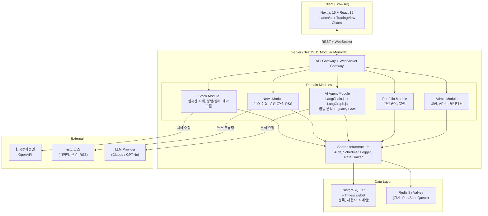

# PRD: AI Agentic Workflow로 자동 구현하는 주식 모니터링 대시보드

> **문서 버전**: v2.0 | **작성일**: 2026-03-28 | **근거**: PHASE 1-3 심층 리서치 (18개 Branch, 200+ 웹 소스) + 3개 검증 리뷰 반영

---

## 1. Executive Summary

### 비전
여러 웹사이트와 HTS에 분산된 주식 정보를 하나의 위젯 기반 대시보드에 통합하고, AI 에이전트가 급등 원인을 실시간 분석하여 투자 의사결정을 가속하는 **개인 맞춤형 PC Web 대시보드**.

### 핵심 가치 제안
1. **정보 통합**: 분산된 주식 정보(시세, 뉴스, 테마, 지표)를 단일 화면에서 조회
2. **AI 급등 분석**: 급등 종목 발생 시 AI가 관련 뉴스와 원인을 자동 분석하여 제공
3. **개인 맞춤**: 관심 종목 등록, 테마별 그룹핑, 조건별 알림으로 개인화된 모니터링

### 목표 사용자
- 개인 주식 투자자 (HTS와 함께 보조 모니터에 상시 표시)
- PC Web 데스크톱 환경 최적화

### 프로젝트 유형
- **외주 납품물**: 클라이언트에게 납품하는 프로젝트 (산출물: 화면 설계서, 디자인 원본, 소스코드 일체)
- **AI Agentic Workflow 자동 구축**: requirements.md를 기반으로 AI 에이전트(Claude Code + Sub-agents)가 대시보드를 **한 번에 자동 생성**
- **멀티유저 대시보드**: 여러 사람이 사용, 2단계 역할 (관리자 1명 + 일반 사용자), 이메일+비밀번호 가입
- **배포**: 미니PC (Ubuntu) + Docker Compose + Cloudflare Tunnel (외부 접근)
- **인간 역할**: 요구사항 정의, AI 산출물 검증, 금융 로직/보안 최종 승인, 납품 (Human-on-the-Loop)

### 기술 전략 요약
- **선택된 시나리오**: Balanced-Tech (기술 혁신과 실용성의 균형)
- **핵심 스택**: Next.js 16 + NestJS 11 + PostgreSQL 17 + TimescaleDB + LangChain.js 1.2
- **구축 방식**: Claude Code Agentic Workflow — PRD → 코드 자동 생성 → 자동 테스트 → 배포
- **AI 코드 생성 비율**: 80-90% (인간은 검증/승인/금융 로직만)
- **데이터 소스**: 한국투자증권 OpenAPI (무료, 계좌 개설 즉시 가능 → 모의투자로 개발 → 실전 전환)
- **배포 환경**: Ubuntu 24.04 미니PC (Ryzen 5 5500U, 16GB RAM, 98GB SSD) + Docker Compose + Cloudflare Tunnel
- **예상 기간**: 2-4주 (Agentic Workflow 자동 구축 기준)
- **예상 비용**: AI API ₩36-56만 + 운영 월 ₩5-10만 (Cloudflare Tunnel 무료)
- **성공 확률**: 50-65% (자율 AI 구축의 현실적 제약 — Devin 성공률 13.86% 고려, 단 인간 개발자 감독으로 상향)

---

## 2. 프로젝트 배경 및 목표

### 2.1 현재 문제 (requirements.md 기반)
- 여러 웹사이트와 HTS에 분산된 정보 확인의 불편함
- 조건별 종목 정렬, 테마별 그룹핑, 관련 뉴스 확인을 통합적으로 제공하는 서비스 부재
- 급등 종목 발생 원인(뉴스 등)을 신속하게 파악하기 어려움

### 2.2 프로젝트 목표
1. HTS와 함께 보조 모니터에 띄워놓고 사용할 수 있는 **웹 기반 주식 현황판** 구축
2. 분산된 정보를 통합하고 급등 종목의 발생 원인을 **신속하게 파악**
3. **AI Agentic Workflow로 대시보드를 한 번에 자동 구축** — 이 PRD를 입력으로, AI 에이전트가 코드/테스트/배포를 자동 수행

### 2.3 AI Agentic Workflow로 자동 구현하는 이유

PHASE 1 PM 리서치 결과:
- McKinsey SDD(Spec-Driven Development) 패턴이 Research → Planning → Implementation 3단계와 구조적으로 동일
- TELUS가 AI 에이전트로 **500,000시간 절감**, 코드 배포 **30% 가속** 달성 (Anthropic 2026 보고서)
- Harness Engineering: 가드레일 + 자가검증으로 에이전트 성능 **52.8% → 66.5%** 향상
- 프롬프트 3라운드 반복으로 만족도 **55% → 85%** 달성

**단, AI의 한계도 명확히 인식** (PHASE 1 Branch 5.1):
- 환각률 33-79% (작업 유형별)
- AI 코드 보안 정확도 56%만 정확 (Branch 3.2)
- AI 코드 부채 축적 속도 인간 대비 1.7배 (Branch 4.1)
- Devin 자율 코딩 성공률 13.86% (PM 리서치)

→ **결론**: AI는 강력한 보조 도구이지만, Quality Gate + Human-in-the-Loop이 필수

---

## 3. 핵심 기능 요구사항

### 3.1 위젯 기반 대시보드 (핵심)
- 사용자가 원하는 종목을 등록하고 주요 정보를 한눈에 볼 수 있는 위젯 기반 대시보드
- 드래그앤드롭 레이아웃 커스터마이징 (React Grid Layout)
- 실시간 주가 업데이트 (WebSocket, 5초 이내 지연 목표)
- **기본 위젯 구성** (확정):
  1. 관심종목 실시간 시세 테이블
  2. 캔들스틱/라인 차트
  3. 종목 연관 뉴스 피드
  4. 테마별 등락률 요약
  5. 급등 종목 알림 (사용자 설정 임계값 기준)
  6. AI 분석 결과 카드
  7. 시장 지수 (KOSPI/KOSDAQ)
  8. 거래대금 상위 종목

### 3.2 조건별 종목 정렬 및 필터링
- 전체 종목 또는 관심 종목을 거래대금, 등락률 등 다양한 기준으로 실시간 정렬
- 다중 필터 조합 지원 (시장, 섹터, 가격 범위, 거래량 등)
- 정렬/필터 프리셋 저장 기능

### 3.3 테마별 종목 그룹핑
- 특정 테마(반도체, 2차전지, AI 등)에 속한 종목들을 그룹으로 관리
- 테마별 등락률 요약, 테마 내 종목 비교
- 사용자/관리자 커스텀 테마 생성
- **초기 테마 데이터**: 네이버 증권/증권플러스 테마 분류 참고하여 사전 세팅 + 관리자 추가/수정 가능

### 3.4 종목 연관 뉴스 피드
- 종목 선택 시 관련 최신 뉴스를 시간순 리스팅
- 뉴스 소스 (확정): **네이버 검색 API** (일 25,000건 무료) + **RSS 피드** + **DART 공시 API**
- AI 뉴스 요약 (LangChain.js — 선택된 Balanced-Tech 스택)

### 3.5 관리자 기능 (관리자 전용 — 2단계 역할)
- 대시보드 기본 설정
- 데이터 연동 API 키 관리 (한국투자증권 OpenAPI)
- 데이터 수집 상태 모니터링
- 사용자 목록 조회/관리
- **역할 구조**: 관리자(Admin) 1명 + 일반 사용자(User) N명. 관리자 기능은 관리자만 접근 가능

### 3.6 AI 급등 원인 분석 (MVP 포함 확정)
- 급등 종목 자동 감지: **사용자별 커스텀 임계값 설정** (예: 5% 설정 시 전일 대비 5% 이상 상승 종목 알림)
- AI가 관련 뉴스(네이버 검색 API), 공시(DART), 테마 정보를 종합하여 급등 원인 분석
- 3계층 Quality Gate 통과 후 사용자에게 제공
- "AI 생성" 라벨 + 신뢰도 점수 표시

### 3.7 산출물 목록 (requirements.md 기반)

| # | 산출물 | 형식 | 납품 시점 |
|---|--------|------|----------|
| 1 | 화면 설계서 (와이어프레임) | Figma 프로토타입 | Phase 1 종료 (Week 6) |
| 2 | 기능 명세서 | Markdown (본 PRD + API 문서) | Phase 2 종료 (Week 10) |
| 3 | UI/UX 디자인 원본 | Figma 원본 파일 (.fig) | Phase 2 종료 (Week 10) |
| 4 | 개발 전체 소스코드 원본 | Git Repository | MVP 출시 (Week 20) |
| 5 | API 문서 | Swagger/OpenAPI 자동 생성 | MVP 출시 (Week 20) |
| 6 | 운영 매뉴얼 | Markdown | 안정화 완료 (Week 24) |

### 3.8 디자인 가이드 방향

- **벤치마킹 레퍼런스** (확정):
  - **TradingView** — 차트 UX, 캔들스틱, 기술적 지표 표시
  - **네이버 증권** — 한국 주식 정보 레이아웃, 뉴스 피드
  - **Ghostfolio** (오픈소스) — 위젯 기반 대시보드, 포트폴리오 뷰
  - **증권플러스** — 테마별 종목 그룹핑, 급등 종목 표시
- **금융 색상 코드**: 상승=빨강, 하락=파랑 (한국 관례 준수)
- **수치 표시 포맷**: 천 단위 콤마, 소수점 2자리 (가격), % 1자리 (등락률)
- **디자인 도구**: Figma (컴포넌트 라이브러리 + 프로토타입)
- **디자인 시스템**: shadcn/ui 기반 커스텀 테마 (다크모드 Phase 5에서 추가)
- **접근성**: WCAG 2.1 Level AA 목표 (색각 이상자를 위한 패턴/아이콘 병용)
- **국제화**: 한국어 전용 (i18n은 향후 확장 시 고려)
- **PC Web 전용**: 최소 해상도 1920x1080 최적화, 모바일 비대응 (범위 외)

---

## 4. 기술 스택 (선택된 시나리오: Balanced-Tech)

### 4.1 기술 스택 총괄표

| 계층 | 기술 | 버전 | 선택 근거 (PHASE 데이터) | 검증 기간 |
|------|------|------|------------------------|----------|
| **Language** | TypeScript | 5.x | 4/4 관점 합의, strict mode로 런타임 에러 40% 사전 차단 | 12년 |
| **Frontend** | Next.js (React 19) | 16.x | React 메타프레임워크 표준, Turbopack GA, 15.x는 Maintenance LTS 격하 | 9년 |
| **UI Components** | shadcn/ui + Tailwind CSS 4 | latest | 커스터마이징 자유도, 접근성 내장, 복사 기반 | 3년+ |
| **상태 관리** | Zustand + TanStack Query | 5.x / 5.x | 경량 전역 상태 + 서버 상태 분리 | 5년 |
| **차트** | TradingView Lightweight Charts + Recharts | 4.x / 2.x | 금융 차트 표준 + 범용 차트 | 7년/8년 |
| **Backend** | NestJS | 11.x | Adidas 일 10억+ 요청, DI 내장, 상업 지원 | 9년 |
| **ORM** | Prisma | 7.x | TS 생태계 표준 ORM, v7 순수 TS 전환(Rust 엔진 제거), ESM 전용, Driver Adapter 필수 | 7년 |
| **실시간** | Socket.IO | 4.x | WebSocket 추상화, 자동 재연결 | 14년 |
| **Database** | PostgreSQL 17 + TimescaleDB | 17.x / 2.x | 4/4 합의, 30년 금융 검증, ACID + 시계열 | 30년/8년 |
| **Cache** | Redis 8 (또는 Valkey 8) | 8.x | GA 안정, Search/JSON/TimeSeries 통합. 라이선스 변경(BSD→트리) 주의, Valkey(BSD 포크) 대안 | 17년 |
| **AI Agent** | LangChain.js + LangGraph.js | 1.2.x / 1.2.x | 1.0 GA 도달, 보안 패치 필수(CVE-2025-68664 CVSS 9.3). 0.x 사용 금지 | 3년 |
| **LLM** | Claude API / OpenAI API | latest | LangChain 추상화로 프로바이더 교체 가능 | — |
| **증권 API** | 한국투자증권 OpenAPI | v1 | 4/4 합의, 국내 접근성 최고, WebSocket 실시간 | 3년 |
| **인증** | Better Auth | 1.x | Auth.js가 Better Auth에 합류(2026). 멀티유저 동일 권한, 회원가입/로그인/세션 관리 | 2년+ |
| **CI/CD** | GitHub Actions | — | GitHub 통합, 무료 tier 충분 | 6년 |
| **모니터링** | Sentry Cloud (무료) + 로컬 로그 | latest | 에러 추적은 SaaS, 메트릭은 Docker 로그 (미니PC RAM 절약, Grafana/Prometheus 제외) | 12년+ |

### 4.2 아키텍처 다이어그램



### 4.3 Modular Monolith 모듈 구조

```
src/
├── main.ts
├── app.module.ts                    # Root Module
├── modules/
│   ├── stock/                       # 주식 도메인
│   │   ├── controllers/             # REST API + WebSocket Gateway
│   │   ├── services/                # 데이터 수집, 필터링, 테마 그룹핑
│   │   ├── entities/                # Prisma 스키마
│   │   └── dto/                     # 요청/응답 DTO
│   ├── news/                        # 뉴스 도메인
│   │   ├── services/                # 뉴스 수집, 종목-뉴스 연관, AI 요약
│   │   └── ...
│   ├── ai-agent/                    # AI 에이전트
│   │   ├── services/                # LangGraph 오케스트레이터, Quality Gate
│   │   └── chains/                  # LangChain 체인 정의
│   ├── portfolio/                   # 관심종목/알림
│   ├── admin/                       # 관리자 기능
│   └── auth/                        # 인증/인가
├── shared/                          # 공유 인프라 (DB, Redis, Logger)
└── config/                          # 환경 설정
```

**Fitness Function** (Branch 2.1): 모듈 간 순환 의존성 자동 탐지, API 응답 시간 P95 < 200ms, 배포 빈도 주 2회 이상을 CI에서 검증.

### 4.4 데이터 모델 (핵심 엔티티)

```sql
-- 종목 마스터
stocks (id, symbol, name, market, sector, listed_at, updated_at)

-- 시계열 시세 (TimescaleDB hypertable)
stock_prices (time, stock_id, open, high, low, close, volume, trade_value)
  → SELECT create_hypertable('stock_prices', by_range('time'));

-- 관심종목/포트폴리오
watchlists (id, user_id, name, created_at)
watchlist_items (id, watchlist_id, stock_id, added_at)

-- 테마 그룹
themes (id, name, description, is_custom, created_at)
theme_stocks (id, theme_id, stock_id)

-- 뉴스
news (id, title, url, source, published_at, summary, created_at)
news_stocks (id, news_id, stock_id, relevance_score)

-- AI 분석 결과
ai_analyses (id, stock_id, analysis_type, content, confidence_score,
             quality_gate_l1, quality_gate_l2, quality_gate_l3, created_at)

-- 알림
alerts (id, user_id, stock_id, condition_type, threshold, is_active, triggered_at)

-- 사용자 (멀티유저, 2단계 역할)
users (id, email, password_hash, name, role ENUM('admin','user'),
       surge_threshold_pct DECIMAL DEFAULT 5.0, settings_json, created_at)
```

### 4.5 주요 API 엔드포인트

| Method | Endpoint | 설명 |
|--------|----------|------|
| GET | `/api/stocks` | 종목 목록 (필터, 정렬, 페이지네이션) |
| GET | `/api/stocks/:symbol` | 종목 상세 정보 |
| GET | `/api/stocks/:symbol/prices` | 시세 데이터 (기간별) |
| GET | `/api/stocks/:symbol/news` | 종목 관련 뉴스 |
| POST | `/api/ai/analyze/:symbol` | AI 급등 원인 분석 요청 |
| GET | `/api/themes` | 테마 목록 |
| POST | `/api/themes` | 커스텀 테마 생성 |
| GET/POST/PUT/DELETE | `/api/watchlists/*` | 관심종목 CRUD |
| GET/POST/PUT/DELETE | `/api/alerts/*` | 알림 CRUD |
| GET | `/api/admin/status` | 시스템 상태/데이터 수집 현황 |
| **WebSocket** | `ws://stock-realtime` | 실시간 시세 스트리밍 |
| **WebSocket** | `ws://alerts` | 알림 푸시 |

### 4.6 보안 전략

| 영역 | 전략 | 도구 |
|------|------|------|
| **인증** | Better Auth (이메일+비밀번호, JWT) | Better Auth 1.x |
| **CORS** | 화이트리스트 기반, 프로덕션 도메인만 허용 | NestJS CORS 미들웨어 |
| **CSRF** | SameSite=Strict 쿠키 + CSRF 토큰 | Better Auth 내장 |
| **XSS** | CSP 헤더 + 입력 새니타이징 | Helmet.js + DOMPurify |
| **Rate Limiting** | IP 기반 + 사용자 기반 이중 제한 | NestJS ThrottlerModule |
| **API 키 보안** | 환경변수 (.env, Docker secrets) | dotenv |
| **전송 암호화** | TLS 1.3 필수 | Cloudflare Tunnel 자동 HTTPS |
| **저장 암호화** | PostgreSQL pgcrypto (민감 데이터) | PG 확장 |
| **의존성 감사** | 자동 취약점 스캔 | Snyk + npm audit |
| **LLM 보안** | 프롬프트 인젝션 방어, 입출력 검증 | Custom sanitizer + LangChain guards |

### 4.7 AI Agent Layer 설계

```
사용자 요청 (급등 종목 분석)
    │
    ▼
┌─────────────────────────────────┐
│  LangGraph.js Orchestrator      │
│  (상태 그래프 기반 워크플로우)    │
├─────────────────────────────────┤
│  Step 1: 종목 데이터 수집       │ → 한투 API + TimescaleDB
│  Step 2: 관련 뉴스 검색         │ → 뉴스 모듈
│  Step 3: AI 원인 분석 (LLM)     │ → Claude / GPT-4o
│  Step 4: Quality Gate 3계층     │ → 구문 → 의미 → 사실 검증
│  Step 5: 결과 반환              │ → "AI 생성" 라벨 + 신뢰도
└─────────────────────────────────┘
```

### 4.8 데이��� 플로우

```
한국투자증권 OpenAPI (WebSocket/REST)
    │
    ▼
NestJS Stock Module (kis-api.service)
    │
    ├──▶ Redis (실시간 시세 캐시, TTL 5초)
    │       └──▶ Socket.IO → Frontend (실시간 차트)
    │
    ├──▶ TimescaleDB (시계열 저장, hypertable)
    │       └──▶ 기술적 분석 쿼리 (이동평균, RSI 등)
    │
    ├──▶ PostgreSQL (종목 마스터, 사용자 데이터)
    │
    └──▶ Bull Queue (비동기 AI 분석 작업)
            └──▶ AI Agent → Quality Gate → 결과 저장
```

---

## 5. 선택하지 않은 시나리오와 그 이유

### 5.1 Cutting Edge — 왜 선택하지 않았는가

**제안 스택**: Bun + Hono + ClickHouse + Claude Agent SDK + LangGraph.js

| 배제 이유 | 근거 (PHASE 데이터) |
|-----------|-------------------|
| **Bun 프로덕션 미검증** | GA 2.5년, Node.js(15년) 대비 엣지 케이스 대응 경험 부족 (Branch 1.1) |
| **ClickHouse 운영 부담** | ACID 미지원, UPDATE/DELETE 비용 높음, 별도 DB 운영 필요 (Branch 2.B) |
| **성공률 65%** | Balanced(75-85%)보다 10-20%p 낮음. 금융 도메인에서 허용 불가 (Branch 3.A) |
| **비용 ₩1.76억** | 3인 팀 6개월 기준, Balanced(₩1.03-1.23억) 대비 40-70% 높음 (Branch 3.A) |
| **AI 코드 70-80%** | 부채 1.7x 축적 + 보안 56%만 정확 → 6개월 후 Complexity Wall (Branch 4.1, 3.1) |

**ClickHouse StockHouse는 매력적이나**: 개인 대시보드 규모(2,500종목 × 1회/초 = 2,500 rows/sec)에서 PostgreSQL + TimescaleDB로 충분. ClickHouse는 과잉 투자.

**탈출 해치로 보존**: 향후 트래픽 급증 시 ClickHouse 전환은 Modular Monolith의 데이터 모듈만 교체하면 됨.

### 5.2 Proven Stack — 왜 선택하지 않았는가

**제안 스택**: React 19 + Vite + NestJS 11 + PG 17 + Redis (AI 코드 0%)

| 배제 이유 | 근거 (PHASE 데이터) |
|-----------|-------------------|
| **AI 활용도 0%** | 2026년 AI 네이티브 트렌드와 괴리. Gartner: 2026년 엔터프라이즈 앱 40%가 AI 에이전트 통합 (Branch 5.1) |
| **AI 급등 분석 불가** | 핵심 차별화 기능인 AI 급등 원인 분석을 구현할 수 없음 |
| **개발 속도 열위** | AI 보조 없이 6개월 15-20개 기능 vs Balanced의 20-25개 (Branch 3.1 vs 3.2) |
| **혁신성 부재** | "동작하는 소프트웨어"이지만 시장 차별화 요소 없음 |

**Proven의 강점은 흡수**: NestJS, PostgreSQL, Redis 등 검증 기술은 Balanced에서도 동일하게 사용. 안정성은 유지하면서 AI 레이어만 추가.

---

## 6. AI Agentic Workflow 자동 구축 전략

> 이 프로젝트의 핵심 차별점: **인간 개발팀이 아닌 AI 에이전트가 대시보드를 자동 구축한다.**

### 6.1 자동 구축 파이프라인

```
┌─────────────────────────────────────────────────────────────┐
│  INPUT: 이 PRD.md + requirements.md                         │
└──────────────────────┬──────────────────────────────────────┘
                       ▼
┌──────────────────────────────────────────────────────────────┐
│  PHASE A: 프로젝트 스캐폴딩 (Claude Code Orchestrator)       │
│  - Turborepo 모노레포 생성                                    │
│  - Docker Compose 설정 (PG + TimescaleDB + Redis)            │
│  - NestJS 11 모듈 구조 생성 (stock/news/ai-agent/portfolio)  │
│  - Next.js 16 프론트엔드 기반 생성                            │
│  - CI/CD (GitHub Actions) 설정                               │
│  → 예상 소요: 1-2시간                                        │
└──────────────────────┬──────────────────────────────────────┘
                       ▼
┌──────────────────────────────────────────────────────────────┐
│  PHASE B: 백엔드 자동 생성 (Sub-agent: Backend Builder)       │
│  - Prisma 7 스키마 생성 (섹션 4.4 데이터 모델 기반)           │
│  - NestJS CRUD API 자동 생성 (섹션 4.5 엔드포인트 기반)       │
│  - 한국투자증권 OpenAPI 연동 서비스                            │
│  - WebSocket Gateway (Socket.IO)                             │
│  - Bull Queue 비동기 작업                                     │
│  - 단위 테스트 자동 생성 (Vitest)                             │
│  → 예상 소요: 2-4시간                                        │
└──────────────────────┬──────────────────────────────────────┘
                       ▼
┌──────────────────────────────────────────────────────────────┐
│  PHASE C: 프론트엔드 자동 생성 (Sub-agent: Frontend Builder)  │
│  - 대시보드 레이아웃 (React Grid Layout + shadcn/ui)          │
│  - 실시간 시세 테이블/차트 (TradingView Lightweight Charts)   │
│  - 종목 필터/정렬/검색 UI                                     │
│  - 테마 그룹 관리 UI                                          │
│  - 뉴스 피드 UI                                               │
│  - 관리자 페이지                                              │
│  → 예상 소요: 3-6시간                                        │
└──────────────────────┬──────────────────────────────────────┘
                       ▼
┌──────────────────────────────────────────────────────────────┐
│  PHASE D: AI Agent 모듈 (Sub-agent: AI Builder)              │
│  - LangGraph.js 1.2 급등 분석 워크플로우                      │
│  - Quality Gate 3계층 구현                                    │
│  - 뉴스 요약 체인                                             │
│  → 예상 소요: 2-4시간                                        │
└──────────────────────┬──────────────────────────────────────┘
                       ▼
┌──────────────────────────────────────────────────────────────┐
│  PHASE E: 통합 + 테스트 + 배포 (Orchestrator)                │
│  - E2E 테스트 (Playwright)                                   │
│  - 보안 스캔 (Snyk)                                          │
│  - Docker 빌드 + 배포                                        │
│  → 예상 소요: 1-2시간                                        │
└──────────────────────┬──────────────────────────────────────┘
                       ▼
┌──────────────────────────────────────────────────────────────┐
│  HUMAN CHECKPOINTS (인간 검증 — 반드시 수행)                  │
│  ☐ DB 스키마 검토 (금융 데이터 정합성)                        │
│  ☐ 한투 API 연동 검증 (인증, Rate Limit)                     │
│  ☐ 금융 계산 로직 검증 (수익률, 등락률 정밀도)                │
│  ☐ 보안 설정 검토 (CORS, API 키, 인증)                       │
│  ☐ AI 분석 결과 품질 검증 (환각 여부)                         │
│  ☐ 최종 UX 검토 및 디자인 조정                                │
└──────────────────────────────────────────────────────────────┘
```

### 6.2 AI 에이전트 역할 분담

| 에이전트 | 역할 | 도구 | AI 자율도 |
|---------|------|------|----------|
| **Orchestrator** | 전체 워크플로우 조율, PRD 해석 | Claude Code | 높음 |
| **Backend Builder** | NestJS API, DB, 서비스 생성 | Claude Code Sub-agent | 높음 |
| **Frontend Builder** | React 컴포넌트, 페이지, 차트 | Claude Code Sub-agent | 높음 |
| **AI Builder** | LangGraph 체인, Quality Gate | Claude Code Sub-agent | 중간 |
| **Test Runner** | 단위/통합/E2E 테스트 생성+실행 | Claude Code Sub-agent | 높음 |
| **인간 (Human-on-the-Loop)** | 검증, 승인, 금융/보안 최종 결정 | 수동 리뷰 | — |

### 6.3 AI 코드 생성 비율: 80-90%

이 프로젝트는 "AI 보조 개발"이 아니라 "AI 주도 자동 구축"이므로, 코드의 대부분을 AI가 생성한다.

| 영역 | AI 생성 | 인간 역할 |
|------|---------|----------|
| **프로젝트 스캐폴딩** | 100% | 구조 확인 |
| **CRUD API** | 95% | 비즈니스 규칙 검증 |
| **UI 컴포넌트** | 90% | UX 미세 조정 |
| **DB 스키마** | 90% | 금융 데이터 정합성 검증 |
| **테스트 코드** | 85% | 엣지 케이스 추가 |
| **실시간 WebSocket** | 80% | 재연결 로직 검증 |
| **AI Agent 체인** | 75% | Quality Gate 튜닝 |
| **보안/인증 설정** | 60% | **반드시 인간 검토** |
| **금융 계산 로직** | 50% | **반드시 인간 검증** (정밀도) |
| **인프라/배포** | 90% | 환경변수/시크릿 검증 |

> **핵심 원칙**: AI가 생성하되, **금융 계산**과 **보안**은 반드시 인간이 최종 검증.
> PHASE 1 데이터: AI 보안 정확도 56%, 환각률 33-79%이므로 무검증 배포는 금지.

### 6.2 AI Quality Gate (3계층)

> 근거: Branch 3.2 — AI 코드 보안 56%만 정확, Branch 5.1 — 환각률 33-79%

```
L1 — 구문 검증 (Syntax Validation)
  │ TypeScript 컴파일, ESLint strict, Zod 스키마 검증
  │ 통과율 목표: 99%+
  ▼
L2 — 의미 검증 (Semantic Validation)
  │ 수치 범위 검증, 자기 모순 탐지, 비즈니스 규칙 준수
  │ 통과율 목표: 95%+
  ▼
L3 — 사실 검증 (Factual Validation)
  │ 실제 주가 데이터와 교차 검증 (한투 API 대조)
  │ 통과율 목표: 90%+
  ▼
  통과 → 사용자 노출 ("AI 생성" 라벨 + 신뢰도 점수)
  실패 → 재생성 (최대 3회) → 최종 실패 시 "검증 미완료" 라벨
```

### 6.3 Human-in-the-Loop 개입 포인트

> 근거: Branch 3.2 — HITL 6개 의무 개입 포인트

| # | 개입 포인트 | 이유 |
|---|-----------|------|
| 1 | **DB 스키마 변경** | 금융 데이터 정합성 직결 |
| 2 | **인증/인가 로직** | 보안 핵심 (AI 보안 정확도 56%) |
| 3 | **금융 계산 로직** | 소수점 정밀도, 수수료 계산 |
| 4 | **외부 API 연동** | 한투 API 호출 패턴, Rate Limit |
| 5 | **배포 구성** | 인프라 변경 반드시 인간 승인 |
| 6 | **AI 분석 결과 검증** | 환각 방지, 사실 검증 |

### 6.4 기술 부채 관리

> 근거: Branch 4.1 — AI 코드 1.7x 부채 축적, 2년 ROI 300%, Branch 4.2 — TDR 15% 경고 임계값

**4계층 예방 전략** (Branch 4.1):
1. **AI Guardrails**: AI 생성 코드에 TypeScript strict + ESLint strict 강제
2. **Pre-Commit Hooks**: 포맷, 린트, 타입 검사 자동 실행
3. **PR Quality Gates**: SonarQube "Clean as You Code" 정책
4. **주간 부채 정산**: 스프린트 20% 시간을 리팩토링에 할당

**TDR(Technical Debt Ratio) 임계값** (Branch 4.2):
- 정상: < 10%
- 경고: 15% → Sprint 0 (1주 부채 해소) 발동
- 위험: 20% → 신규 기능 중단, 부채 해소 집중
- 임계: 25% → 아키텍처 리뷰 소집

---

## 7. 개발 프로세스

### 7.1 개발 환경

```yaml
# 로컬 개발 스택
Runtime: Node.js 22 LTS
Package Manager: pnpm (Turborepo 모노레포)
Container: Docker Compose v2
  - PostgreSQL 17 + TimescaleDB
  - Redis 8 (또는 Valkey 8)
IDE: VSCode (권장 Extensions 공유)

# 환경 셋업 목표: 1시간 이내
# docker compose up -d && pnpm install && pnpm dev
```

### 7.2 CI/CD 파이프라인

```
[Push to Branch]
    │
    ├── Lint + Type Check (2분)
    ├── Unit Tests (3분)
    ├── Build (2분)
    │
[PR to main]
    │
    ├── Integration Tests (5분)
    ├── SonarQube Analysis (3분)
    ├── AI Code Review (보조)
    │
[Merge to main]
    │
    ├── 자동: Staging 배포
    ├── E2E Tests on Staging (5분)
    │
[수동 승인]
    │
    └── Production 배포 (Blue-Green)
```

### 7.3 테스트 전략

> 근거: Branch 3.2 — Playwright(Cypress 대비 45% 빠르고 flakiness 72% 낮음)

| 유형 | 도구 | 커버리지 목표 | 실행 시점 |
|------|------|-------------|----------|
| **정적 분석** | TypeScript strict + ESLint | 100% | pre-commit |
| **단위 테스트** | Vitest | 80%+ | pre-push, CI |
| **통합 테스트** | Vitest + Testcontainers | API 100% | CI |
| **E2E 테스트** | Playwright | 핵심 시나리오 10개 | CI (Staging 후) |
| **AI 출력 테스트** | Custom Eval Suite | Quality Gate 3계층 | AI 분석 시 |

### 7.4 배포 전략

- **Staging**: main 머지 시 자동 배포, E2E 자동 실행
- **Production**: 수동 승인 후 Blue-Green 배포
- **배포 빈도**: 주 2-3회
- **Rollback**: Health Check 실패 시 자동 롤백

---

## 8. 마일스톤 (Agentic Workflow 자동 구축 기준)

> 기존 6개월 외주 일정이 아닌, **AI Agentic Workflow 자동 구축** 기준 일정.
> 인간은 검증/승인 역할만 수행하므로 일정이 대폭 단축됨.

### Sprint 0: 준비 (Day 1-2) — 인간 주도
- PRD.md 최종 확정, 기술 스택 확인
- 개발 환경 준비 (Docker, Node.js, API 키)
- 한국투자증권 OpenAPI 계좌 개설 + 인증 토큰 확보
- **산출물**: 개발 환경 Ready, API 접근 확인

### Sprint 1: AI 자동 생성 — 백엔드 (Day 3-5) — AI 주도
- **Orchestrator**: 프로젝트 스캐폴딩 (Turborepo + NestJS + Next.js + Docker)
- **Backend Builder**: Prisma 스키마, CRUD API, 한투 API 연동, WebSocket
- **Test Runner**: 단위 테스트 자동 생성
- **인간 체크포인트**: DB 스키마 검토, 한투 API 연동 검증
- **산출물**: 백엔드 API 동작, 실시간 시세 수신

### Sprint 2: AI 자동 생성 — 프론트엔드 (Day 6-9) — AI 주도
- **Frontend Builder**: 대시보드 레이아웃, 차트, 필터/정렬, 테마 그룹
- **AI Builder**: LangGraph.js 급등 분석 체인 + Quality Gate
- **인간 체크포인트**: UX 검토, 금융 수치 표시 정확도 확인
- **산출물**: 프론트엔드 + AI 분석 기능 동작

### Sprint 3: 통합 + 검증 (Day 10-14) — 인간+AI 협업
- **Test Runner**: E2E 테스트 (Playwright), 보안 스캔
- **인간**: 금융 계산 로직 전수 검증, 보안 설정 검토, UX 최종 조정
- 뉴스 연동 + 관리자 기능 + 알림 시스템
- **산출물**: 전체 기능 통합 완료

### Sprint 4: 안정화 + 배포 (Week 3-4) — 인간+AI 협업
- 버그 수정, 성능 최적화, 실사용 테스트
- 프로덕션 배포 (Docker + VPS/AWS)
- 모니터링 설정 (Sentry + Grafana)
- **산출물**: **MVP 출시**

### 이후: 운영 + 개선 (Week 5+, 선택)
- 실사용 피드백 반영
- 추가 기능 (포트폴리오 분석, 다크모드)
- AI 분석 품질 튜닝

```
Day 1-2    ████              Sprint 0: 준비 (인간 - 환경, API 키)
Day 3-5    ██████            Sprint 1: 백엔드 자동 생성 (AI 주도)
Day 6-9    ████████          Sprint 2: 프론트엔드 + AI Agent (AI 주도)
Day 10-14  ██████████        Sprint 3: 통합 + 검증 (인간+AI)
Week 3-4   ████████████████  Sprint 4: 안정화 + 배포 → MVP ★
Week 5+    ████████████████  운영 + 개선 (선택)
```

**총 MVP 기간: 2-4주** (기존 18-20주에서 **5-10배 단축**)

---

## 9. 비용 추정 (Agentic Workflow 자동 구축 기준)

> AI가 코드를 자동 생성하므로, 전통적 외주 인건비(₩1억+)가 **AI API 비용**으로 대체됨.

### 9.1 초기 구축 비용 (2-4주)

| 항목 | 비용 | 비고 |
|------|------|------|
| Claude Code (Max Plan) | ₩60,000/월 | 자동 구축 기간 1개월 |
| Claude API (LLM 호출) | ₩300,000-500,000 | AI Agent 분석 기능용 (구축 + 테스트) |
| 한국투자증권 OpenAPI | 무료 | 계좌 필요 |
| GitHub | 무료 | Free tier |
| **초기 구축 합계** | **₩360,000-560,000** | |

### 9.2 월간 운영 비용 (MVP 이후)

| 항목 | 월 비용 | 비고 |
|------|---------|------|
| 미니PC 전기료 | ₩5,000-10,000 | 24시간 가동 기준 |
| AI API (LLM) | ₩100,000-300,000 | 급등 분석 사용량 기반 |
| Cloudflare Tunnel | 무료 | HTTPS + 외부 접근 |
| 도메인 | ₩1,500/월 | 선택 (Cloudflare 무료 서브도메인 가능) |
| 한국투자증권 API | 무료 | 계좌 개설 필요 |
| **월 운영 합계** | **₩106,500-311,500** | |

### 9.3 전통 외주 대비 비용 비교

| 항목 | 전통 외주 (3인 6개월) | Agentic Workflow |
|------|---------------------|-----------------|
| 인건비 | ₩10,800-12,600만 | **₩0** (AI가 생성) |
| AI/도구 비용 | ₩0 | ₩36-56만 |
| 인프라 (6개월) | ₩330만 (AWS) | ₩64-187만 (미니PC) |
| **총합** | **₩1.11-1.29억** | **₩100-243만** |
| 기간 | 18-20주 | **2-4주** |

> **핵심 가치**: Agentic Workflow = 비용 **97-98% 절감** + 기간 **5-10배 단축**.
> 단, 인간 개발자의 검증/감독 시간(약 40-80시간)이 별도 소요됨.

---

## 10. 리스크 매트릭스

| ID | 리스크 | 확률 | 영향 | 점수 | 완화 전략 |
|----|--------|------|------|------|----------|
| R1 | **AI 환각으로 잘못된 분석** | 35% | 9/10 | 3.15 | Quality Gate 3계층 + "AI 생성" 라벨 + 신뢰도 점수 |
| R2 | **한투 API 변경/장애** | 30% | 8/10 | 2.40 | Adapter 패턴, Redis 캐시 폴백, 대체 API(KRX 공공데이터) |
| R3 | **AI 코드 기술 부채 축적** | 40% | 7/10 | 2.80 | 4계층 예방, TDR 15% 경고, Sprint 0 발동 |
| R4 | **실시간 WebSocket 안정성** | 25% | 6/10 | 1.50 | Socket.IO 자동 재연결, Redis Pub/Sub 백업 |
| R5 | **AI 생성 코드 전체 품질 미달** | 30% | 8/10 | 2.40 | 모듈별 점진적 생성, 각 Sprint 후 인간 검증 체크포인트 |
| R6 | **LangChain.js 버전 변경** | 30% | 5/10 | 1.50 | Adapter 패턴으로 LLM 프로바이더 추상화, 핵심 기능만 사용 |
| R7 | **성능 병목 (시계열 쿼리)** | 20% | 5/10 | 1.00 | TimescaleDB Continuous Aggregate, Redis 캐시 |
| R8 | **뉴스 데이터 소스 제한** | 15% | 4/10 | 0.60 | 네이버 검색 API(합법) + RSS + DART 공시로 확정. 크롤링 불사용으로 법적 리스크 해소 |
| R9 | **LangChain/LangGraph 보안 취약점** | 40% | 8/10 | 3.20 | 최신 패치 필수(CVE-2025-68664 CVSS 9.3), 입출력 검증 레이어, 최소 권한 원칙 |

**최고 리스크: R9(LangChain 보안)** — 금융 데이터 접근 시 최신 패치 + 입출력 검증 필수
**2순위: R1(AI 환각)** — Quality Gate 3계층이 핵심 방어선
**3순위: R3(AI 부채)** — 4계층 예방 + TDR 모니터링이 핵심

---

## 11. 성공 지표 (KPI)

### 기술 KPI

| 지표 | 목표 | 측정 도구 |
|------|------|----------|
| API 응답 시간 P95 | < 200ms | Prometheus |
| WebSocket 시세 지연 | < 5초 | Custom metric |
| 테스트 커버리지 | >= 80% | Vitest |
| SonarQube Quality Gate | A등급 통과 | SonarQube |
| TDR (기술 부채 비율) | < 10% | SonarQube |
| AI Quality Gate 통과율 | L1: 99%, L2: 95%, L3: 90% | Custom eval |
| 배포 빈도 | >= 주 2회 | GitHub Actions |
| 프로덕션 에러율 | < 0.1% | Sentry |

### 비즈니스 KPI

| 지표 | 목표 | 측정 |
|------|------|------|
| MVP 출시 | 4주 이내 | 캘린더 |
| 핵심 기능 완성도 | 100% (섹션 3의 3.1-3.6) | 체크리스트 |
| 대시보드 초기 로드 | < 3초 | Lighthouse |
| 사용자 만족도 | >= 4/5 | 피드백 |

---

## 12. 심층 조사 근거

### 12.1 PHASE 1 — 10개 Branch 리서치 요약

| Branch | 역할 | 핵심 발견 |
|--------|------|----------|
| **PM Agent** | 웹 리서치 | CrewAI+LangGraph 최적, 한투 API 1순위, korea-stock-mcp, Devin 13.86% |
| **1.1 Core Aggressive** | 최신 기술 | Bun 3.7x, ClickHouse StockHouse, Claude SDK, 추천 9/10 |
| **1.2 Core Conservative** | 검증 기술 | NestJS 10억/일, React Fortune 500 1,035개사, PG 30년, 안정 8.5/10 |
| **2.1 Arch Evolutionary** | 점진적 진화 | Modular Monolith, MVP 16-20주, Fitness Function |
| **2.2 Arch Big Bang** | 초기 완성도 | Modular Monolith+Event-Ready, **양쪽 MSA 거부** |
| **3.1 Workflow Rapid** | 빠른 개발 | 1기능 5-15분, AI 70-80%, "3개월 Complexity Wall" |
| **3.2 Workflow Robust** | 견고한 개발 | 5단계 Quality Gate, HITL 6개, Playwright 권장 |
| **4.1 Debt Minimized** | 부채 최소화 | AI 1.7x 부채, 4계층 예방, 2년 ROI 300% |
| **4.2 Debt Practical** | 실용적 부채 | 3계층 AI코드 관리, TDR 15% 경고, 관리 시 36% 절감 |
| **5.1 Theory Modern** | 최신 이론 | ReAct, MCP/A2A 표준, 추론-환각 역설, 이론 8/10 |
| **5.2 Theory Classical** | 고전 이론 | SOLID, ACID, DDD, Lamport, 이론 확실성 9/10 |

### 12.2 PHASE 2 — 4개 관점별 토론 요약

| 관점 | 핵심 권장 | Backend 선택 | AI 접근 |
|------|----------|-------------|---------|
| **2.A 최신 기술** | Bun+Hono+ClickHouse | Hono+Bun | AI-native 1급 시민 |
| **2.B 안정성** | NestJS+PG+Redis | NestJS 11 | 3-Zone 제한 |
| **2.C 개발 속도** | Supabase+Vercel | Hono+Bun | 70-80% AI |
| **2.D 유지보수** | NestJS+PG+DDD | NestJS 11 | Robust 이중 리뷰 |
| **합의** | React 19+TS, PG, Modular Monolith, Quality Gate | 2:2 분열 | Gate 필수 |

### 12.3 PHASE 3 — 3개 시나리오 비교

| 항목 | Cutting Edge | **Balanced-Tech ★** | Proven Stack |
|------|------------|---------------------|-------------|
| Backend | Bun+Hono | **NestJS 11** | NestJS 11 |
| DB | ClickHouse+PG+Redis | **PG+TimescaleDB+Redis** | PG+TimescaleDB+Redis |
| AI 비율 | 70-80% | **~55%** | 0% |
| 성공률 | 65% | **50-65% (Agentic)** | 90%+ |
| MVP | 22주 | **2-4주 (Agentic)** | 20주 |
| 비용 | ₩1.76억 | **₩127-297만 (Agentic)** | ₩1.23-1.55억 |
| 기술 리더십 | 매우 높음 | **중간** | 낮음 |
| 2년 유지보수 | 불확실 | **안정적** | 최소 |

### 12.4 참고 자료 (주요 출처)

**AI Agent 이론**
- Wei et al. (2022) — Chain-of-Thought Prompting, NeurIPS 2022
- Yao et al. (2022) — ReAct: Synergizing Reasoning and Acting, ICLR 2023
- Tao et al. (2025) — Multi-Agent Collaboration Mechanisms Survey
- ICLR 2026 Workshop on Lifelong Agents

**아키텍처**
- Martin Fowler — Monolith First, Strangler Fig Pattern
- Neal Ford — Building Evolutionary Architectures, Fitness Functions
- Microsoft — AI Agent Design Patterns (Azure Architecture Center)

**실시간 금융 데이터**
- Reactive Manifesto (2014)
- Greg Young — CQRS/Event Sourcing
- 한국투자증권 Open API Portal (apiportal.koreainvestment.com)

**기술 부채**
- SonarQube "Clean as You Code" 방법론
- CodeRabbit 2025 AI Code Quality Report
- Forrester 2026 AI Technical Debt Prediction

**프레임워크 검증**
- NestJS — Adidas 일 10억+ 요청 처리
- React — Fortune 500 1,035개사 채택
- PostgreSQL — 30년 금융 도메인 검증
- Playwright — Cypress 대비 45% 빠르고 flakiness 72% 낮음

---

> **이 PRD v2.0은 18개 AI Agent Branch의 병렬 심층 리서치(200+ 웹 소스, 50+ 학술 논문) + 3개 검증 리뷰를 기반으로 작성되었습니다.**
>
> **v2.0 주요 변경:**
> - **프로젝트 방향 전환**: "외주 3인 팀 6개월 개발" → "AI Agentic Workflow 자동 구축 (2-4주)"
> - 기술 스택 버전 최신화: LangChain/LangGraph 1.2.x, Prisma 7, Redis 8, Next.js 16, Better Auth
> - 비용: 전통 외주 ₩1.03-1.23억 → Agentic ₩127-297만 (97-98% 절감)
> - 일정: 18-20주 → 2-4주 (Sprint 0-4 자동 구축 파이프라인)
> - AI 코드 생성 비율: 55% → 80-90% (AI 주도, 인간은 검증/승인)
> - 섹션 6 전면 재작성: 자동 구축 파이프라인 (Phase A-E), 에이전트 역할 분담
> - 산출물 목록/디자인 프로세스/보안 전략/DB 스키마/API 설계 추가
> - LangChain 보안 취약점(CVE-2025-68664 CVSS 9.3) 리스크 반영
>
> 모든 기술 선택은 정량적 데이터에 근거하며, 선택하지 않은 대안과 그 이유도 투명하게 기록되어 있습니다.
