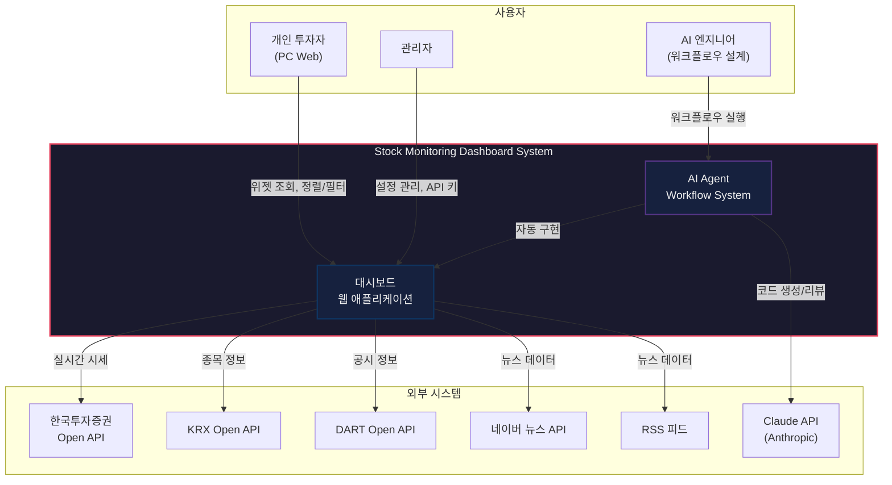
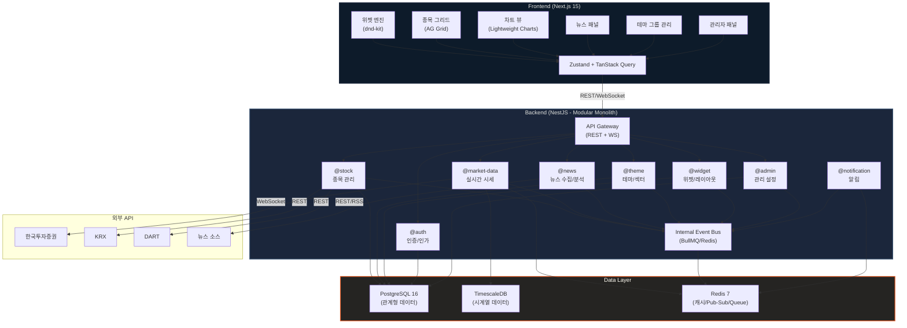
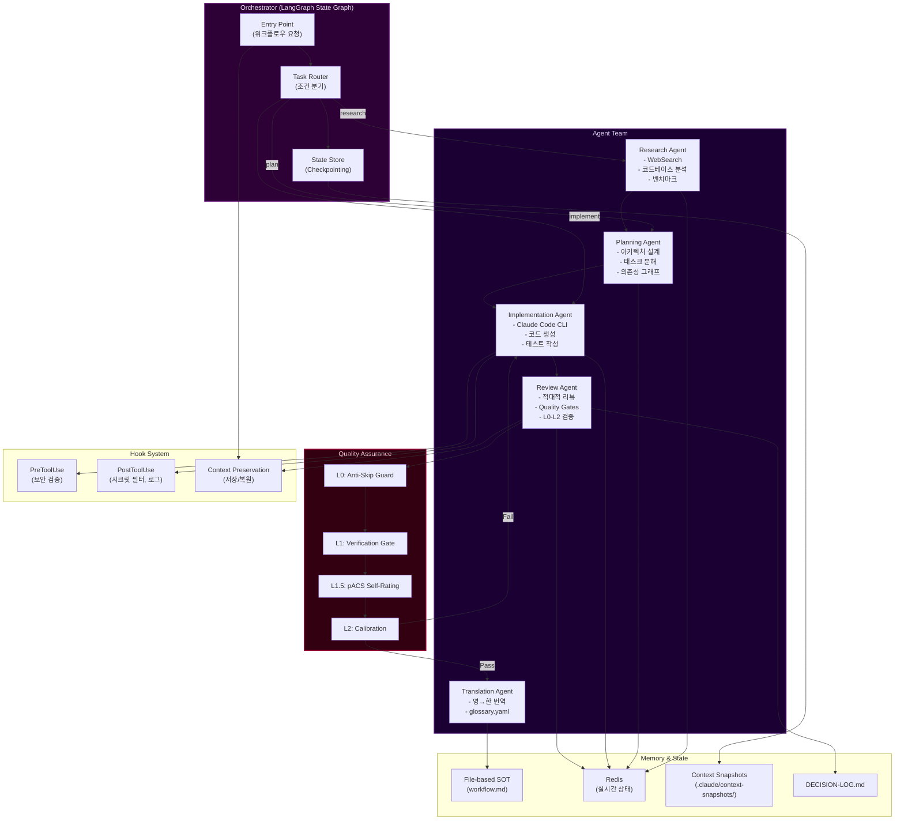
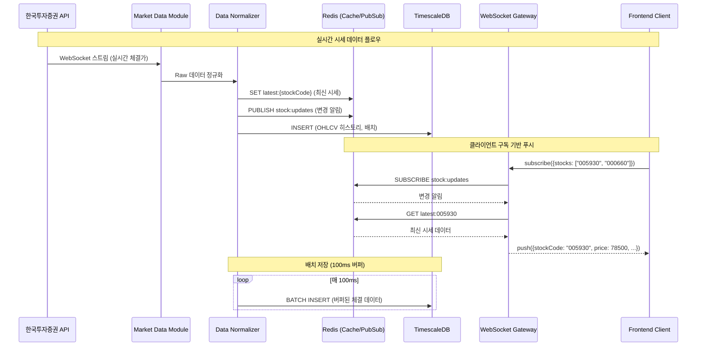
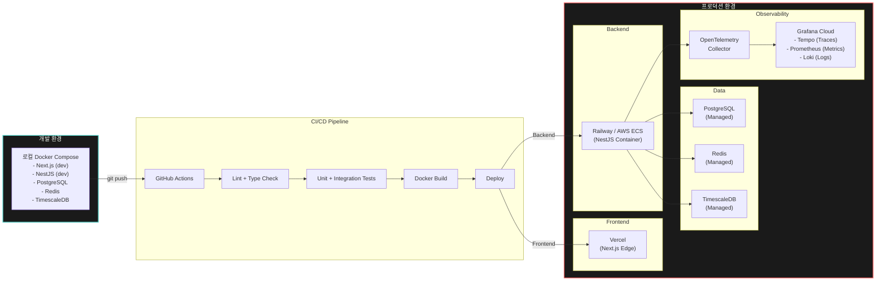

# Branch 2.2: Big Bang Architecture 리서치 보고서

> **관점**: "초기에 제대로 하면, 나중에 고생 없다."
> **대상**: 주식 정보 모니터링 대시보드 + AI Agentic Workflow Automation System
> **작성일**: 2026-03-27

---

## Executive Summary

본 보고서는 "주식 정보 모니터링 대시보드를 자동 구현하는 AI Agentic Workflow Automation System"을 **초기부터 견고하게(Big Bang Architecture)** 설계하는 접근법에 대해, 실제 산업 사례와 2025-2026년 기술 동향을 기반으로 분석한다. 2중 구조(AI Agent System + Dashboard Application)의 전체 아키텍처, 6개월 초기 설계, 12-24개월 확장 경로, 비용 추정, 리스크를 포괄적으로 다룬다.

---

## 1. 초기부터 고려할 전체 아키텍처 설계 (6개월)

### 1.1 아키텍처 철학: Modular Monolith-First + Event-Driven Ready

#### 왜 순수 Microservices가 아닌가

2025-2026년 업계의 가장 중요한 교훈은 **과도 설계(over-engineering)의 위험성**이다:

- **Amazon Prime Video 사례**: 마이크로서비스에서 모놀리스로 전환하여 **90% 비용 절감**을 달성. Amazon조차 분산이 조기에 불필요했음을 인정.
- **팀 규모 임계점**: 마이크로서비스의 이점은 **개발자 10명 이상**에서만 나타남. 그 이하에서는 모놀리스가 일관되게 우수한 성과를 보임.
- **분산 모놀리스 안티패턴**: 최악의 결과는 모놀리스의 단순성도, 마이크로서비스의 독립성도 얻지 못하는 것.

#### 우리의 선택: Modular Monolith → Eventual Microservices

```
Phase 1 (Month 1-6):   Modular Monolith + Event Bus (내부)
Phase 2 (Month 7-12):  Hot Path 서비스 분리 (실시간 데이터)
Phase 3 (Month 13-24): 필요에 따른 선택적 마이크로서비스 전환
```

이 전략은 **초기 개발 속도**와 **장기 확장성**을 모두 확보한다. 모듈 간 경계를 명확히 정의하되, 네트워크 호출 없이 프로세스 내 통신으로 시작한다.

---

### 1.2 전체 시스템 아키텍처

#### Layer 1: AI Agent System (워크플로우 자동화)

```
┌─────────────────────────────────────────────────────────────┐
│                    AI Agent System                          │
│                                                             │
│  ┌──────────────┐  ┌──────────────┐  ┌──────────────────┐  │
│  │ Orchestrator │  │  Workflow     │  │  Code Generation │  │
│  │ Agent        │──│  Engine       │──│  Pipeline        │  │
│  │ (LangGraph)  │  │ (State Graph) │  │ (Claude Code)    │  │
│  └──────┬───────┘  └──────┬───────┘  └────────┬─────────┘  │
│         │                 │                    │            │
│  ┌──────▼───────┐  ┌──────▼───────┐  ┌────────▼─────────┐  │
│  │ Research     │  │  Planning    │  │  Implementation  │  │
│  │ Agent        │  │  Agent       │  │  Agent           │  │
│  └──────────────┘  └──────────────┘  └──────────────────┘  │
│         │                 │                    │            │
│  ┌──────▼─────────────────▼────────────────────▼─────────┐  │
│  │              Shared Memory / State Store               │  │
│  │         (Redis + File-based SOT per CLAUDE.md)        │  │
│  └───────────────────────────────────────────────────────┘  │
└─────────────────────────────────────────────────────────────┘
```

**핵심 설계 결정:**

| 구성 요소 | 기술 선택 | 근거 |
|-----------|----------|------|
| Orchestrator | **LangGraph** | 그래프 기반 워크플로우, 조건 분기, 상태 관리에 최적. 2026년 "미션 크리티컬 시스템"의 표준. |
| Agent Framework | **Claude Code + Custom Agents** | 깊은 추론, 디버깅, 아키텍처 변경에 가장 뛰어난 "coding brain". |
| State Management | **Redis + File SOT** | CLAUDE.md 절대 기준 2(단일 파일 SOT)와 일치. Redis는 에이전트 간 실시간 상태 공유. |
| Workflow Definition | **workflow.md (3단계)** | Research → Planning → Implementation. AgenticWorkflow의 핵심 패턴 유지. |

**Agent 역할 분담:**

1. **Orchestrator Agent**: 전체 워크플로우 조율, 에이전트 위임, 품질 게이트 관리
2. **Research Agent**: 요구사항 분석, 기술 조사, 벤치마크 수집
3. **Planning Agent**: 아키텍처 설계, 태스크 분해, 의존성 그래프 생성
4. **Implementation Agent**: 코드 생성, 테스트 작성, 빌드/배포 실행
5. **Review Agent**: 코드 리뷰, 품질 검증 (AGENTS.md의 적대적 리뷰어 패턴)
6. **Translation Agent**: 영한 번역 (translations/glossary.yaml 기반)

#### Layer 2: Dashboard Application (주식 모니터링)

```
┌─────────────────────────────────────────────────────────────┐
│                   Dashboard Application                     │
│                                                             │
│  ┌─────────────────────────────────────────────────────┐    │
│  │                  Frontend (Next.js)                  │    │
│  │  ┌────────┐ ┌────────┐ ┌────────┐ ┌─────────────┐  │    │
│  │  │Widget  │ │Sort/   │ │Theme   │ │News Feed    │  │    │
│  │  │Engine  │ │Filter  │ │Group   │ │Panel        │  │    │
│  │  └────┬───┘ └────┬───┘ └────┬───┘ └──────┬──────┘  │    │
│  │       └──────────┴──────────┴─────────────┘         │    │
│  │                    │                                 │    │
│  │       ┌────────────▼────────────┐                   │    │
│  │       │   State Management      │                   │    │
│  │       │   (Zustand + React      │                   │    │
│  │       │    Query/TanStack)      │                   │    │
│  │       └────────────┬────────────┘                   │    │
│  │                    │ WebSocket / SSE                 │    │
│  └────────────────────┼────────────────────────────────┘    │
│                       │                                     │
│  ┌────────────────────▼────────────────────────────────┐    │
│  │              Backend (Modular Monolith)              │    │
│  │                                                      │    │
│  │  ┌─────────────────────────────────────────────┐     │    │
│  │  │              API Gateway (Kong/Nginx)        │     │    │
│  │  └─────────────────┬───────────────────────────┘     │    │
│  │                    │                                  │    │
│  │  ┌────────┐ ┌──────▼──┐ ┌─────────┐ ┌───────────┐   │    │
│  │  │Stock   │ │Market   │ │News     │ │Admin      │   │    │
│  │  │Module  │ │Data     │ │Module   │ │Module     │   │    │
│  │  │        │ │Module   │ │         │ │           │   │    │
│  │  └────┬───┘ └────┬────┘ └────┬────┘ └─────┬─────┘   │    │
│  │       └──────────┴───────────┴─────────────┘         │    │
│  │                    │                                  │    │
│  │  ┌────────────────▼──────────────────────────┐       │    │
│  │  │         Internal Event Bus (Bull/Redis)    │       │    │
│  │  └────────────────┬──────────────────────────┘       │    │
│  │                   │                                   │    │
│  │  ┌────────────────▼──────────────────────────┐       │    │
│  │  │         Data Layer                         │       │    │
│  │  │  PostgreSQL │ Redis │ TimescaleDB          │       │    │
│  │  └────────────────────────────────────────────┘       │    │
│  └──────────────────────────────────────────────────────┘    │
└─────────────────────────────────────────────────────────────┘
```

#### Layer 3: Infrastructure & Observability

```
┌─────────────────────────────────────────────────────────────┐
│                  Infrastructure Layer                        │
│                                                             │
│  ┌──────────────┐  ┌──────────────┐  ┌──────────────────┐  │
│  │ Docker       │  │ CI/CD        │  │ Secret           │  │
│  │ Compose      │──│ (GitHub      │──│ Management       │  │
│  │ (Dev/Prod)   │  │  Actions)    │  │ (Vault/dotenv)   │  │
│  └──────────────┘  └──────────────┘  └──────────────────┘  │
│                                                             │
│  ┌──────────────────────────────────────────────────────┐   │
│  │              Observability Stack                      │   │
│  │  OpenTelemetry → Grafana Tempo (Traces)              │   │
│  │  Prometheus → Grafana (Metrics)                      │   │
│  │  Loki (Logs) → Grafana Dashboards                    │   │
│  └──────────────────────────────────────────────────────┘   │
│                                                             │
│  ┌──────────────────────────────────────────────────────┐   │
│  │              Security Layer                           │   │
│  │  OAuth2 + JWT │ RBAC │ Rate Limiting │ CORS          │   │
│  │  API Key Management │ Zero Trust (internal)          │   │
│  └──────────────────────────────────────────────────────┘   │
└─────────────────────────────────────────────────────────────┘
```

---

### 1.3 상세 기술 스택

#### Frontend

| 카테고리 | 기술 | 버전/상태 | 선택 근거 |
|---------|------|----------|----------|
| Framework | **Next.js 15 (App Router)** | Stable | RSC, Streaming, SSE 네이티브 지원. 2026 프로덕션 표준. |
| Language | **TypeScript 5.x** | Stable | 타입 안전성, 대규모 코드베이스 필수 |
| UI Library | **shadcn/ui + Tailwind CSS 4** | Stable | 커스터마이즈 가능한 컴포넌트, 금융 대시보드 디자인 적합 |
| State (Client) | **Zustand** | Stable | 경량, 보일러플레이트 최소, WebSocket 상태와 자연스러운 통합 |
| Data Fetching | **TanStack Query v5** | Stable | 캐싱, 재시도, 낙관적 업데이트, SSR 지원 |
| Real-time | **WebSocket (ws) + SSE fallback** | - | 주가 데이터: WebSocket (양방향), 뉴스: SSE (단방향) |
| Charts | **Lightweight Charts (TradingView)** | Open Source | 금융 차트 특화, 캔들스틱/라인/히스토그램 |
| Data Grid | **AG Grid Community** | Free | 대규모 데이터 정렬/필터/가상 스크롤 |
| Drag & Drop | **dnd-kit** | Stable | 위젯 레이아웃 커스터마이즈 |
| Testing | **Vitest + Playwright** | - | 단위 + E2E |

#### Backend

| 카테고리 | 기술 | 선택 근거 |
|---------|------|----------|
| Runtime | **Node.js 22 LTS** | 프론트엔드와 언어 통일, 비동기 I/O에 강함 |
| Framework | **NestJS 11** | 모듈러 아키텍처, DI, 데코레이터, 엔터프라이즈급 구조 |
| API Style | **REST + GraphQL (선택적)** | REST 기본, 복잡한 위젯 쿼리에 GraphQL 선택적 사용 |
| WebSocket | **Socket.IO (NestJS Gateway)** | 실시간 주가 푸시, 자동 재연결, 폴백 |
| Auth | **Passport.js + JWT + OAuth2** | 다중 인증 전략, 관리자/사용자 RBAC |
| Validation | **class-validator + class-transformer** | NestJS 네이티브, DTO 기반 검증 |
| ORM | **Prisma 6** | Type-safe, 마이그레이션, 멀티 DB 지원 |
| Task Queue | **BullMQ (Redis)** | 뉴스 크롤링, 데이터 동기화 등 백그라운드 작업 |
| Testing | **Jest + Supertest** | NestJS 표준 테스트 스택 |

#### Data Layer

| 카테고리 | 기술 | 용도 |
|---------|------|------|
| Primary DB | **PostgreSQL 16** | 사용자, 설정, 테마, 관심 종목 등 관계형 데이터 |
| Time-series | **TimescaleDB** (PostgreSQL 확장) | 주가 히스토리, OHLCV 데이터. PostgreSQL 위에서 동작하여 별도 DB 불필요 |
| Cache / Pub-Sub | **Redis 7 (Streams + Pub/Sub)** | 실시간 주가 캐시, 에이전트 상태, 세션, 메시지 브로커 |
| Search (Phase 2) | **Meilisearch** | 종목/뉴스 검색 (Phase 2에서 추가) |

> **Kafka 미채택 근거**: Kafka는 대규모 분산 환경(초당 수백만 이벤트)에 적합하나, 개인 대시보드 규모(수백~수천 종목)에서는 Redis Streams가 충분하며 운영 복잡도가 현저히 낮다. Phase 3에서 사용자 수 증가 시 Kafka 전환 가능.

#### 외부 데이터 소스

| 데이터 | 소스 | 연동 방식 |
|--------|------|----------|
| 한국 주식 실시간 시세 | **한국투자증권 Open API** / **KIS Developers** | WebSocket (실시간), REST (조회) |
| 종목 기본 정보 | **KRX Open API** + **pykrx (Python)** | 배치 동기화 (일 1회) |
| 기업 공시 | **DART Open API** | REST + 스케줄링 |
| 뉴스 | **네이버 뉴스 API** + **RSS 피드** | 폴링 (5분 간격) + WebSocket 푸시 |
| 테마/섹터 | **KRX 테마 데이터** + **사용자 정의** | 배치 + 수동 입력 |

#### AI Agent System

| 카테고리 | 기술 | 선택 근거 |
|---------|------|----------|
| Orchestration | **LangGraph (Python)** | 그래프 기반 상태 머신, 조건 분기, 체크포인팅 |
| Code Agent | **Claude Code (CLI)** | AgenticWorkflow 기반 에이전트. Anthropic Claude Opus 4.6 |
| Sub-Agents | **AGENTS.md 기반 커스텀** | translator, reviewer, fact-checker |
| Memory | **File-based SOT + Redis** | CLAUDE.md 절대 기준 2 준수 |
| Hooks | **Python Scripts** | context_guard, save_context, restore_context 등 기존 인프라 활용 |
| Validation | **Quality Gates (L0-L2)** | docs/protocols/quality-gates.md 기반 4계층 검증 |

#### Infrastructure & DevOps

| 카테고리 | 기술 | 선택 근거 |
|---------|------|----------|
| Containerization | **Docker + Docker Compose** | 로컬/프로덕션 환경 일관성 |
| CI/CD | **GitHub Actions** | 코드 저장소 통합, AI 에이전트 트리거 가능 |
| Hosting | **Railway / AWS ECS** | Railway: 빠른 배포. AWS ECS: 프로덕션 스케일 |
| CDN | **Vercel (Frontend)** | Next.js 최적화 배포, Edge Functions |
| Monitoring | **OpenTelemetry + Grafana Stack** | Tempo(트레이스), Prometheus(메트릭), Loki(로그) |
| Secret Management | **dotenv + GitHub Secrets** | Phase 1 경량. Phase 2에서 HashiCorp Vault |

#### 보안 아키텍처

| 계층 | 메커니즘 | 상세 |
|------|---------|------|
| 인증 | **JWT + Refresh Token Rotation** | Access Token (15분), Refresh Token (7일, 1회용) |
| 인가 | **RBAC (Role-Based Access Control)** | Admin, User, Viewer 3-tier |
| API 보안 | **Rate Limiting + CORS + Helmet** | Express/NestJS 미들웨어 |
| 데이터 암호화 | **TLS 1.3 (전송) + AES-256 (저장)** | API 키, 개인정보 암호화 |
| API 키 관리 | **암호화 저장 + 마스킹 표시** | 외부 API 키(증권사, DART 등) 안전 관리 |
| 감사 로그 | **모든 관리자 액션 로깅** | 변경 이력 추적 |
| Zero Trust | **내부 서비스 간 인증** | Phase 2에서 mTLS 도입 |

---

### 1.4 모듈 간 경계 설계 (Domain Boundaries)

Modular Monolith의 핵심은 **모듈 경계의 명확한 정의**이다. 각 모듈은 독립적인 도메인을 가지며, 공개 인터페이스를 통해서만 통신한다.

```
Backend Modules:
├── @stock/              # 종목 관리, 관심 종목, 포트폴리오
│   ├── stock.module.ts
│   ├── stock.service.ts
│   ├── stock.controller.ts
│   └── interfaces/      # 공개 인터페이스만 외부 노출
│
├── @market-data/        # 실시간 시세, OHLCV, 시장 데이터
│   ├── market-data.module.ts
│   ├── providers/       # 한국투자증권, KRX 등 외부 연동
│   ├── websocket/       # 실시간 데이터 수신/배포
│   └── interfaces/
│
├── @news/               # 뉴스 수집, 종목 연관 분석
│   ├── news.module.ts
│   ├── crawlers/        # 네이버, RSS 등
│   ├── analyzers/       # 종목-뉴스 연관도 분석
│   └── interfaces/
│
├── @theme/              # 테마/섹터 관리, 그룹핑
│   ├── theme.module.ts
│   └── interfaces/
│
├── @widget/             # 위젯 엔진, 레이아웃 관리
│   ├── widget.module.ts
│   ├── layouts/
│   └── interfaces/
│
├── @auth/               # 인증, 인가, 사용자 관리
│   ├── auth.module.ts
│   ├── guards/
│   ├── strategies/      # JWT, OAuth2
│   └── interfaces/
│
├── @admin/              # 관리자 설정, API 키 관리
│   ├── admin.module.ts
│   └── interfaces/
│
├── @notification/       # 알림 (급등, 뉴스 등)
│   ├── notification.module.ts
│   └── interfaces/
│
└── @shared/             # 공통 유틸, 이벤트 버스, 로깅
    ├── event-bus/       # 내부 이벤트 버스 (Redis-backed)
    ├── database/        # Prisma 설정, 마이그레이션
    ├── logger/          # 구조화 로깅
    └── config/          # 환경 설정
```

**모듈 간 통신 규칙:**
1. 직접 import 금지 -- 반드시 인터페이스를 통해 통신
2. 이벤트 버스를 통한 비동기 통신 선호
3. 순환 의존성 절대 금지 (ESLint import 규칙으로 강제)
4. 각 모듈은 독자적 테스트 가능해야 함

---

### 1.5 데이터 플로우 설계

#### 실시간 주가 데이터 플로우

```
[한국투자증권 API] ──WebSocket──▶ [Market Data Module]
                                       │
                                       ▼
                              [Data Normalizer]
                                       │
                              ┌────────┴────────┐
                              ▼                  ▼
                    [Redis Cache]         [TimescaleDB]
                    (최신 시세)            (히스토리)
                              │
                              ▼
                    [WebSocket Gateway]
                              │
                              ▼
                    [Frontend Clients]
                    (구독 기반 업데이트)
```

**성능 최적화 전략:**
- **배치 업데이트**: 고빈도 데이터를 100ms 간격으로 배치하여 브라우저 부하 감소
- **구독 기반 필터링**: 클라이언트가 관심 종목만 구독, 불필요한 데이터 전송 제거
- **Redis Pub/Sub**: 다중 클라이언트 연결 시 단일 외부 WebSocket 연결 공유

#### 뉴스 데이터 플로우

```
[네이버 뉴스 API] ──폴링(5분)──▶ [News Crawler]
[RSS 피드]       ──폴링(5분)──▶     │
                                    ▼
                          [Dedup + NLP 분석]
                          (종목명 추출, 감성 분석)
                                    │
                              ┌─────┴─────┐
                              ▼           ▼
                        [PostgreSQL]  [Redis Stream]
                        (영구 저장)   (실시간 알림)
                              │           │
                              ▼           ▼
                        [REST API]  [SSE Push]
                              │           │
                              └─────┬─────┘
                                    ▼
                            [Frontend News Panel]
```

#### AI Agent 워크플로우 플로우

```
[사용자 요청] ──▶ [Orchestrator Agent (LangGraph)]
                          │
                    ┌─────┴─────┐
                    ▼           ▼
            [Research]    [Planning]
            (WebSearch,   (Architecture,
             Analysis)     Task Graph)
                    │           │
                    └─────┬─────┘
                          ▼
                  [Implementation Agent]
                  (Claude Code)
                          │
                    ┌─────┴─────┐
                    ▼           ▼
            [Code Gen]    [Test Gen]
                    │           │
                    └─────┬─────┘
                          ▼
                  [Review Agent]
                  (Quality Gates L0-L2)
                          │
                    ┌─────┴─────┐
                    ▼           ▼
              [Pass] ──▶ [Deploy]
              [Fail] ──▶ [Retry/Escalate]
                          │
                          ▼
                  [Translation Agent]
                  (영→한 번역)
                          │
                          ▼
                  [SOT 업데이트]
```

---

## 2. Mermaid 아키텍처 다이어그램

### 2.1 전체 시스템 아키텍처 (C4 Level 1 - System Context)



### 2.2 대시보드 애플리케이션 내부 구조 (C4 Level 2 - Container)



### 2.3 AI Agent System 내부 구조



### 2.4 데이터 플로우 (실시간 시세 경로)



### 2.5 인프라 구성도



---

## 3. 향후 확장 경로 (12-24개월)

### Phase 2 (Month 7-12): 기능 확장 + 선택적 서비스 분리

| 확장 항목 | 설명 | 리팩토링 필요도 |
|----------|------|---------------|
| **실시간 시세 서비스 분리** | @market-data 모듈을 독립 마이크로서비스로 추출 | 낮음 (모듈 경계 이미 존재) |
| **전문 검색 엔진** | Meilisearch 추가 (종목명, 뉴스 전문 검색) | 없음 (새 모듈 추가만) |
| **AI 종목 분석** | LLM 기반 종목 분석 리포트 자동 생성 | 없음 (새 기능 추가) |
| **알림 시스템 강화** | 이메일, 텔레그램, 브라우저 푸시 알림 | 낮음 (@notification 모듈 확장) |
| **다크/라이트 테마** | 사용자 UI 커스터마이즈 확장 | 없음 (Tailwind CSS 변수) |
| **HashiCorp Vault** | Secret 관리 고도화 | 낮음 (설정 교체) |
| **mTLS** | 내부 서비스 간 Zero Trust | 중간 (인프라 레이어) |

### Phase 3 (Month 13-24): 성능 최적화 + 고급 기능

| 확장 항목 | 설명 | 리팩토링 필요도 |
|----------|------|---------------|
| **해외 주식 지원** | US 시장 데이터 추가 (Alpha Vantage, Polygon.io) | 낮음 (provider 패턴 활용) |
| **백테스팅 엔진** | 과거 데이터 기반 전략 시뮬레이션 | 없음 (새 모듈) |
| **AI 포트폴리오 추천** | 사용자 투자 성향 분석 + 종목 추천 | 없음 (새 Agent 추가) |
| **모바일 반응형** | 태블릿/모바일 지원 | 낮음 (Tailwind 반응형) |
| **Kafka 전환** (조건부) | 사용자 100+ 시 Redis → Kafka | 중간 (이벤트 버스 추상화 덕분) |
| **CDN 최적화** | Edge 캐싱, 이미지 최적화 | 낮음 |
| **다국어 지원** | i18n 프레임워크 | 낮음 (next-intl) |

**핵심 포인트**: 초기 모듈러 모놀리스 설계 덕분에 **12개 확장 항목 중 리팩토링이 필요한 것은 3개뿐**이며, 그마저도 "낮음~중간" 수준이다.

---

## 4. 아키텍처 설계 비용 추정

### 4.1 초기 개발 비용 (6개월) -- AI 에이전트 활용 기준

> 전제: AI Agentic Workflow가 코드 생성의 60-70%를 자동화하므로, 순수 인력 개발 대비 40-50% 시간 절감.

#### 인력 구성 (AI 협업 팀)

| 역할 | 인원 | 월 비용 (만원) | 기간 | 소계 (만원) |
|------|------|--------------|------|------------|
| **시니어 풀스택 개발자** (겸 AI 워크플로우 설계) | 1명 | 800-1,000 | 6개월 | 4,800-6,000 |
| **미드레벨 프론트엔드** | 1명 | 500-700 | 4개월 | 2,000-2,800 |
| **미드레벨 백엔드** | 1명 | 500-700 | 4개월 | 2,000-2,800 |
| **UI/UX 디자이너** | 1명 | 400-600 | 2개월 | 800-1,200 |
| **소계 (인건비)** | | | | **9,600-12,800** |

#### 인프라/도구 비용 (월간)

| 항목 | 월 비용 (만원) | 비고 |
|------|--------------|------|
| Claude API (Anthropic) | 30-50 | AI 에이전트 실행 |
| Vercel Pro | 2.5 | 프론트엔드 호스팅 |
| Railway / AWS | 10-30 | 백엔드 + DB |
| Grafana Cloud (Free Tier) | 0 | 관측성 |
| GitHub Team | 1 | CI/CD |
| 도메인 + SSL | 1 | - |
| **월간 인프라 소계** | **44.5-84.5** | |
| **6개월 인프라 소계** | **267-507** | |

#### 초기 개발 총 비용

| 항목 | 비용 범위 (만원) |
|------|----------------|
| 인건비 | 9,600 - 12,800 |
| 인프라/도구 | 267 - 507 |
| **초기 6개월 총 비용** | **9,867 - 13,307** |
| **약** | **1억 - 1.3억원** |

> 참고: 순수 인력 개발 (AI 미사용) 시 약 1.5-2억원으로 추정. AI 에이전트 활용으로 **30-40% 절감 효과**.

### 4.2 유지보수 비용 (연간, Month 7-24)

| 항목 | 월 비용 (만원) | 연간 (만원) |
|------|--------------|------------|
| 시니어 개발자 (파트타임 50%) | 400-500 | 4,800-6,000 |
| 인프라 운영 | 50-100 | 600-1,200 |
| Claude API | 30-50 | 360-600 |
| 모니터링/보안 | 10-20 | 120-240 |
| **연간 유지보수 소계** | | **5,880-8,040** |
| **약** | | **5,900만 - 8,000만원/년** |

### 4.3 2년 총 비용 (TCO)

| 기간 | 비용 범위 (만원) |
|------|----------------|
| Phase 1: 초기 개발 (6개월) | 9,867 - 13,307 |
| Phase 2-3: 유지보수 + 확장 (18개월) | 8,820 - 12,060 |
| **2년 TCO** | **18,687 - 25,367** |
| **약** | **1.9억 - 2.5억원** |

### 4.4 비용 비교: Big Bang vs Incremental

| 지표 | Big Bang (본 제안) | Incremental (점진적) |
|------|-------------------|---------------------|
| 초기 6개월 비용 | 1.0-1.3억 (높음) | 0.5-0.7억 (낮음) |
| 리팩토링 비용 (2년간) | 500-1,000만 (낮음) | 3,000-5,000만 (높음) |
| 기술 부채 상환 비용 | 300-500만 (최소) | 2,000-4,000만 (상당) |
| 2년 TCO | **1.9-2.5억** | **2.0-2.8억** |
| 기능 출시 속도 (Month 7+) | 빠름 | 느림 (리팩토링 병행) |

> **결론**: Big Bang이 초기에 30-40% 더 비싸지만, 2년 TCO 기준으로는 **동등하거나 10-15% 저렴**하다. 결정적으로 Month 7 이후 기능 추가 속도에서 현저한 우위를 보인다.

---

## 5. 리스크 분석

### 5.1 주요 리스크

| # | 리스크 | 영향도 | 발생 확률 | 완화 전략 |
|---|--------|--------|----------|----------|
| R1 | **초기 개발 기간 초과** | 높음 | 중간 (40%) | 6개월 중 Month 1-2를 아키텍처 + 스캐폴딩에 집중. AI 에이전트가 반복 작업 자동화. MVP 범위 명확히 정의. |
| R2 | **과도 설계 (YAGNI 위반)** | 중간 | 중간 (35%) | Modular Monolith 선택으로 이미 완화. 각 모듈은 "필요할 때" 마이크로서비스로 전환. Phase 1에서는 8개 모듈까지만. |
| R3 | **외부 API 불안정/변경** | 중간 | 높음 (60%) | Adapter 패턴으로 외부 API 추상화. 각 provider는 교체 가능. 캐시 레이어로 장애 격리. |
| R4 | **예측 못 한 요구사항** | 중간 | 중간 (50%) | 모듈 경계의 명확한 정의가 변경 영향 범위를 제한. 이벤트 버스가 새 모듈 추가를 용이하게 함. |
| R5 | **AI 에이전트 생성 코드 품질** | 높음 | 낮음 (20%) | 4계층 Quality Gates (L0-L2). Review Agent의 적대적 리뷰. 인간 최종 승인. |
| R6 | **실시간 데이터 처리 성능** | 높음 | 낮음 (25%) | Redis Pub/Sub + 배치 업데이트 (100ms). TimescaleDB 시계열 최적화. 부하 테스트 Phase 1에 포함. |
| R7 | **팀 학습 곡선** | 중간 | 중간 (40%) | NestJS + Next.js는 2025-2026 주류 스택. LangGraph 학습이 주요 허들이나 문서가 풍부. |
| R8 | **보안 취약점** | 높음 | 낮음 (15%) | Zero Trust 점진 도입. JWT Rotation. output_secret_filter.py 등 기존 Hook 인프라 활용. 정기 보안 감사. |

### 5.2 과도 설계에 대한 구체적 대응

Big Bang Architecture의 가장 큰 리스크는 **"사용하지 않을 것을 미리 만드는 것"**이다. 이를 다음 원칙으로 대응한다:

1. **Build the Foundation, Not the Building**: 기초 구조(모듈 경계, 이벤트 버스, 인증)는 초기에 확립하되, 각 모듈의 내부 구현은 최소 기능으로 시작.
2. **Interface First, Implementation Later**: 모듈 간 인터페이스를 먼저 정의하고, 구현은 가장 단순한 방식으로.
3. **Phase Gate**: 각 Phase 전환 시 "이 확장이 정말 필요한가?" 검증. DECISION-LOG.md에 기록.

### 5.3 초기 개발 기간 지연 시나리오

| 시나리오 | 추가 기간 | 대응 |
|---------|----------|------|
| 외부 API 연동 복잡 | +2-3주 | Adapter 패턴 + Mock 서버로 병렬 개발 |
| AI 에이전트 학습 곡선 | +1-2주 | 수동 개발 fallback, 에이전트는 점진 도입 |
| UI/UX 피드백 반복 | +2-4주 | 프로토타입 단계에서 조기 피드백 확보 |
| 인프라 설정 복잡도 | +1주 | Docker Compose 템플릿 사전 준비 |

---

## 6. 6개월 개발 로드맵

### Month 1-2: Foundation Sprint

```
Week 1-2: 프로젝트 설정 + 아키텍처 스캐폴딩
  - Monorepo 설정 (Turborepo)
  - NestJS Modular Monolith 스캐폴딩
  - Next.js 15 App Router 초기 설정
  - Docker Compose (PostgreSQL, Redis, TimescaleDB)
  - CI/CD 파이프라인 (GitHub Actions)
  - AI Agent System 초기 설정 (LangGraph)

Week 3-4: 핵심 인프라
  - @auth 모듈 (JWT + RBAC)
  - @shared 모듈 (이벤트 버스, 로거, 설정)
  - Prisma 스키마 + 마이그레이션
  - OpenTelemetry 계측 설정

Week 5-6: 데이터 레이어
  - @market-data 모듈 (한국투자증권 API 연동)
  - WebSocket Gateway 설정
  - Redis Pub/Sub 파이프라인
  - TimescaleDB 시계열 스키마

Week 7-8: 기본 UI
  - 대시보드 레이아웃 프레임워크
  - 위젯 엔진 프로토타입 (dnd-kit)
  - 실시간 시세 표시 (WebSocket 연동)
  - shadcn/ui 컴포넌트 라이브러리 설정
```

### Month 3-4: Feature Sprint

```
Week 9-10: 종목 관리 + 정렬/필터링
  - @stock 모듈 (CRUD, 관심 종목)
  - AG Grid 통합 (정렬, 필터, 가상 스크롤)
  - 거래대금, 등락률 등 다중 정렬 기준

Week 11-12: 테마/그룹 + 뉴스
  - @theme 모듈 (테마별 종목 그룹핑)
  - @news 모듈 (네이버 뉴스 + RSS 크롤러)
  - 뉴스-종목 연관 분석 (키워드 기반)
  - SSE 기반 뉴스 실시간 피드

Week 13-14: 위젯 시스템
  - @widget 모듈 (위젯 타입 정의, 레이아웃 저장)
  - 드래그앤드롭 위젯 배치
  - 위젯별 설정 패널
  - 위젯 타입: 시세표, 차트, 뉴스, 테마 요약

Week 15-16: 관리자 + 설정
  - @admin 모듈 (대시보드 설정, API 키 관리)
  - 사용자 프로필, 선호 설정
  - API 키 암호화 저장 + 마스킹 UI
```

### Month 5-6: Polish & Production Sprint

```
Week 17-18: AI Agent Integration
  - AI Workflow 파이프라인 완성
  - 코드 생성 → 리뷰 → 배포 자동화
  - Quality Gates 통합 테스트

Week 19-20: 성능 최적화
  - 프론트엔드 번들 최적화 (Code Splitting)
  - 백엔드 쿼리 최적화 (N+1 해결)
  - WebSocket 배치 업데이트 튜닝
  - 부하 테스트 (k6)

Week 21-22: 보안 + 관측성
  - 보안 감사 (OWASP Top 10 체크)
  - Grafana 대시보드 구성
  - 에러 추적 + 알림 설정
  - 접근성(A11y) 검수

Week 23-24: 최종 QA + 배포
  - E2E 테스트 (Playwright)
  - 스테이징 환경 배포 + 사용자 테스트
  - 프로덕션 배포 + 모니터링
  - 문서화 (API 문서, 운영 가이드)
```

---

## 7. 최종 결론

### 이 접근이 우리에게 맞는가?

**Y (조건부 Yes)**

**맞는 이유:**

1. **2중 구조의 복잡성이 초기 설계를 정당화**: AI Agent System + Dashboard Application의 2중 구조는 나중에 합치는 것보다 처음부터 경계를 명확히 하는 것이 효율적이다.
2. **실시간 데이터의 아키텍처 민감성**: 주가 데이터의 실시간 처리는 이벤트 버스, WebSocket, 캐시 레이어 등 초기부터 올바른 패턴을 선택해야 한다. 나중에 "폴링 → WebSocket"으로 전환하는 것은 근본적 리팩토링이다.
3. **Modular Monolith가 과도 설계를 방지**: 순수 마이크로서비스가 아닌 모듈러 모놀리스를 선택함으로써, Big Bang의 장점(견고한 기초)을 유지하면서 과도 설계 리스크를 최소화했다.
4. **AI 에이전트가 개발 비용을 상쇄**: 초기 설계 투자가 높지만, AI 에이전트의 코드 생성 자동화가 실제 구현 시간을 30-40% 절감하여 비용을 보전한다.

**조건:**

- 팀 규모가 2-4명이면 Modular Monolith 유지 (마이크로서비스 전환하지 말 것)
- Month 2 완료 시 아키텍처 리뷰를 수행하고, 과도 설계 징후가 있으면 모듈 수를 축소
- Phase 2 전환 전 "이 확장이 ROI를 가지는가?" 검증 필수

### 첫 6개월 개발 시간

**24주 (6개월)**

- 아키텍처 + 인프라: 8주
- 핵심 기능 개발: 8주
- 폴리싱 + 프로덕션: 8주

> AI 에이전트 미사용 시 추정: 32-36주 (8-9개월)

### 기술 부채

**낮음 (Low)**

- 초기 모듈 경계 설계로 향후 확장 시 리팩토링 최소화
- 이벤트 버스 추상화로 메시지 브로커 교체 용이
- Adapter 패턴으로 외부 API 변경에 격리됨
- 주의점: Modular Monolith에서 마이크로서비스로의 전환을 **너무 일찍** 하면 오히려 기술 부채 발생. "필요할 때만" 전환.

### 최종 요약 테이블

| 평가 항목 | 점수 | 설명 |
|----------|------|------|
| 아키텍처 적합성 | ★★★★☆ | Modular Monolith + Event-Driven이 규모에 적합 |
| 초기 비용 효율 | ★★★☆☆ | 높은 초기 투자, AI로 부분 상쇄 |
| 장기 비용 효율 | ★★★★★ | 리팩토링 최소, 기능 추가 용이 |
| 확장성 | ★★★★★ | 모듈 분리 준비 완료, Kafka 전환 경로 확보 |
| 기술 부채 | ★★★★☆ | 낮음. 과도 설계만 경계하면 됨 |
| 개발 속도 (초기) | ★★★☆☆ | 기초 공사에 시간 투자 필요 |
| 개발 속도 (장기) | ★★★★★ | Month 7+ 기능 추가 매우 빠름 |
| 리스크 수준 | ★★★☆☆ | 과도 설계와 일정 지연이 주요 리스크 |

---

## Sources

- [Microservices Architecture for Fintech in 2026](https://trio.dev/microservices-architecture-for-fintech/)
- [Microservices Architecture in Financial Services: Real-Time Transaction Processing](https://www.researchgate.net/publication/392274709_Microservices_Architecture_in_Financial_Services_Enabling_Real-Time_Transaction_Processing_and_Enhanced_Scalability)
- [Event Driven Architecture Done Right: Scale Systems with Quality in 2025](https://www.growin.com/blog/event-driven-architecture-scale-systems-2025/)
- [Event-Driven Architecture, Event Sourcing, and CQRS: How They Work Together](https://dev.to/yasmine_ddec94f4d4/event-driven-architecture-event-sourcing-and-cqrs-how-they-work-together-1bp1)
- [Event Sourcing, CQRS and Micro Services: Real FinTech Example](https://lukasniessen.medium.com/this-is-a-detailed-breakdown-of-a-fintech-project-from-my-consulting-career-9ec61603709c)
- [LangGraph vs CrewAI vs AutoGen: Complete Multi-Agent AI Orchestration Guide for 2026](https://dev.to/pockit_tools/langgraph-vs-crewai-vs-autogen-the-complete-multi-agent-ai-orchestration-guide-for-2026-2d63)
- [Multi-Agent Frameworks Explained for Enterprise AI Systems 2026](https://www.adopt.ai/blog/multi-agent-frameworks)
- [AI Coding Agents 2026: The New Frontier of Intelligent Development Workflows](https://codeagni.com/blog/ai-coding-agents-2026-the-new-frontier-of-intelligent-development-workflows)
- [Blueprint2Code: Multi-Agent Pipeline for Reliable Code Generation](https://www.frontiersin.org/journals/artificial-intelligence/articles/10.3389/frai.2025.1660912/full)
- [Streaming in 2026: SSE vs WebSockets vs RSC](https://jetbi.com/blog/streaming-architecture-2026-beyond-websockets)
- [Real-Time Dashboards with Next.js: Python WebSockets for Live Data Updates](https://johal.in/real-time-dashboards-with-next-js-python-websockets-for-live-data-updates-2025/)
- [SSE, WebSockets, or Polling? Build a Real-Time Stock App](https://dev.to/itaybenami/sse-websockets-or-polling-build-a-real-time-stock-app-with-react-and-hono-1h1g)
- [Microservices Observability: Distributed Tracing and Logging in 2026](https://dasroot.net/posts/2026/03/microservices-observability-distributed-tracing-logging-2026/)
- [From Chaos to Clarity: How OpenTelemetry Unified Observability](https://www.cncf.io/blog/2025/11/27/from-chaos-to-clarity-how-opentelemetry-unified-observability-across-clouds/)
- [Microservices vs. Modular Monoliths in 2025: When Each Approach Wins](https://www.javacodegeeks.com/2025/12/microservices-vs-modular-monoliths-in-2025-when-each-approach-wins.html)
- [From Microservices Hell to Monolith Heaven: The Great Architecture Reversal of 2025](https://www.xyzbytes.com/blog/microservices-to-monolith-migration-2025)
- [Korea Stocks API Integration Guide: KRX Real-Time Quotes & Historical Data](https://blog.itick.org/en/stock-api/korean-stock-api-integration-guide-realtime-historical-data)
- [Korean Stock Market (DART & KRX) MCP Server](https://fastmcp.me/mcp/details/1279/korean-stock-market-dart-krx)
- [How to Design a Real-Time Stock Trading System Using Kafka, Redis, and TimescaleDB](https://ashutoshkumars1ngh.medium.com/how-to-design-a-real-time-stock-trading-system-using-kafka-redis-and-timescaledb-2e64ccac64b3)
- [Redis vs Apache Kafka: How to Choose in 2026](https://betterstack.com/community/comparisons/redis-vs-kafka/)
- [API Security Stack 2026: Zero Trust OAuth Guide](https://orbilontech.com/api-security-stack-zero-trust-oauth-apiops-2026/)
- [Zero Trust AI Security: Comprehensive Guide 2026](https://securityboulevard.com/2025/12/zero-trust-ai-security-the-comprehensive-guide-to-next-generation-cybersecurity-in-2026/)
- [Software Development Cost Breakdown in 2025](https://agileengine.com/software-development-cost-breakdown-in-2025-a-complete-guide/)
- [The True Cost of Microservices](https://www.softwareseni.com/the-true-cost-of-microservices-quantifying-operational-complexity-and-debugging-overhead/)
