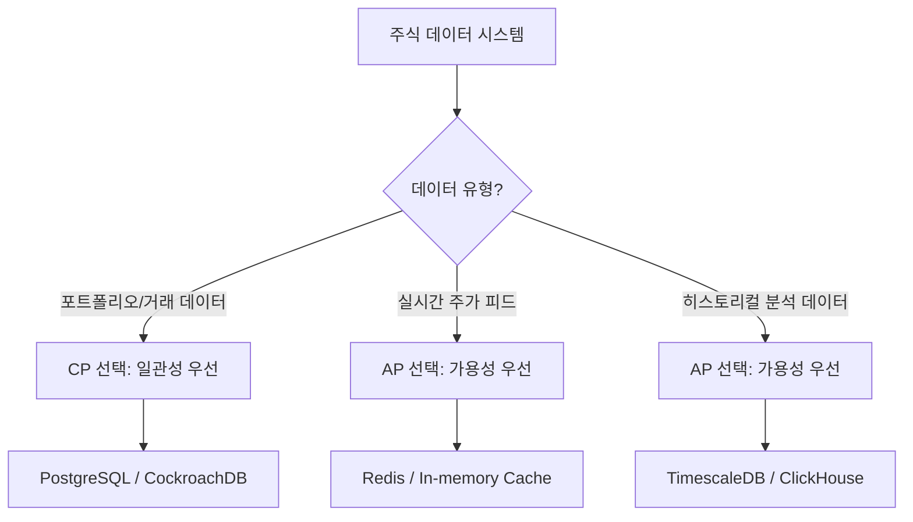
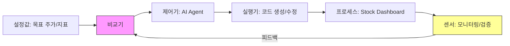
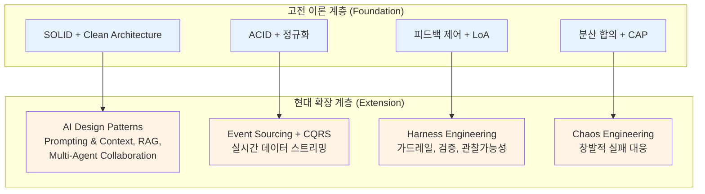

# Branch 5.2: Classical/Foundational Theory Analysis
## 주식 정보 모니터링 대시보드 AI Agentic Workflow 자동화 시스템

**분석 관점**: "수십 년 검증된 이론이 가장 신뢰할 수 있다."
**작성일**: 2026-03-27
**분석 대상**: 주식 정보 통합 대시보드 + AI 자동 구현 시스템 (2중 구조: AI Agent System + Stock Dashboard)

---

## 목차
1. [소프트웨어 공학의 고전 이론적 뿌리](#1-소프트웨어-공학의-고전-이론적-뿌리)
2. [데이터 관리의 고전 이론](#2-데이터-관리의-고전-이론)
3. [분산 시스템의 고전 이론](#3-분산-시스템의-고전-이론)
4. [자동화의 고전 이론](#4-자동화의-고전-이론)
5. [고전 이론의 검증](#5-고전-이론의-검증)
6. [고전 이론의 한계 인정](#6-고전-이론의-한계-인정)
7. [최종 결론](#7-최종-결론)

---

## 1. 소프트웨어 공학의 고전 이론적 뿌리

### 1.1 SOLID 원칙 (Robert C. Martin, 2000)

Robert C. Martin(Uncle Bob)이 2000년 논문 *"Design Principles and Design Patterns"* 에서 체계화하고, 이후 Michael Feathers가 SOLID라는 약어로 정리한 5대 객체지향 설계 원칙이다. 25년 이상 검증되어 현대 소프트웨어 아키텍처의 근간을 이루고 있다.

#### 원칙 상세와 본 시스템 적용

| 원칙 | 정의 | AI Agent System 적용 | Stock Dashboard 적용 |
|------|------|---------------------|---------------------|
| **SRP** (Single Responsibility) | 클래스는 변경의 이유가 하나뿐이어야 한다 | 각 에이전트가 단일 책임만 소유: 데이터 수집 에이전트, 분석 에이전트, UI 생성 에이전트를 분리. 시스템의 디버깅과 확장이 용이해진다 | 데이터 페칭 모듈, 차트 렌더링 모듈, 알림 모듈을 분리 |
| **OCP** (Open/Closed) | 확장에 열려 있고 수정에 닫혀 있어야 한다 | 새로운 데이터 소스(API)나 분석 전략 추가 시 기존 에이전트 코드 변경 없이 플러그인 방식으로 확장 | 새 차트 유형이나 지표 추가 시 기존 대시보드 코드 무변경 |
| **LSP** (Liskov Substitution) | 파생 클래스는 기반 클래스를 대체할 수 있어야 한다 | 모든 데이터 소스 에이전트가 동일 인터페이스 준수, 어떤 API 에이전트든 교체 가능 | 차트 컴포넌트 간 호환성 보장 |
| **ISP** (Interface Segregation) | 클라이언트에 불필요한 인터페이스 의존 금지 | 에이전트 간 통신 인터페이스를 최소화, 각 에이전트가 필요한 메서드만 노출 | 대시보드 위젯이 필요한 데이터 인터페이스만 구독 |
| **DIP** (Dependency Inversion) | 고수준 모듈이 저수준 모듈에 의존하지 않고, 추상에 의존 | Orchestrator가 구체적 API 클라이언트가 아닌 추상 DataProvider 인터페이스에 의존 | 뷰 레이어가 구체적 데이터 저장소가 아닌 추상 Repository에 의존 |

**현대적 적용 사례**: SOLID 원칙은 AI 에이전트 아키텍처에서 특히 중요하게 재조명되고 있다. Syncfusion(2025)의 분석에 따르면, SRP와 OCP를 따르면 "모듈형 컴포넌트가 실험을 지원하여 팀이 전체 시스템을 다시 작성하지 않고 부분을 교체할 수 있다." Multi-agent 시스템에서 각 에이전트에 단일 책임을 부여하면 시스템의 디버깅과 확장이 크게 용이해진다.

> **원저자/출처**: Robert C. Martin, *"Design Principles and Design Patterns"* (2000); Michael Feathers (SOLID 약어 제안)

---

### 1.2 Clean Architecture (Robert C. Martin, 2017)

Martin의 *Clean Architecture: A Craftsman's Guide to Software Structure and Design* (2017)은 Hexagonal Architecture(Alistair Cockburn, 2005), Onion Architecture(Jeffrey Palermo, 2008) 등 선행 아키텍처 사상을 통합한 것이다. 핵심 규칙은 **"소스 코드 의존성은 안쪽(고수준 정책)으로만 향해야 한다"** 는 것이다.

#### 본 시스템 적용

```
┌──────────────────────────────────────────────────────┐
│                   Frameworks & Drivers                │
│  (React Dashboard, WebSocket, REST API, DB Driver)   │
├──────────────────────────────────────────────────────┤
│              Interface Adapters                       │
│  (Controllers, Presenters, Gateways)                 │
├──────────────────────────────────────────────────────┤
│              Application Business Rules               │
│  (Use Cases: 주가 모니터링, 포트폴리오 분석,          │
│   에이전트 오케스트레이션)                             │
├──────────────────────────────────────────────────────┤
│              Enterprise Business Rules                │
│  (Entities: Stock, Portfolio, Agent, Workflow)        │
└──────────────────────────────────────────────────────┘
       ↑ 의존성 방향: 바깥 → 안쪽 (Dependency Rule)
```

**핵심 이점**:
- **프레임워크 독립성**: React에서 다른 프레임워크로 전환하더라도 비즈니스 로직 무변경
- **테스트 용이성**: Use Case를 UI, DB, 외부 API 없이 단독 테스트 가능
- **AI 에이전트 분리**: 에이전트 오케스트레이션 로직이 특정 LLM 프레임워크에 결합되지 않음

Martin은 "프레임워크는 유용한 도구이지만, 비즈니스 규칙을 프레임워크에 엄격히 결합하면 장기적으로 해를 끼칠 수 있다"고 경고하며, 이는 빠르게 변화하는 AI 프레임워크 생태계에서 특히 중요한 교훈이다.

> **원저자/출처**: Robert C. Martin, *Clean Architecture* (Prentice Hall, 2017)

---

### 1.3 Domain-Driven Design (Eric Evans, 2003)

Eric Evans의 *Domain-Driven Design: Tackling Complexity in the Heart of Software* (2003)는 복잡한 소프트웨어의 핵심은 도메인 모델에 있다는 사상을 체계화했다. Evans는 금융, 해운, 보험, 제조 자동화 등 복잡한 도메인에서의 실무 경험을 기반으로 이 방법론을 구축했다.

#### 핵심 개념과 본 시스템 적용

| DDD 개념 | 정의 | 본 시스템 적용 |
|----------|------|---------------|
| **Ubiquitous Language** | 개발자와 도메인 전문가가 공유하는 언어 | "종목(Ticker)", "호가(Bid/Ask)", "포트폴리오", "감시목록(Watchlist)" 등 주식 도메인 용어를 코드에 반영 |
| **Bounded Context** | 모델의 적용 범위를 명확히 한정 | AI Agent Context(워크플로우, 태스크, 에이전트)와 Stock Domain Context(주가, 지표, 포트폴리오)를 분리 |
| **Aggregate** | 일관성 경계를 가진 엔티티 클러스터 | Portfolio Aggregate(포트폴리오 + 보유종목 + 거래내역), WatchlistAggregate(감시목록 + 알림규칙) |
| **Domain Event** | 도메인에서 발생한 의미 있는 사건 | `StockPriceChanged`, `ThresholdBreached`, `WorkflowStepCompleted` |
| **Repository** | Aggregate 영속화 추상 | `StockRepository`, `PortfolioRepository` -- 저장소 기술 독립 |
| **Anti-Corruption Layer** | 외부 시스템과의 경계 보호 | 외부 주식 API(Yahoo Finance, Alpha Vantage 등)의 데이터 모델이 내부 도메인 모델을 오염시키지 않도록 변환 계층 구성 |

**금융 도메인에서의 검증**: Evans는 자신의 책에서 금융 거래 시스템 사례를 직접 다루었으며, "팀은 날카로운 도메인 모델 덕분에 반복적으로 정제하고 코드로 표현하면서 트레이더의 유연한 요구에 대응하고 역량을 확장할 수 있었다"고 기록하였다. 이 상승 궤적은 "반복적으로 정제되고 코드로 표현된 날카로운 도메인 모델에 직접 기인한다."

> **원저자/출처**: Eric Evans, *Domain-Driven Design: Tackling Complexity in the Heart of Software* (Addison-Wesley, 2003)

---

### 1.4 Design Patterns (Gang of Four, 1994)

Erich Gamma, Richard Helm, Ralph Johnson, John Vlissides가 공저한 *Design Patterns: Elements of Reusable Object-Oriented Software* (1994)는 소프트웨어 설계의 공통 어휘를 확립했다. 30년이 넘었지만 패턴의 정신은 AI 시대에도 살아있다.

#### 핵심 패턴과 본 시스템 적용

| 패턴 | 원래 의도 | AI Agent System 적용 | Stock Dashboard 적용 |
|------|----------|---------------------|---------------------|
| **Observer** | 객체 간 1:N 의존, 상태 변경 자동 통지 | 에이전트 간 이벤트 전파: 워크플로우 상태 변경 시 의존 에이전트에 자동 통지 | **핵심 패턴**: 주가 변경 시 모든 구독 위젯에 실시간 push. WebSocket 기반 pub-sub 구현의 이론적 근거 |
| **Strategy** | 알고리즘을 캡슐화하여 교체 가능 | 분석 전략을 교체 가능하게 설계: 이동평균, RSI, MACD 등 기술적 분석 전략을 플러그인으로 | 차트 렌더링 전략(캔들스틱, 라인, 바), 정렬 전략 교체 |
| **Command** | 요청을 객체로 캡슐화, 실행 취소 가능 | AI 에이전트의 모든 작업을 Command로 캡슐화 -- 실행 이력 추적, 롤백, 감사 로그 | 사용자 조작(필터 추가, 정렬 변경)을 Command로 기록, undo/redo 지원 |
| **Factory Method** | 객체 생성을 서브클래스에 위임 | 에이전트 팩토리: 태스크 유형에 따라 적절한 에이전트 인스턴스 생성 | 차트 팩토리: 데이터 유형에 따라 적절한 차트 컴포넌트 생성 |
| **Facade** | 복잡한 서브시스템에 단순 인터페이스 제공 | AI 시스템 전체를 단일 WorkflowFacade로 노출, 내부 복잡성 은닉 | 여러 API 소스를 하나의 StockDataFacade로 통합 |
| **Template Method** | 알고리즘 뼈대 정의, 세부 구현은 서브클래스에 | 에이전트 실행 파이프라인: 초기화 -> 데이터 수집 -> 처리 -> 결과 반환의 뼈대 고정, 각 단계 커스터마이징 가능 | 대시보드 위젯 렌더링 파이프라인 |

**현대적 진화**: InfoQ(2025. 5.)의 분석에 따르면, AI 시대에서 GoF 패턴은 새로운 형태로 진화하고 있다. Command 패턴은 "prompt-as-command" 설계로 발전하여 LLM 호출을 1급 작업(first-class operation)으로 취급하고, Strategy 패턴은 "창발적(emergent)" 전략으로 변모하여 LLM이 프롬프트 템플릿과 few-shot 예제를 기반으로 전략을 결정한다. AI 설계 패턴은 5가지 범주(Prompting & Context, Responsible AI, User Experience, AI-Ops, Optimization)로 재편되고 있다.

> **원저자/출처**: Erich Gamma, Richard Helm, Ralph Johnson, John Vlissides, *Design Patterns: Elements of Reusable Object-Oriented Software* (Addison-Wesley, 1994)

---

### 1.5 보조 원칙: DRY, KISS, YAGNI

이 세 원칙은 개별 저자보다 커뮤니티 합의로 성숙한 원칙이며, AI가 코드를 생성하는 시대에 더욱 중요해졌다.

| 원칙 | 기원 | 정의 | AI 코드 생성에서의 중요성 |
|------|------|------|--------------------------|
| **DRY** (Don't Repeat Yourself) | Andy Hunt & Dave Thomas, *The Pragmatic Programmer* (1999) | 모든 지식은 시스템 내에 단일하고 명확한 권위 있는 표현을 가져야 한다 | AI가 대량의 코드를 생성할 때 중복 로직이 산포되기 쉬움. 중복된 로직을 재사용 가능한 함수로 추출하도록 강제해야 한다 |
| **KISS** (Keep It Simple, Stupid) | Kelly Johnson, Lockheed Skunk Works (1960년대) | 불필요한 복잡성을 배제한다 | AI가 과도하게 추상화된 코드를 생성하는 경향을 억제. 직관적이고 이해하기 쉬운 로직을 우선시 |
| **YAGNI** (You Aren't Gonna Need It) | Ron Jeffries, Extreme Programming (1990년대) | 현재 필요하지 않은 기능은 구현하지 않는다 | AI가 잠재적 미래 요구를 위해 과도 설계하는 것을 방지 |

**긴장 관계**: DRY와 KISS는 때때로 충돌한다. DRY를 철저히 지키면 코드가 더 복잡해질 수 있고, YAGNI를 과도하게 적용하면 확장성을 잃을 수 있다. AI 에이전트 시스템 설계 시 이 원칙들 사이의 균형점을 의식적으로 찾아야 한다.

> **원저자/출처**: Andy Hunt & Dave Thomas, *The Pragmatic Programmer* (1999); Kelly Johnson (KISS, 1960s); Ron Jeffries, Extreme Programming (1990s)

---

## 2. 데이터 관리의 고전 이론

### 2.1 관계형 모델 (Edgar F. Codd, 1970)

Edgar Frank "Ted" Codd는 1970년 IBM 재직 중 *"A Relational Model of Data for Large Shared Data Banks"* 를 발표하며, 정보를 공통 특성에 기반하여 연결(관계)할 수 있는 테이블로 조직하는 관계형 모델을 제안했다. 이 이론은 55년이 넘도록 데이터 관리의 근간을 이루고 있다.

#### Codd의 12규칙과 본 시스템에의 함의

본 시스템이 관계형 데이터베이스를 주식 데이터 저장에 활용할 경우, Codd의 원칙은 다음과 같이 적용된다:

| 규칙 범주 | 주식 데이터 적용 |
|----------|-----------------|
| **정보 표현의 일관성** | 주가, 거래량, 재무제표 등 모든 데이터를 테이블의 행과 열로 일관되게 표현 |
| **보장된 접근** | 테이블명 + 기본키(종목코드 + 타임스탬프) + 열명의 조합으로 모든 데이터에 명확히 접근 |
| **NULL 값의 체계적 처리** | 상장 폐지 종목, 미공시 재무 데이터 등 결측치를 체계적으로 처리 |
| **뷰 갱신 가능성** | 대시보드가 참조하는 뷰(포트폴리오 요약, 업종별 통계)의 갱신 가능성 보장 |

#### 주식 데이터를 위한 스키마 설계 원칙

```
stocks (ticker PK, name, sector, exchange, listed_date)
    │
    ├── stock_prices (ticker FK, timestamp PK, open, high, low, close, volume)
    │
    ├── financial_statements (ticker FK, period PK, revenue, profit, eps, ...)
    │
    └── watchlist_items (user_id FK, ticker FK, threshold_high, threshold_low)
```

50년이 넘도록 관계형 데이터베이스 모델은 "세계가 데이터를 관리하고 분석하는 방식의 중심"으로 남아 있으며(Medium, 2025), 더 새로운 기술들도 "Codd가 옹호한 견고함, 일관성, 신뢰성에서 차용"하고 있다.

> **원저자/출처**: Edgar F. Codd, *"A Relational Model of Data for Large Shared Data Banks"*, Communications of the ACM, Vol. 13, No. 6 (1970)

---

### 2.2 ACID 속성 (Jim Gray, 1981 체계화)

ACID(Atomicity, Consistency, Isolation, Durability) 속성은 1981년 Jim Gray와 Andreas Reuter에 의해 체계화되었으며, 이후 Theo Haerder와 Andreas Reuter의 1983년 논문 *"Principles of Transaction-Oriented Database Recovery"* 에서 ACID라는 약어가 확립되었다. 40년 이상 트랜잭션 처리의 신뢰성을 보장해온 근본 원칙이다.

#### 주식 데이터 시스템에서의 ACID 적용

| 속성 | 정의 | 주식 시스템 적용 시나리오 |
|------|------|------------------------|
| **Atomicity** (원자성) | 트랜잭션은 전부 실행되거나 전부 취소 | 포트폴리오 리밸런싱: 매수+매도 주문이 부분 실행되면 안됨 |
| **Consistency** (일관성) | 트랜잭션 전후로 데이터베이스 무결성 규칙 유지 | 보유 주식 수 = 매수 총량 - 매도 총량 항등식 보존 |
| **Isolation** (격리성) | 동시 트랜잭션이 서로 간섭하지 않음 | 여러 사용자가 동시에 감시목록 수정 시 상호 간섭 방지 |
| **Durability** (지속성) | 커밋된 트랜잭션은 시스템 장애 후에도 유지 | 알림 설정, 포트폴리오 변경 사항이 서버 재시작 후에도 보존 |

**금융 시스템에서의 특별한 중요성**: 금융 기관에서는 ACID 준수가 규제 요건이자 사업 필수 조건이다. 관계형 데이터베이스가 "강력한 ACID 준수가 데이터 무결성에 필요한 응용 프로그램과 복잡한 트랜잭션 시스템에서 계속 지배적"인 이유이다.

> **원저자/출처**: Jim Gray & Andreas Reuter (1981 체계화); Theo Haerder & Andreas Reuter, *"Principles of Transaction-Oriented Database Recovery"*, ACM Computing Surveys (1983)

---

### 2.3 정규화 이론 (E.F. Codd, 1970; R. Boyce & E.F. Codd, 1974)

정규화 이론은 데이터 중복을 최소화하고 데이터 무결성을 강화하기 위한 체계적 과정이다.

#### 주식 데이터에 대한 정규화 수준 결정

| 정규형 | 요구사항 | 주식 시스템 적용 |
|--------|----------|-----------------|
| **1NF** | 원자적 값, 반복 그룹 없음 | 종목당 여러 지표를 별도 행으로 분리 |
| **2NF** | 부분 함수 종속 제거 | 종목 기본정보(이름, 섹터)를 가격 테이블에서 분리 |
| **3NF** | 이행적 종속 제거 | 업종-섹터 매핑을 별도 테이블로 독립, 비키 속성이 다른 비키 속성에 의존하지 않음 |
| **BCNF** | 모든 결정자가 후보키 | 복합 키를 가진 재무제표 데이터에서 중복 제거 |

**전략적 판단**: "대부분의 비즈니스 애플리케이션은 3NF 또는 BCNF에서 최적의 균형을 달성한다. 적합한 접근법은 구체적 요구에 따라 다르다: 데이터 무결성이 필요한 트랜잭션 시스템에는 완전 정규화를, 쿼리 성능이 중요한 읽기 위주 분석 애플리케이션에는 전략적 비정규화를 선택한다."

본 시스템의 경우:
- **트랜잭션성 데이터** (포트폴리오, 감시목록, 알림): **3NF** 이상으로 정규화 -- 데이터 무결성 우선
- **분석용 데이터** (히스토리컬 주가, 기술적 지표): 전략적 **비정규화** 허용 -- 읽기 성능 우선
- Journal of Information Systems 연구에 따르면, "적절히 정규화된 데이터베이스는 비정규화 대비 저장 요구량을 20-40% 줄인다"

> **원저자/출처**: Edgar F. Codd, 1NF-3NF (1970-1972); Raymond F. Boyce & Edgar F. Codd, BCNF (1974)

---

### 2.4 Event Sourcing & CQRS

Event Sourcing과 CQRS(Command Query Responsibility Segregation)는 Greg Young(2010년대 체계화)이 정립한 패턴으로, Bertrand Meyer의 CQS(Command Query Separation, 1988)에서 발전했다.

#### 금융 시스템에서의 검증된 적용

```
[명령(Write)] ──→ Event Store(Kafka) ──→ [이벤트 핸들러] ──→ [조회(Read) DB]
                        │                                        │
                   모든 상태 변경을                         대시보드가 참조하는
                   불변 이벤트로 기록                       최적화된 읽기 모델
```

**금융 서비스에서의 이점**:
- "은행은 막대한 거래량, 복잡한 워크플로우, 엄격한 규제 요건을 다루며; CQRS를 사용하면 무거운 리포팅 쿼리가 중요한 트랜잭션 처리를 지연시키지 않고, Event Sourcing은 계좌 생성부터 사기 경고까지 모든 상태 변경이 컴플라이언스와 분석을 위해 저장됨을 보장한다"
- 읽기와 쓰기 경로를 독립적으로 최적화 가능(쓰기에 SQL, 읽기에 NoSQL)
- 새로운 기능(분석, 리포팅) 추가가 핵심 비즈니스 로직 변경 없이 가능

**중요한 경고**: "결과적 일관성(eventual consistency)으로 인해 읽기 모델이 최근 변경사항을 반영하는 데 시간이 걸리며, 고도의 실시간 시스템(예: 주식 시장)에는 부적합할 수 있다." 따라서 본 시스템에서는 모니터링 대시보드(읽기 위주)에 CQRS를 적용하되, 실시간 가격 피드에는 별도의 직접 스트리밍 경로를 구성해야 한다.

> **원저자/출처**: Bertrand Meyer, CQS (1988); Greg Young, CQRS & Event Sourcing 체계화 (2010s)

---

## 3. 분산 시스템의 고전 이론

### 3.1 Leslie Lamport의 분산 시스템 이론

Leslie Lamport는 2013년 Turing Award 수상자로, "겉보기에 혼돈스러운 분산 컴퓨팅 시스템의 행동에 명확하고 잘 정의된 일관성을 부여"한 공로를 인정받았다.

#### 핵심 기여와 본 시스템 적용

**1) 논리적 시계(Logical Clocks, 1978)**

Lamport의 1978년 논문 *"Time, Clocks, and the Ordering of Events in a Distributed System"* 은 분산 시스템에서 이벤트 순서를 정의하는 방법을 제시했다.

- **적용**: 다수의 주식 API에서 동시에 데이터를 수집할 때, 이벤트의 인과적 순서(causal ordering)를 보장하여 "A API의 가격 업데이트가 B API보다 먼저 발생했는가?"를 정확히 판단
- **AI 에이전트 시스템**: 복수 에이전트가 병렬로 작업할 때 작업 완료 순서와 의존성을 논리적 시계로 추적

**2) Byzantine Generals Problem (1982)**

Lamport, Shostak, Pease의 1982년 논문에서 제시된 이 문제는 "시스템의 일부 컴포넌트가 고장났을 때, 올바른 작동에 필요한 합의에 도달하는 것을 다른 컴포넌트가 방해하는 실패에 대해 방어할 수 있는 능력"을 다룬다.

- **적용**: 여러 데이터 소스에서 상충하는 주가 정보가 도착할 때, 다수결이나 가중 합의를 통해 정확한 가격을 결정
- **AI 에이전트 시스템**: 하나의 에이전트가 오류를 발생시키더라도 전체 워크플로우가 실패하지 않도록 내결함성 설계

**3) Paxos 합의 알고리즘 (1989/1998)**

Paxos는 "네트워크 지연, 노드 장애, 메시지 손실에도 불구하고 분산 시스템에서 합의를 달성하기 위해 Leslie Lamport가 개발한 프로토콜 계열"이다. Prepare -> Promise -> Accept 3단계로 운영된다.

- **실무 적용**: Google의 Chubby 시스템과 Apache ZooKeeper가 Paxos 기반 상태 머신 복제를 외부 서비스로 제공. Azure Storage가 "분산 저장 시스템 전체에서 일관성을 관리하고 쓰기 작업이 모든 복제본에 안정적으로 전파되도록" Paxos를 사용.

> **원저자/출처**: Leslie Lamport, *"Time, Clocks, and the Ordering of Events in a Distributed System"* (1978); Lamport, Shostak, Pease, *"The Byzantine Generals Problem"* (1982); Leslie Lamport, *"The Part-Time Parliament"* (Paxos, 1998)

---

### 3.2 CAP 정리 (Eric Brewer, 1998-2002)

UC Berkeley의 Eric Brewer가 1998년 가을에 처음 제시하고, 2000년 PODC 심포지엄에서 추측으로 발표하였으며, 2002년 MIT의 Seth Gilbert와 Nancy Lynch가 형식적으로 증명하여 정리로 확립되었다.

#### 핵심 내용

분산 데이터 저장소는 다음 세 가지를 **동시에 모두** 보장할 수 없다:
- **Consistency** (일관성): 모든 읽기가 가장 최근의 쓰기를 반환
- **Availability** (가용성): 모든 요청이 (오류가 아닌) 응답을 받음
- **Partition Tolerance** (분할 내성): 네트워크 파티션 상황에서도 시스템이 작동

네트워크 파티션은 불가피하므로, 실질적 선택은 **CP(일관성 + 분할 내성)** vs **AP(가용성 + 분할 내성)** 이다.

#### 주식 모니터링 대시보드에서의 전략적 선택



**Brewer의 후속 관점**: "일관성과 가용성 사이의 트레이드오프는 네트워크가 파티션된 경우에만 고려하면 된다 -- 네트워크가 파티션되지 않은 시점에서는 시스템이 일관성과 가용성 모두를 가질 수 있다." 이 정밀한 이해는 주식 시스템에 특히 중요하다: 정상 작동 시에는 두 속성 모두 유지하면서, 파티션 시나리오에 대한 대비 전략을 수립해야 한다.

> **원저자/출처**: Eric Brewer, CAP Conjecture (2000 PODC); Seth Gilbert & Nancy Lynch, *"Brewer's Conjecture and the Feasibility of Consistent, Available, Partition-Tolerant Web Services"* (2002)

---

### 3.3 Raft 합의 알고리즘 (Ongaro & Ousterhout, 2014)

Diego Ongaro와 John Ousterhout가 2014년 *"In Search of an Understandable Consensus Algorithm"* 에서 발표한 Raft는 Paxos와 동등한 내결함성과 성능을 제공하면서 이해하기 쉽게 설계되었다.

**Paxos vs Raft 핵심 차이**: "두 알고리즘 모두 분산 합의에 매우 유사한 접근법을 취하며, 주로 리더 선출 방식에서 차이가 있다. Raft는 최신 로그를 가진 서버만 리더가 될 수 있도록 허용하는 반면, Paxos는 어떤 서버든 리더가 될 수 있되 이후 로그를 갱신하도록 요구한다."

**본 시스템에서의 실용적 선택**: Raft의 이해 용이성은 AI 에이전트 시스템의 상태 관리에 적합하다. 복수 에이전트 인스턴스 간의 리더 선출, 설정 동기화, 장애 복구에 Raft 기반 서비스(etcd, Consul)를 활용할 수 있다.

> **원저자/출처**: Diego Ongaro & John Ousterhout, *"In Search of an Understandable Consensus Algorithm"* (Stanford, 2014)

---

## 4. 자동화의 고전 이론

### 4.1 자동화 수준 이론 (Sheridan & Verplank, 1978)

Thomas B. Sheridan과 William L. Verplank이 1978년 MIT에서 발표한 자동화 수준(Levels of Automation) 이론은 인간-기계 상호작용에서 자동화의 정도를 0부터 10까지 11단계로 분류했다. 이 이론은 자동화 수준 분류의 최초이자 가장 오래 검증된 프레임워크이다.

#### 11단계 척도와 AI 에이전트 시스템 매핑

| LoA | Sheridan-Verplank 정의 | AI Agent System 매핑 | 본 시스템 적용 |
|-----|------------------------|---------------------|---------------|
| 1 | 컴퓨터가 대안을 제시하지 않음 | 수동 코딩 | 해당 없음 |
| 2 | 컴퓨터가 대안을 제시 | AI가 코드 제안 (Copilot) | 주식 분석 제안 |
| 3 | 대안의 범위를 좁힘 | AI가 최적 해결책 추천 | 투자 전략 추천 |
| 4 | 하나의 대안을 제안 | AI가 단일 구현안 제시 | 대시보드 레이아웃 자동 제안 |
| 5 | 인간이 동의하면 실행 | **Human-in-the-loop** | **워크플로우 승인 모드**: AI가 실행 계획을 수립하고 사용자 승인 후 실행 |
| 6 | 인간에게 거부할 시간을 줌 | 자동 실행 + 취소 가능 | 자동 알림 발송 전 유예 시간 제공 |
| 7 | 자동 실행 후 인간에게 통보 | AI 자동 실행 + 보고 | **Autopilot 모드**: 워크플로우 자동 실행 후 결과 보고 |
| 8 | 인간이 요청하면 통보 | 요청 시에만 보고 | 백그라운드 모니터링, 이상 감지 시에만 알림 |
| 9 | 인간에게 통보할지도 결정 | 완전 자율 + 선별 보고 | AI가 중요도 판단하여 선별 알림 |
| 10 | 인간 개입 완전 배제 | 완전 자율 시스템 | 위험: 블랙박스화 |

#### 신뢰 보정(Trust Calibration) 문제

"적절히 보정된 신뢰는 인간-자동화 상호작용에서 인간 오류를 최소화하는 데 필수적이다." 신뢰 보정은 SDT(Signal Detection Theory)를 사용하여 평가할 수 있으며, 운영자 반응을 히트, 미스, 오경보, 정확 거부로 분류한다.

**본 시스템에서의 함의**:
- **과잉 신뢰(Over-trust)**: AI 에이전트의 모든 추천을 무비판적으로 수용 -> 오류 전파 위험
- **과소 신뢰(Under-trust)**: AI의 유효한 분석도 무시 -> 자동화 이점 상실
- **최적 전략**: LoA 5-7 범위에서 운영하며, 중요 의사결정(코드 배포, 아키텍처 변경)에는 LoA 5(인간 승인), 반복 작업(데이터 수집, 차트 업데이트)에는 LoA 7(자동 실행 + 보고)을 적용

> **원저자/출처**: Thomas B. Sheridan & William L. Verplank, *"Human and Computer Control of Undersea Teleoperators"*, MIT Man-Machine Systems Laboratory (1978)

---

### 4.2 사이버네틱스와 피드백 제어 이론 (Norbert Wiener, 1948)

Norbert Wiener는 1948년 *Cybernetics: Or Control and Communication in the Animal and the Machine* 에서 사이버네틱스를 창시했다. Wiener는 "모든 지능적 행동이 기계로 시뮬레이션할 수 있는 피드백 메커니즘의 결과"라고 이론화한 최초의 학자 중 한 명이며, 이는 "현대 인공지능 개발을 향한 중요한 초기 단계"였다.

#### 피드백 루프 이론과 본 시스템 적용



| 사이버네틱스 개념 | 현대적 대응 | 본 시스템 적용 |
|------------------|-----------|---------------|
| **음의 피드백(Negative Feedback)** | 오류 수정 루프 | 대시보드 성능 지표가 목표치에 미달하면 AI 에이전트가 자동으로 최적화 코드 생성 |
| **양의 피드백(Positive Feedback)** | 강화 학습 보상 | 사용자가 유용하다고 평가한 기능 패턴을 강화하여 유사 기능 자동 생성 |
| **항상성(Homeostasis)** | 시스템 안정성 유지 | API 응답 지연, 데이터 오류 등 외란(disturbance)에 대해 자동 복구 |
| **적응(Adaptation)** | 자기 개선 시스템 | 시장 변동성에 따라 대시보드 갱신 빈도 자동 조정 |

**현대적 검증**: "Wiener의 피드백 루프에 대한 통찰은 신경망 기반 딥러닝 회로와 인공지능 자체의 이론적 기초 일부를 형성한다." 강화 학습은 "피드백 루프, 적응적 제어 등 사이버네틱스의 원리가 현대 머신러닝 프레임워크에 어떻게 통합되는지를 예시한다."

자율 로보틱스, 시스템 생물학, AI 윤리에서 사이버네틱스 개념이 새 생명을 얻고 있으며, "피드백과 제어에 대한 연구는 복잡한 환경에서 안전하고 적응적이며 지능적으로 작동해야 하는 기술을 설계하는 방식을 계속 형성하고 있다."

> **원저자/출처**: Norbert Wiener, *Cybernetics: Or Control and Communication in the Animal and the Machine* (MIT Press, 1948)

---

## 5. 고전 이론의 검증

### 5.1 검증 기간과 견고성 평가

| 이론/원칙 | 원저자 | 발표년도 | 검증 기간 | 기본 원칙의 견고성 | 최신 기술과의 관계 |
|----------|--------|---------|----------|-------------------|-------------------|
| 관계형 모델 | Edgar F. Codd | 1970 | **56년** | 매우 견고 | 조화: NoSQL/NewSQL이 보완, 대체 아님 |
| 사이버네틱스/피드백 이론 | Norbert Wiener | 1948 | **78년** | 매우 견고 | 조화: RL, 자율 시스템의 이론적 기초 |
| Sheridan-Verplank LoA | Sheridan & Verplank | 1978 | **48년** | 견고 | 조화: AI 자율성 수준 결정의 기초 |
| ACID 속성 | Gray & Reuter | 1981 | **45년** | 매우 견고 | 조화: 분산 트랜잭션에서 BASE와 공존 |
| Byzantine Generals | Lamport et al. | 1982 | **44년** | 매우 견고 | 조화: 블록체인, BFT 합의의 이론적 근간 |
| GoF Design Patterns | Gamma et al. | 1994 | **32년** | 견고 (진화 중) | 조화: AI 패턴으로 확장, 정신 유지 |
| DRY/KISS/YAGNI | Hunt, Thomas 등 | 1960s-1999 | **27-66년** | 매우 견고 | 조화: AI 코드 생성에서 더욱 중요 |
| SOLID 원칙 | Robert C. Martin | 2000 | **26년** | 매우 견고 | 조화: 에이전트 아키텍처에 직접 적용 |
| DDD | Eric Evans | 2003 | **23년** | 매우 견고 | 조화: 마이크로서비스와 자연스러운 결합 |
| Clean Architecture | Robert C. Martin | 2017 | **9년** | 견고 | 조화: AI 프레임워크 독립성에 필수 |
| Raft | Ongaro & Ousterhout | 2014 | **12년** | 견고 | 조화: etcd, Consul 등 실무 표준 |
| CAP 정리 | Eric Brewer | 2000 | **26년** | 매우 견고 | 조화: 분산 시스템 설계의 필수 고려사항 |

### 5.2 공통적 발견

1. **기본 원칙은 불변한다**: 관계형 모델의 데이터 정합성, 피드백 제어의 자기 조정, SOLID의 모듈성과 교체 가능성 -- 이 핵심 원리는 기술 패러다임이 바뀌어도 유효하다.

2. **구현 형태만 진화한다**: Observer 패턴은 WebSocket pub-sub으로, Command 패턴은 prompt-as-command로, Paxos는 Raft로 진화했지만, 근본 아이디어(느슨한 결합, 요청 객체화, 합의 도달)는 동일하다.

3. **검증 기간이 길수록 더 신뢰할 수 있다**: 78년 된 사이버네틱스부터 9년 된 Clean Architecture까지, 오래된 이론일수록 더 다양한 환경에서 검증되었다.

---

## 6. 고전 이론의 한계 인정

### 6.1 고전 이론이 풀 수 없는 현대적 문제들

| 한계 영역 | 구체적 문제 | 고전 이론의 부족한 점 | 필요한 보완 |
|----------|-----------|---------------------|------------|
| **비결정적 행동** | LLM 기반 에이전트는 동일 입력에 다른 출력을 생성 | SOLID, Design Patterns 등은 결정론적 시스템을 가정 | **Harness Engineering**: 제약, 도구, 피드백 루프, 검증 시스템으로 비예측적 AI를 안내하는 신흥 분야 |
| **컨텍스트 윈도우 한계** | AI 에이전트의 입력 정보량이 커지면 주의력이 저하 | 전통적 메모리 모델(변수, DB)과 근본적으로 다름 | 컨텍스트 보존 시스템, 메모리 계층 설계 |
| **창발적 실패(Emergent Failure)** | "다중 에이전트 아키텍처는 개별 에이전트의 한계를 증폭시키는 복잡한 상호작용 역학을 도입, 예측과 진단이 어려운 창발적 실패를 야기" | 전통적 테스팅/디버깅 방법론으로는 불충분 | 관찰 가능성(observability) 강화, 카오스 엔지니어링 |
| **장기 수행 태스크의 엔트로피** | "에이전트는 여전히 장기 실행 태스크에서 구조화된 가드레일 없이는 드리프트하거나 잔해(cruft)를 축적하거나 실패한다" | 전통적 소프트웨어는 실행 경로가 명시적 | 구조화된 가드레일, 체크포인트 시스템, 자동 복구 |
| **확률적 의사결정** | AI의 출력이 확률 분포를 따르므로 전통적 테스팅(입력-출력 매핑)이 불완전 | "기호적 AI 에이전트가 명시적으로 정의된 세계 모델과 탐색 기반 계획에 의존하는 것과 달리, LLM 기반 코딩 에이전트는 확률적, 언어 구동 방식으로 작동" | 통계적 테스팅, A/B 테스팅, 가드레일 + 사후 검증 |

### 6.2 대응 전략: 고전 + 현대의 하이브리드 접근



**핵심 원칙**: 고전 이론을 기초(foundation)로 두고, 그 위에 현대적 확장을 레이어링한다. 고전 이론을 버리는 것이 아니라, 그 범위를 확장한다.

구체적으로:
1. **SOLID + AI Design Patterns**: 에이전트의 SRP를 유지하면서 prompt-as-command, reflection loops 등 AI 고유 패턴을 결합
2. **ACID + Event Sourcing**: 트랜잭션 무결성은 ACID로 보장하면서, 이벤트 히스토리는 Event Sourcing으로 보존
3. **피드백 제어 + Harness Engineering**: Wiener의 피드백 루프 원리 위에 AI 특화 가드레일과 검증 시스템을 구축
4. **분산 합의 + Chaos Engineering**: Lamport의 합의 이론 위에 현대적 장애 주입과 복원력 테스팅을 추가

---

## 7. 최종 결론

### 7.1 종합 평가

| 평가 항목 | 결과 |
|----------|------|
| **이론적 확실성** | **9/10** -- 모든 고전 이론이 수십 년간 실무에서 검증되었으며, 본 시스템의 두 축(AI Agent + Stock Dashboard) 모두에 명확한 적용점이 존재한다. 1점 감점은 AI 에이전트의 비결정적 특성에 고전 이론만으로 대응하기 어려운 영역이 존재하기 때문이다. |
| **불변 원칙이 미래에도 유효할 가능성** | **매우 높음** -- 관계형 모델(56년), 피드백 제어(78년), SOLID(26년) 등의 핵심 원리는 구현 기술이 변해도 유효하다. 이 원칙들은 "무엇을 해야 하는가"가 아니라 "어떤 속성을 보장해야 하는가"를 정의하기 때문이다. |
| **팀이 실무에 적용할 수 있는가?** | **Yes** -- 모든 이론이 구체적 구현 지침을 동반한다. SOLID은 에이전트 분리 설계로, CAP은 데이터 저장소 선택으로, LoA는 자동화 수준 결정으로 직접 연결된다. |
| **이론에 근거한 구현 안정성** | **매우 안정적** -- 고전 이론이 제공하는 구조적 견고함(데이터 무결성, 모듈성, 내결함성, 피드백 제어) 위에 현대적 확장을 레이어링하면, AI 에이전트 시스템의 비예측성을 효과적으로 제어할 수 있다. |

### 7.2 본 시스템을 위한 이론적 아키텍처 청사진

```
┌─────────────────────────────────────────────────────────────┐
│                    사용자 인터페이스 계층                      │
│    Stock Dashboard (Observer Pattern, WebSocket Pub-Sub)     │
├─────────────────────────────────────────────────────────────┤
│                   응용 서비스 계층                            │
│    AI Agent Orchestration (LoA 5-7, Feedback Control)       │
│    Use Cases: 모니터링, 분석, 알림, 워크플로우 실행           │
├─────────────────────────────────────────────────────────────┤
│                   도메인 계층 (DDD)                           │
│    Bounded Contexts: Stock Domain | Agent Domain             │
│    Aggregates: Portfolio, Watchlist, Workflow, Agent          │
│    Domain Events: PriceChanged, ThresholdBreached            │
├─────────────────────────────────────────────────────────────┤
│                  인프라스트럭처 계층                           │
│    Data: ACID (PostgreSQL) + Event Store (Kafka)             │
│    Consensus: Raft (etcd) for Agent Coordination             │
│    CAP Strategy: CP(거래) / AP(실시간 피드)                   │
│    Normalization: 3NF(트랜잭션) / 비정규화(분석)              │
└─────────────────────────────────────────────────────────────┘
    ↕ 의존성 방향: Clean Architecture Dependency Rule
    ↕ 설계 원칙: SOLID + DRY + KISS + YAGNI
    ↕ 내결함성: Byzantine Fault Tolerance 원리
    ↕ 자동화 제어: Sheridan-Verplank LoA + Wiener Feedback
```

### 7.3 핵심 참고 자료 목록

| 번호 | 원저자 | 저서/논문 | 발표년도 | 핵심 기여 |
|------|--------|----------|---------|----------|
| 1 | Norbert Wiener | *Cybernetics: Or Control and Communication in the Animal and the Machine* | 1948 | 피드백 제어 이론, AI의 이론적 선구 |
| 2 | Edgar F. Codd | *"A Relational Model of Data for Large Shared Data Banks"* | 1970 | 관계형 데이터베이스 이론의 초석 |
| 3 | Leslie Lamport | *"Time, Clocks, and the Ordering of Events in a Distributed System"* | 1978 | 분산 시스템 이벤트 순서화 |
| 4 | Thomas B. Sheridan & William L. Verplank | *"Human and Computer Control of Undersea Teleoperators"* | 1978 | 자동화 수준 11단계 분류 |
| 5 | Jim Gray & Andreas Reuter | ACID 속성 체계화 | 1981 | 트랜잭션 신뢰성 보장 원칙 |
| 6 | L. Lamport, R. Shostak, M. Pease | *"The Byzantine Generals Problem"* | 1982 | 분산 시스템 내결함성 이론 |
| 7 | Theo Haerder & Andreas Reuter | *"Principles of Transaction-Oriented Database Recovery"* | 1983 | ACID 약어 확립 |
| 8 | Bertrand Meyer | CQS (Command Query Separation) | 1988 | 명령-조회 분리 원칙 |
| 9 | E. Gamma, R. Helm, R. Johnson, J. Vlissides | *Design Patterns: Elements of Reusable Object-Oriented Software* | 1994 | 23개 소프트웨어 설계 패턴 표준화 |
| 10 | Leslie Lamport | *"The Part-Time Parliament"* (Paxos) | 1998 | 분산 합의 알고리즘 |
| 11 | Andy Hunt & Dave Thomas | *The Pragmatic Programmer* | 1999 | DRY 원칙 |
| 12 | Robert C. Martin | *"Design Principles and Design Patterns"* | 2000 | SOLID 원칙 체계화 |
| 13 | Eric Brewer / S. Gilbert & N. Lynch | CAP Conjecture / 형식적 증명 | 2000/2002 | 분산 시스템의 근본적 트레이드오프 |
| 14 | Eric Evans | *Domain-Driven Design: Tackling Complexity in the Heart of Software* | 2003 | 복잡한 도메인 모델링 방법론 |
| 15 | Diego Ongaro & John Ousterhout | *"In Search of an Understandable Consensus Algorithm"* (Raft) | 2014 | 이해 가능한 합의 알고리즘 |
| 16 | Robert C. Martin | *Clean Architecture: A Craftsman's Guide to Software Structure and Design* | 2017 | 프레임워크 독립적 아키텍처 원칙 |

### 7.4 최종 소견

> 수십 년 검증된 고전 이론은 본 시스템의 **구조적 골격**을 제공한다. 이 골격 없이 현대 AI 기술만으로 시스템을 구축하는 것은 기초 없이 건물을 세우는 것과 같다. 반대로, 고전 이론만으로 AI 에이전트의 비결정적 특성에 대응하는 것은 불가능하므로, 고전 이론 위에 현대적 확장(Harness Engineering, AI Design Patterns, Chaos Engineering)을 레이어링하는 **하이브리드 접근**이 최적이다.
>
> 특히 금융 데이터를 다루는 본 시스템에서 ACID의 데이터 무결성, CAP의 전략적 트레이드오프, Byzantine Fault Tolerance의 내결함성은 선택이 아닌 필수이다. 이 이론들은 "왜 이렇게 설계해야 하는가"에 대한 수학적으로 증명된 답을 제공한다.

---

## Sources

- [SOLID Principles by Robert C. Martin (GitHub Gist)](https://gist.github.com/OddExtension5/5590a2a8197a31aa3bf1d4ca3ee20f83)
- [SOLID Principles from the Perspective of Robert C. Martin (Medium)](https://medium.com/@hosein.molaei3/solid-principles-from-the-perspective-of-robert-c-martin-1dca4d091aef)
- [Applying SOLID Principles to Agentic Application Design (Medium)](https://medium.com/@sharath.mech/applying-solid-principles-to-agentic-application-design-71d2039c13e0)
- [How to Apply SOLID Principles in AI Development Using Prompt Engineering (Syncfusion)](https://www.syncfusion.com/blogs/post/solid-principles-ai-development)
- [Designing Multi-Agent Intelligence (Microsoft Developer Blog)](https://developer.microsoft.com/blog/designing-multi-agent-intelligence)
- [Why SOLID principles are still the foundation for modern software architecture (Stack Overflow)](https://stackoverflow.blog/2021/11/01/why-solid-principles-are-still-the-foundation-for-modern-software-architecture/)
- [Clean Architecture by Robert C. Martin (Amazon)](https://www.amazon.com/Clean-Architecture-Craftsmans-Software-Structure/dp/0134494164)
- [Summary of Clean Architecture (GitHub Gist)](https://gist.github.com/ygrenzinger/14812a56b9221c9feca0b3621518635b)
- [Domain-Driven Design by Eric Evans (Amazon)](https://www.amazon.com/Domain-Driven-Design-Tackling-Complexity-Software/dp/0321125215)
- [bliki: Domain Driven Design (Martin Fowler)](https://martinfowler.com/bliki/DomainDrivenDesign.html)
- [The Gang of Four Gave Us 23 Design Patterns... Are They Still Relevant in 2025? (Medium)](https://medium.com/@freddy.dordoni/the-gang-of-four-gave-us-23-design-patterns-are-they-still-relevant-in-2025-f2e999c384c0)
- [Design Patterns After the Singularity: Rethinking the Gang of Four for an AI-Driven Stack (DEV Community)](https://dev.to/tawe/design-patterns-after-the-singularity-rethinking-the-gang-of-four-for-an-ai-driven-stack-462e)
- [Beyond the Gang of Four: Practical Design Patterns for Modern AI Systems (InfoQ)](https://www.infoq.com/articles/practical-design-patterns-modern-ai-systems/)
- [Edgar F. Codd (IBM History)](https://www.ibm.com/history/edgar-codd)
- [A Relational Model of Data for Large Shared Data Banks (Codd, 1970 - Original Paper)](https://www.seas.upenn.edu/~zives/03f/cis550/codd.pdf)
- [50 Years of Codd's Rules: Transforming Data Management (Medium)](https://medium.com/itversity/50-years-of-codds-rules-transforming-data-management-and-the-global-economy-7745b6708fc3)
- [CAP Theorem (Wikipedia)](https://en.wikipedia.org/wiki/CAP_theorem)
- [CAP Theorem and Its Implications - Distributed Systems Data Consistency (Oboe)](https://oboe.com/learn/distributed-systems-data-consistency-in-2025-1pb8iys/cap-theorem-and-its-implications-2)
- [What Is the CAP Theorem? (IBM)](https://www.ibm.com/think/topics/cap-theorem)
- [Perspectives on the CAP Theorem (Gilbert & Lynch, MIT)](https://groups.csail.mit.edu/tds/papers/Gilbert/Brewer2.pdf)
- [Leslie Lamport - A.M. Turing Award Laureate](https://amturing.acm.org/award_winners/lamport_1205376.cfm)
- [The Writings of Leslie Lamport](https://lamport.azurewebsites.net/pubs/pubs.html)
- [The Byzantine Generals Problem (Lamport, 1982 - Original Paper)](https://lamport.azurewebsites.net/pubs/byz.pdf)
- [Half a Century of Distributed Byzantine Fault-Tolerant Consensus (arXiv, 2024)](https://arxiv.org/html/2407.19863v3)
- [In Search of an Understandable Consensus Algorithm (Raft Paper)](https://raft.github.io/raft.pdf)
- [Paxos vs Raft: Have we reached consensus on distributed consensus? (Cambridge)](https://www.repository.cam.ac.uk/bitstreams/14f1d94c-6022-4ef6-9175-33be465b80c0/download)
- [Levels of Automation (Sheridan & Verplank, 1978 - ResearchGate)](https://www.researchgate.net/figure/Levels-of-Automation-From-Sheridan-Verplank-1978_tbl1_235181550)
- [The Role of Trust in Human-Robot Interaction (Springer)](https://link.springer.com/chapter/10.1007/978-3-319-64816-3_8)
- [From Cybernetics to AI: the Pioneering Work of Norbert Wiener (Max Planck Neuroscience)](https://maxplanckneuroscience.org/from-cybernetics-to-ai-the-pioneering-work-of-norbert-wiener/)
- [Return of cybernetics (Nature Machine Intelligence)](https://www.nature.com/articles/s42256-019-0100-x)
- [From Cybernetics to Machine Learning: Evolution of Self-Regulating Systems (Quantum Zeitgeist)](https://quantumzeitgeist.com/from-cybernetics-to-machine-learning-the-evolution-of-self-regulating-systems/)
- [Vibe Coding Principles: DRY, KISS, YAGNI & Beyond (Synaptic Labs)](https://blog.synapticlabs.ai/what-are-dry-kiss-yagni-programming-principles)
- [Observer Pattern Stock Market Notification System (Tech Edu Byte)](https://www.techedubyte.com/observer-pattern-stock-market-notifications/)
- [Event Sourcing, CQRS and Micro Services: Real FinTech Example (Medium)](https://lukasniessen.medium.com/this-is-a-detailed-breakdown-of-a-fintech-project-from-my-consulting-career-9ec61603709c)
- [CQRS and Event Sourcing in Financial Systems (Mavidev/Medium)](https://medium.com/@mavidev/cqrs-and-event-sourcing-in-financial-systems-when-and-how-to-use-them-a18b651c16ae)
- [CQRS & Event Sourcing in Financial Services (Icon Solutions)](https://iconsolutions.com/blog/cqrs-event-sourcing)
- [Building a Stock Trading System: HFT Architecture (DEV Community)](https://dev.to/sgchris/building-a-stock-trading-system-high-frequency-trading-architecture-e2f)
- [Algorithmic Trading System Architecture (Turing Finance)](https://www.turingfinance.com/algorithmic-trading-system-architecture-post/)
- [AI Agents: Evolution, Architecture, and Real-World Applications (arXiv)](https://arxiv.org/html/2503.12687v1)
- [Harness Engineering in 2026 (Agent Engineering)](https://www.agent-engineering.dev/article/harness-engineering-in-2026-the-discipline-that-makes-ai-agents-production-ready)
- [Google Cloud: Choose a design pattern for your agentic AI system](https://docs.cloud.google.com/architecture/choose-design-pattern-agentic-ai-system)
- [Database Normalization (DigitalOcean)](https://www.digitalocean.com/community/tutorials/database-normalization)
- [Event Sourcing pattern (Microsoft Azure Architecture Center)](https://learn.microsoft.com/en-us/azure/architecture/patterns/event-sourcing)
- [Event-Driven Architecture in Finance and Banking (Confluent)](https://www.confluent.io/blog/event-driven-architecture-powers-finance-and-banking/)
