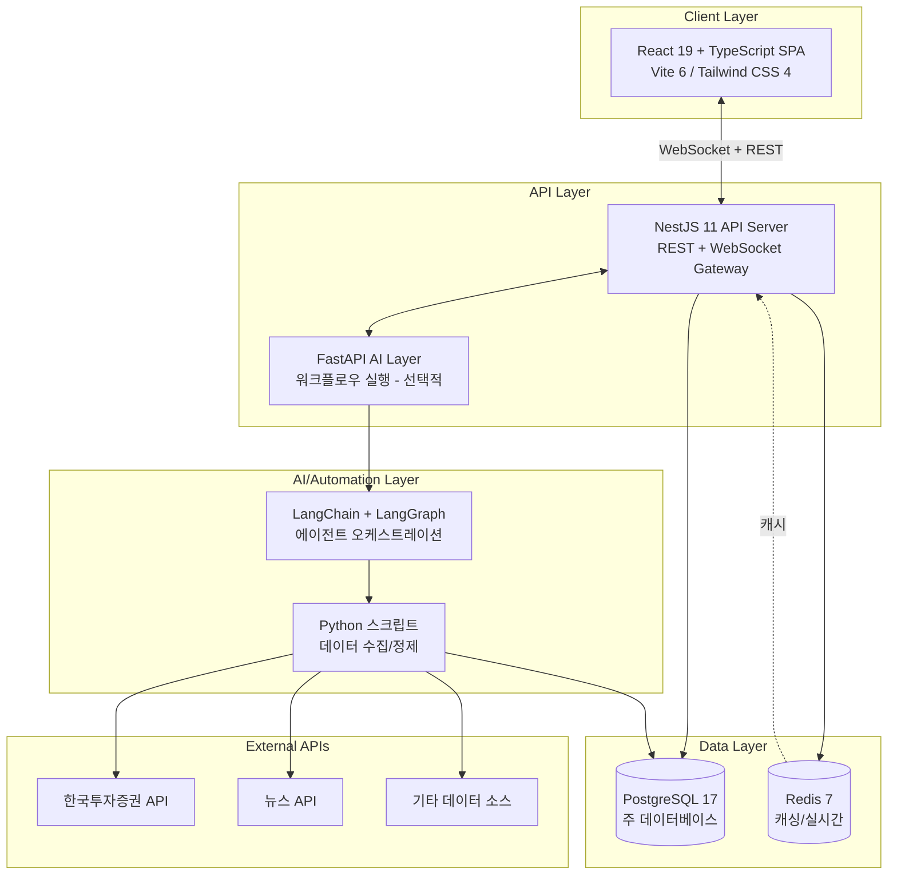

# Branch 1.2: Conservative Tech Stack Analysis
## "검증된 기술이 우리를 생존시킨다. 안정성이 최우선이다."

**분석 관점**: 검증되고 안정적인 기술을 중시하는 기술 분석가
**분석 대상**: 주식 정보 모니터링 대시보드를 자동 구현하는 AI Agentic Workflow Automation System
**분석 일자**: 2026-03-27

---

## 1. 업계 표준 기술/프레임워크 분석 (5년 이상 사용)

### 1.1 AI/Automation Layer

#### LangChain + LangGraph (2022~ / 4년)

| 항목 | 상세 |
|------|------|
| **엔터프라이즈 채택도** | Fortune 500 제조기업 포함, 57%의 응답 조직이 에이전트를 프로덕션에 운용 중 (State of Agent Engineering 2026) |
| **안정성 기록** | 아직 4년차로 5년 미만이나, LangGraph가 2025년 5월 GA 이후 급속히 안정화. 94%의 프로덕션 에이전트가 observability를 갖추고 있음 |
| **주요 이슈** | 품질(Quality)이 가장 큰 장벽 — 1/3의 응답자가 정확성/일관성을 1차 블로커로 지목 |
| **LTS/보안** | LangChain Inc. 기업 후원. 활발한 릴리스 주기. 그러나 전통적 LTS 모델 부재 |

**보수적 관점 평가**: LangGraph는 복잡한 에이전트 워크플로우에서 가장 전투 검증된(battle-tested) 프레임워크이며, 대안 대비 30-40% 낮은 레이턴시를 보인다. 그러나 4년차 프레임워크라는 한계가 있으므로, Python 표준 라이브러리와 조합하여 탈출구를 확보해야 한다.

**대안 비교**:
- **CrewAI**: Series A 확보, Time-to-Production 40% 빠르지만 모니터링 도구 미성숙
- **AutoGen (Microsoft)**: 기업 후원 가장 강력하나 maintenance mode 전환 중
- **결론**: LangGraph가 stateful 프로덕션 시스템 기준 가장 안정적

#### Python (1991~ / 35년)

| 항목 | 상세 |
|------|------|
| **엔터프라이즈 채택도** | 금융권 퀀트/자동화 사실상 표준. 한국투자증권 Open API, 키움증권 API 모두 Python SDK 제공 |
| **안정성 기록** | 35년간 검증. AI/ML 생태계 독보적 |
| **LTS/보안** | Python 3.12+ LTS. 보안 패치 정기 릴리스 |

**보수적 관점 평가**: 의심의 여지가 없는 선택. AI/자동화 + 금융 데이터 처리의 교차점에서 유일무이한 언어.

---

### 1.2 Frontend

#### React + TypeScript (React: 2013~ / 13년, TypeScript: 2012~ / 14년)

| 항목 | 상세 |
|------|------|
| **엔터프라이즈 채택도** | 5.2M+ 활성 도메인, JS 프레임워크 시장 69.7% 점유 (2026). IBM, Accenture, Deloitte, McDonald's, PwC 등 Fortune 500 기업 1,035개사 이상 채택 |
| **안정성 기록** | 13년간 Facebook(Meta)이 프로덕션 사용. 2026년 초 React Foundation(Linux Foundation) 이관으로 거버넌스 강화 |
| **개발자 풀** | 847,000+ 활성 채용 공고(글로벌), 전년 대비 67% 증가 |
| **TypeScript 채택** | React 코드베이스의 78%가 TypeScript 사용. Fortune 500의 80%+ 채택. 2025년 GitHub #1 언어(월 260만 기여자) |
| **타입 안전성** | 컴파일 타임 타입 에러 수정 비용 $25 vs 프로덕션 발견 시 $750-$1,500 (Microsoft Research, 2025) |

**보수적 관점 평가**: React는 13년간 검증된 프론트엔드 프레임워크의 절대 표준이다. 특히 주식 대시보드처럼 인증 뒤에 위치하는 SPA(Single Page Application)에는 Next.js의 SSR 오버헤드 없이 React SPA가 더 단순하고 실용적이다. TypeScript 조합은 프로덕션 버그를 15% 감소시키며, 대규모 코드베이스에서 런타임 에러를 43% 줄인다.

**대안 비교 — Angular vs React**:
- Angular: 대규모(20+명) 팀에서 일관성 중시 시 유리. Google, Siemens가 미션크리티컬 앱에 사용
- React: 점진적 도입 가능, 생태계 압도적, 인재 풀 최대
- **이 프로젝트에서 React 선택 이유**: 소규모 팀(외주), 위젯 기반 대시보드, 풍부한 차트 라이브러리 생태계, WebSocket 실시간 업데이트와의 궁합

#### 주요 라이브러리 생태계 (검증됨)

| 라이브러리 | 용도 | 성숙도 |
|-----------|------|--------|
| Recharts / Lightweight Charts | 주식 차트/시각화 | 7년+ |
| TanStack Query (React Query) | 서버 상태 관리 | 5년+ |
| Zustand / Redux Toolkit | 클라이언트 상태 관리 | 5년+ |
| Tailwind CSS | 스타일링 | 7년+ |
| react-use-websocket | 실시간 데이터 | 4년+ |

---

### 1.3 Backend

#### NestJS + TypeScript (2017~ / 9년)

| 항목 | 상세 |
|------|------|
| **엔터프라이즈 채택도** | Adidas(일 10억+ 요청), Mercedes-Benz, Roche, IBM, ByteDance. 금융권: Societe Generale, PicPay |
| **안정성 기록** | 기업 Node.js 앱 채택 67% 증가(2025). 43%가 코드 유지보수성 향상을 주요 이점으로 지목 |
| **성능** | 단일 인스턴스 QPS 8,500 (Express 9,200 대비 8% 차이 — 95%의 엔터프라이즈 앱에서 개발 효율성이 이 차이를 상쇄) |
| **LTS/보안** | Series A 확보, 2030년까지 유지보수 확약. WebSocket API, 고급 캐싱, 보안 인증 레이어 내장 |

**보수적 관점 평가**: NestJS는 Express.js의 검증된 안정성 위에 엔터프라이즈급 아키텍처(DI, 모듈 시스템, 데코레이터)를 제공한다. 프론트엔드 React와 동일한 TypeScript를 사용하므로 팀 전체가 하나의 언어로 통일된다. WebSocket 게이트웨이가 내장되어 있어 실시간 주식 데이터 스트리밍에 이상적이다.

**대안 비교**:
- **Express.js 단독**: 너무 자유로움, 대규모 프로젝트에서 구조 부재 문제
- **FastAPI (Python)**: 성능 우수(150K RPS)하나, 프론트엔드와 언어 불일치
- **Spring Boot (Java)**: Goldman Sachs/JPMorgan급 트레이딩 플랫폼 표준이나, 이 프로젝트 규모에 과도
- **Django**: batteries-included이나 async 지원 미흡, 실시간 데이터에 부적합

**FastAPI를 AI Layer에 활용하는 하이브리드 옵션**:
> 메인 API 서버는 NestJS, AI 에이전트 워크플로우 실행 레이어는 Python/FastAPI로 분리하는 것이 실용적. Django vs FastAPI 실무 보고에서도 "Django는 코어 프로덕트, FastAPI는 AI 레이어"라는 하이브리드 아키텍처를 권장.

---

### 1.4 Database

#### PostgreSQL (1996~ / 30년)

| 항목 | 상세 |
|------|------|
| **엔터프라이즈 채택도** | 은행, 결제 시스템, 정부, 의료 분야 전방위. "금융 데이터를 위한 최고의 가격/성능" |
| **안정성 기록** | 30년간 검증된 ACID 완전 준수. 2026년 2월 PostgreSQL 18.3 릴리스(14.x~18.x 동시 보안 패치) |
| **보안** | Row-level Security, 감사 로깅, 저장 시 암호화. 금융/의료/정부 규정 준수 |
| **확장성** | JSONB 지원으로 반정형 데이터 처리. TimescaleDB 확장으로 시계열 데이터 처리 가능 |
| **제한사항** | 수평 확장(scale-out) 한계 — 수직 확장(scale-up) 지향. 초당 수십만 트랜잭션 처리 시 별도 설계 필요 |

**보수적 관점 평가**: 30년간 은행 시스템에서 검증된 데이터베이스. 이 프로젝트의 규모(개인 대시보드)에서 수평 확장 한계는 문제되지 않는다. ACID 준수와 JSONB는 주식 데이터의 정합성과 유연한 위젯 설정 저장에 모두 적합.

#### Redis (2009~ / 17년)

| 항목 | 상세 |
|------|------|
| **엔터프라이즈 채택도** | Deutsche Borse Group(독일 거래소)이 규제 보고용 데이터 처리에 사용. 99.999% 가동시간 |
| **안정성 기록** | 17년간 캐싱의 사실상 표준. 2025년 오픈소스 재전환(AGPL v3 삼중 라이선스) |
| **용도** | 실시간 주가 데이터 캐싱, 세션 관리, API 응답 캐싱 |

**보수적 관점 평가**: 금융 데이터 캐싱에 Deutsche Borse Group이 사용하는 검증된 솔루션. Write-through 캐싱은 금융 데이터처럼 stale data가 큰 문제인 시나리오에 적합.

---

### 1.5 Infrastructure

#### Docker + Kubernetes (Docker: 2013~ / 13년, K8s: 2014~ / 12년)

| 항목 | 상세 |
|------|------|
| **엔터프라이즈 채택도** | 82%의 컨테이너 사용자가 K8s를 프로덕션 운용(2025 CNCF 설문). 평균 기업 6.3개 클러스터 운영 |
| **관리형 서비스** | 79%가 EKS/GKE/AKS 같은 managed 서비스 선택. AWS EKS 42% 시장 점유 |
| **보안 개선** | 2025년 Critical CVE 3건(2024년 5건 대비 감소), 패치 중앙값 8일 |

**이 프로젝트에서의 권장**: 개인 대시보드 규모에서 K8s는 과도하다. **Docker Compose + managed 서비스(예: AWS ECS, Railway, 또는 단일 VPS)** 가 적정하다. 향후 확장 시 K8s 마이그레이션 경로를 확보하되, 초기에는 단순성을 우선한다.

#### Terraform + Ansible (Terraform: 2014~ / 12년, Ansible: 2012~ / 14년)

| 항목 | 상세 |
|------|------|
| **채택도** | 90%의 클라우드 사용자가 IaC 사용. Terraform이 사실상 표준 |
| **역할 분담** | Terraform: 인프라 프로비저닝(VM, 네트워크, 스토리지). Ansible: 소프트웨어 설정 및 유지보수 |
| **통합** | HashiCorp Terraform + Red Hat Ansible + Vault의 엔터프라이즈 통합 완료 |

**이 프로젝트에서의 권장**: Terraform으로 클라우드 리소스 정의, Docker Compose로 앱 배포. 초기에는 Terraform만으로 충분하며, 규모 확대 시 Ansible 추가.

---

## 2. 대규모 엔터프라이즈 사례

### 사례 1: Bloomberg Terminal

| 항목 | 상세 |
|------|------|
| **사용 기간** | 1982년~ (44년) |
| **기술 스택** | C++ 기반 서버, Chromium 기반 프론트엔드(2010년대 전환), JavaScript/TypeScript + Python |
| **아키텍처** | 클라이언트-서버 구조, multiprocessor Unix 서버 |
| **AI 도입** | 2009년 ML 기반 시장 심리 모델 도입, 2024~2026년 생성형 AI/LLM 확대 |
| **핵심 교훈** | 오픈소스 기술(Chromium) 채택으로 확장성 확보. 독자 개발만으로는 한계 |

### 사례 2: Robinhood (미국 리테일 트레이딩 플랫폼)

| 항목 | 상세 |
|------|------|
| **사용 기간** | 2013년~ (13년) |
| **기술 스택** | 클라우드 네이티브, 마이크로서비스, Python, React Native |
| **아키텍처** | 오픈소스 + 클라우드 서비스 기반 스타트업 모델이 레거시 대형 증권사를 disruption |
| **2026년 현재** | "금융 수퍼앱"으로 진화 중. Legend 데스크톱 플랫폼으로 고급 차트/분석 제공 |
| **핵심 교훈** | 소규모 팀이 오픈소스 + 클라우드로 대형 증권사를 이길 수 있음 |

### 사례 3: 한국 증권사 생태계

| 항목 | 상세 |
|------|------|
| **키움증권** | 12년 연속 거래대금 1위. Open API+ (Windows COM, REST API, TCP/IP). Python SDK 제공 |
| **한국투자증권** | Open API 개발자센터 운영. React + Java 연동 사례 다수 |
| **미래에셋증권** | 2025년 국내 최초 1,000억원 디지털 채권 발행 (블록체인/DLT) |
| **기술 트렌드** | Web3, DLT, 토큰증권에 투자 집중. REST API + WebSocket 표준화 진행 |
| **핵심 교훈** | 한국 증권 API 생태계가 Python/REST/WebSocket 중심으로 표준화되고 있음 |

---

## 3. 이 기술을 써야 하는 이유

### 3.1 안정성 기록 (Stability Track Record)

| 기술 | 나이 | 프로덕션 검증 수준 | 안정성 등급 |
|------|------|-------------------|-----------|
| Python | 35년 | 금융/과학/자동화 전방위 | S |
| PostgreSQL | 30년 | 은행/결제/정부 | S |
| Redis | 17년 | 독일 거래소(Deutsche Borse) | A+ |
| TypeScript | 14년 | Fortune 500의 80%+ | A+ |
| React | 13년 | 5.2M+ 도메인, 69.7% 시장 | A+ |
| Docker | 13년 | 82% 프로덕션 사용 | A+ |
| NestJS | 9년 | Adidas 일 10억+ 요청 | A |
| LangGraph | 2년 (GA 1년) | 57% 에이전트 프로덕션 | B+ |

### 3.2 인재 풀 (Talent Pool)

| 기술 | 글로벌 채용 공고 | 한국 시장 | 학습 용이성 |
|------|-----------------|-----------|-----------|
| React + TypeScript | 847,000+ | 풍부 | 높음 |
| NestJS | 급성장 (67% YoY) | 보통 | 중간 |
| Python | 최상위 | 풍부 | 높음 |
| PostgreSQL | 최상위 | 풍부 | 중간 |
| LangChain/LangGraph | 급성장 | 성장 중 | 중간 |

### 3.3 커뮤니티 지원

- **React**: Linux Foundation 산하 React Foundation(2026년 초). 8개 Platinum 창립 멤버 후원
- **NestJS**: 전용 기업 컨설팅 서비스. Series A 펀딩. 2030년까지 유지보수 확약
- **PostgreSQL**: 비영리 글로벌 개발 그룹. 30년간 지속적 보안 패치
- **LangChain**: LangChain Inc. 기업 후원. 월간 릴리스

---

## 4. 현재의 약점 인정

### 4.1 최신인가? No, 하지만...

이 스택은 "bleeding edge"가 아니다. React 19의 Compiler, Next.js 15의 Turbopack, Bun 런타임 같은 최신 기술을 의도적으로 배제했다.

**하지만**: React 19 + TypeScript + NestJS + PostgreSQL 조합은 "modern stable"이다. 최신 기술을 쫓는 것이 아니라, **충분히 새롭고 충분히 검증된** 지점에 서 있다. Bloomberg조차 Chromium(오픈소스)을 채택하면서도 핵심은 30년 된 C++ 서버를 유지한다. 안정성과 현대성은 양자택일이 아니다.

### 4.2 성능이 최고인가? No, 하지만...

- NestJS는 Fastify 대비 약 40% 느리다 (8,500 vs 15,000+ QPS)
- React SPA는 Next.js SSR 대비 초기 로드가 느릴 수 있다
- PostgreSQL은 수평 확장에서 CockroachDB/TiDB에 뒤진다

**하지만**: 이 프로젝트는 개인 대시보드이다. 동시 사용자 수십 명, 데이터량 수천 종목 수준. NestJS의 8,500 QPS는 이 규모에서 10,000배 이상의 여유가 있다. 성능 병목은 외부 API(증권사 API, 뉴스 API)에서 발생하지, 우리 서버에서 발생하지 않는다.

### 4.3 LangGraph의 성숙도 부족

LangGraph는 GA 1년밖에 되지 않았다. 전통적 엔터프라이즈 기준에서는 미성숙이다.

**하지만**: AI 에이전트 프레임워크 시장 자체가 2022년 이후에 형성되었다. "5년 이상 검증된 AI 에이전트 프레임워크"는 존재하지 않는다. 이 제약 하에서 LangGraph는 가장 전투 검증된 선택이며, LangChain Inc.의 기업 후원과 57%의 프로덕션 배포율이 이를 뒷받침한다.

### 4.4 그래도 선택해야 하는 이유

> **기술 부채는 '잘못된 최신 기술'에서 가장 많이 발생한다.**

2년 후 사라질 수 있는 프레임워크에 투자하는 것보다, 10년 후에도 존재할 기술에 투자하는 것이 진정한 보수적 선택이다. React, TypeScript, PostgreSQL, Python은 10년 후에도 확실히 존재한다. NestJS와 LangGraph는 상대적으로 새롭지만, 각각 기업 후원(2030년 유지보수 확약, LangChain Inc.)이 보장한다.

---

## 5. 최종 결론: 안정성 중심 기술 스택

### 5.1 권장 기술 스택 (구체적 버전)

```
┌─────────────────────────────────────────────────────────┐
│                    AI/Automation Layer                    │
│  Python 3.12+ / LangChain 0.3.x / LangGraph 0.4.x      │
│  (워크플로우 설계/실행, AI 에이전트 오케스트레이션)         │
├─────────────────────────────────────────────────────────┤
│                       Frontend                           │
│  React 19 + TypeScript 5.x + Vite 6.x                   │
│  Tailwind CSS 4.x / TanStack Query v5 / Zustand v5      │
│  Recharts 2.x 또는 Lightweight Charts 5.x (TradingView) │
│  react-use-websocket (실시간 데이터)                      │
├─────────────────────────────────────────────────────────┤
│                       Backend                            │
│  NestJS 11.x + TypeScript 5.x (메인 API 서버)            │
│  WebSocket Gateway (실시간 주식 데이터 스트리밍)           │
│  FastAPI 0.115.x (AI 워크플로우 실행 레이어, 선택적)      │
├─────────────────────────────────────────────────────────┤
│                       Database                           │
│  PostgreSQL 17.x (주 데이터베이스 — 종목, 사용자, 설정)    │
│  Redis 7.x (실시간 주가 캐싱, 세션, API 응답 캐시)        │
├─────────────────────────────────────────────────────────┤
│                    Infrastructure                        │
│  Docker + Docker Compose (컨테이너화)                     │
│  Terraform (클라우드 리소스 IaC)                          │
│  AWS (ECS/EC2) 또는 Railway (초기 간소화)                 │
│  GitHub Actions (CI/CD)                                  │
└─────────────────────────────────────────────────────────┘
```

### 5.2 아키텍처 다이어그램



### 5.3 종합 평가

| 평가 항목 | 결과 | 근거 |
|----------|------|------|
| **안정성 점수** | **8.5 / 10** | 핵심 스택(React, TypeScript, PostgreSQL, Redis, Python) 모두 10년+ 검증. LangGraph만 2년차로 감점 |
| **6개월 습득 가능?** | **Y (조건부)** | React + TypeScript + NestJS 경험자 기준. LangGraph 학습에 1-2개월 추가 필요 |
| **채용 시장** | **쉬움** | React 847K+ 글로벌 공고, TypeScript 78% 채택. 한국 시장에서도 풍부 |
| **기술 부채** | **낮음** | 모든 기술이 활발히 유지보수 중. NestJS 2030년까지 확약. React Foundation 설립 |

### 5.4 리스크 매트릭스

| 리스크 | 확률 | 영향도 | 완화 전략 |
|--------|------|--------|----------|
| LangGraph 급격한 API 변경 | 중 | 중 | LangChain 추상화 레이어 + 인터페이스 분리 |
| 증권사 API 변경/중단 | 중 | 높 | 어댑터 패턴으로 API 교체 용이하게 설계 |
| NestJS 커뮤니티 축소 | 낮 | 중 | Express.js 호환 — 마이그레이션 경로 존재 |
| PostgreSQL 수평 확장 한계 | 극낮 | 낮 | 프로젝트 규모상 해당 없음 |
| Redis 라이선스 재변경 | 낮 | 낮 | Dragonfly/Valkey 등 호환 대안 존재 |

### 5.5 왜 이 스택인가 — 한 문장 요약

> **"13년 된 React, 30년 된 PostgreSQL, 35년 된 Python 위에 서서, 1년 된 LangGraph로 미래를 연다."**

검증된 기반 위에 새로운 AI 레이어를 올리는 것. 이것이 혁신과 안정성을 동시에 잡는 보수적 기술 분석가의 답이다.

---

## Sources

### AI/Automation
- [LangChain: State of Agent Engineering](https://www.langchain.com/state-of-agent-engineering)
- [LangChain in Production: Enterprise Scale](https://www.nexastack.ai/blog/langchain-production)
- [LangChain Agents: Complete Guide in 2026](https://www.leanware.co/insights/langchain-agents-complete-guide-in-2025)
- [How LangChain Development is Leading AI Orchestration in 2026](https://teqnovos.com/blog/why-langchain-still-leads-ai-orchestration-key-advantages-explained/)
- [CrewAI vs LangGraph vs AutoGen: Top 10 AI Agent Frameworks](https://o-mega.ai/articles/langgraph-vs-crewai-vs-autogen-top-10-agent-frameworks-2026)
- [AI Agent Frameworks: CrewAI vs AutoGen vs LangGraph Compared (2026)](https://designrevision.com/blog/ai-agent-frameworks)
- [Top 9 AI Agent Frameworks as of March 2026](https://www.shakudo.io/blog/top-9-ai-agent-frameworks)

### Frontend
- [45+ Effective React Statistics, Facts & Insights for 2026](https://www.esparkinfo.com/software-development/technologies/reactjs/statistics)
- [React vs Angular vs Ext JS: Enterprise UI Framework Benchmark 2026](https://www.sencha.com/blog/react-angular-or-ext-js-benchmarking-enterprise-ui-frameworks-for-2026/)
- [State of React 2025-2026: Key Takeaways](https://strapi.io/blog/state-of-react-2025-key-takeaways)
- [The Future of React: Top Trends Shaping Frontend Development in 2026](https://www.netguru.com/blog/react-js-trends)
- [TypeScript vs JavaScript: 73% of Devs Switched [2026]](https://tech-insider.org/typescript-vs-javascript-2026/)
- [State of JavaScript 2025 (InfoQ)](https://www.infoq.com/news/2026/03/state-of-js-survey-2025/)
- [Next.js vs React: When to Use Which (2026)](https://designrevision.com/blog/nextjs-vs-react)

### Backend
- [NestJS: The Backbone of Modern Enterprise Applications](https://fabwebstudio.com/blog/nest-js-the-backbone-of-modern-enterprise-applications)
- [NestJS: Enterprise Framework for Scalability & Maintainability](https://edana.ch/en/2026/01/12/nestjs-why-this-framework-appeals-to-it-teams-and-what-it-brings-to-your-business-projects/)
- [NestJS in 2025: Still Worth It for Backend Developers?](https://leapcell.io/blog/nestjs-2025-backend-developers-worth-it)
- [A New Chapter for Express.js: 2025 Vision](https://expressjs.com/2025/01/09/rewind-2024-triumphs-and-2025-vision.html)
- [Node.js Enterprise Application Development: 2026 Guide](https://www.spaceo.ca/blog/node-js-enterprise-application-development/)
- [Django vs FastAPI in 2026](https://www.capitalnumbers.com/blog/django-vs-fastapi/)
- [FastAPI vs Django in 2026: I Moved 3 Production Services](https://buildsmartengineering.substack.com/p/fastapi-vs-django-in-2026-i-moved)
- [Spring Boot Java Financial Trading Platforms](https://medium.com/@anandjeyaseelan10/how-trading-platforms-handle-real-time-data-streaming-using-java-and-spring-boot-9803484c068b)

### Database
- [Best Database for Financial Data: Guide 2026](https://www.ispirer.com/blog/best-database-for-financial-data)
- [PostgreSQL for Data Analysis: A Complete Guide](https://www.domo.com/learn/article/postgresql-for-data-analysis-a-complete-guide)
- [PostgreSQL Resolutions for 2026](https://www.postgresql.fastware.com/blog/postgresql-resolutions-for-2026)
- [Redis Enterprise for Caching](https://redis.io/resources/redis-enterprise-for-caching/)
- [Enterprise Caching: Strategies for Caching at Scale](https://redis.io/resources/enterprise-caching-strategies-for-caching-at-scale/)
- [Complete Guide to Redis in 2026](https://www.dragonflydb.io/guides/complete-guide-to-redis-architecture-use-cases-and-more)

### Infrastructure
- [Kubernetes Statistics and Adoption Trends in 2026](https://releaserun.com/kubernetes-statistics-adoption-2026/)
- [CNCF: Kubernetes Production Use Hits 82% in 2025](https://www.cncf.io/announcements/2026/01/20/kubernetes-established-as-the-de-facto-operating-system-for-ai-as-production-use-hits-82-in-2025-cncf-annual-cloud-native-survey/)
- [Infrastructure as Code in 2026: Terraform, Ansible, and CloudFormation](https://www.nucamp.co/blog/infrastructure-as-code-in-2026-terraform-ansible-and-cloudformation-explained)
- [Terraform & Ansible: Unifying Infrastructure](https://www.hashicorp.com/en/blog/terraform-ansible-unifying-infrastructure-provisioning-configuration-management)

### Enterprise Case Studies
- [Trading Platform Development: 2025-2026 Playbook](https://www.etnasoft.com/trading-platform-development-2025-2026-playbook-for-u-s-broker-dealers-rias/)
- [Trading App Tech Stack: Architecture for Low-Latency in 2026](https://www.mobileappdevelopmentcompany.us/trading-app-tech-stack/)
- [Bloomberg Terminal (Wikipedia)](https://en.wikipedia.org/wiki/Bloomberg_Terminal)
- [Inside the Bloomberg Terminal's AI](https://www.itbrew.com/stories/2025/11/06/inside-the-bloomberg-terminal-ai)
- [Innovating a Modern Icon: Bloomberg Terminal](https://www.bloomberg.com/company/stories/innovating-a-modern-icon-how-bloomberg-keeps-the-terminal-cutting-edge/)
- [Robinhood Platform Architecture Analysis](https://medium.com/@gwrx2005/technical-analysis-of-robinhoods-platform-architecture-and-fintech-innovations-a2dbb95fd1ef)
- [한국 증권사 디지털 사업 투자 (시사저널e)](https://www.sisajournal-e.com/news/articleView.html?idxno=419368)
- [한국투자증권 Open API 개발자센터](https://apiportal.koreainvestment.com/intro)
- [키움증권 Open API](https://www.kiwoom.com/h/customer/download/VOpenApiInfoView)
- [WebSocket Real-Time Stock Dashboard (React)](https://www.sevensquaretech.com/reactjs-live-stock-price-dashboard-websocket-github-code/)
- [Real-Time Dashboard with WebSockets (NestJS + React)](https://www.lochana.co/projects/real-time-dashboard-websockets)
- [Fortune 500 Tech Stack Directory 2026](https://www.salttechno.ai/datasets/fortune-500-tech-stack-2026/)
