# Step 10: AI Surge Analysis Pipeline — Complete Design Specification

> **Agent**: `@ai-designer`
> **Date**: 2026-03-27
> **Input**: Step 4 (AI Pipeline Research), Step 5 (News Research), PRD sections 3.6, 4.7, 6.2
> **Status**: Design Complete
> **Trace**: `[trace:step-10:ai-agent-design]`

---

## Table of Contents

1. [Architecture Overview](#1-architecture-overview)
2. [LangGraph.js State Graph Specification](#2-langgraphjs-state-graph-specification)
3. [Node Specifications](#3-node-specifications)
4. [Prompt Templates](#4-prompt-templates)
5. [Quality Gate 3-Layer Specification](#5-quality-gate-3-layer-specification)
6. [Confidence Scoring Formula](#6-confidence-scoring-formula)
7. [Cost Budget](#7-cost-budget)
8. [Display Component Spec](#8-display-component-spec)
9. [Bull Queue Integration](#9-bull-queue-integration)
10. [Security Considerations](#10-security-considerations)
11. [Error Recovery Matrix](#11-error-recovery-matrix)

---

## 1. Architecture Overview

The AI Surge Analysis Pipeline is a LangGraph.js stateful orchestration pipeline that automatically detects surging stocks (configurable threshold, default 5%), aggregates news from three Korean-language sources (Naver Search API, RSS feeds, DART disclosures), produces a structured LLM-powered analysis, validates it through a 3-layer Quality Gate, and delivers the result to the frontend with an "AI 생성" badge and confidence score.

### 1.1 High-Level Flow

```mermaid
flowchart TD
    TRIGGER([Bull Queue trigger:<br/>stock changeRate > threshold])
    DC["dataCollector<br/><i>KIS API + TimescaleDB</i>"]
    NS["newsSearcher<br/><i>Naver + RSS + DART</i>"]
    AN["analyzer<br/><i>LLM structured output</i>"]
    QG{"qualityGate<br/><i>L1 → L2 → L3</i>"}
    RF["resultFormatter<br/><i>Confidence scoring + labels</i>"]
    EH["errorHandler<br/><i>Degraded result</i>"]
    DONE_OK([Return verified result<br/>→ WebSocket push to frontend])
    DONE_ERR([Return error result<br/>→ "분석 실패" card])

    TRIGGER --> DC
    DC -->|success| NS
    DC -->|error| EH
    NS -->|success| AN
    NS -->|error| EH
    AN -->|success| QG
    AN -->|error| EH

    QG -->|"All 3 layers PASS"| RF
    QG -->|"FAIL & retryCount < 3"| AN
    QG -->|"FAIL & retryCount >= 3"| RF

    RF --> DONE_OK
    EH --> DONE_ERR

    style DC fill:#4CAF50,color:#fff
    style NS fill:#2196F3,color:#fff
    style AN fill:#FF9800,color:#fff
    style QG fill:#9C27B0,color:#fff
    style RF fill:#00BCD4,color:#fff
    style EH fill:#f44336,color:#fff
```

### 1.2 State Diagram (Detailed)

```mermaid
stateDiagram-v2
    [*] --> DataCollector

    DataCollector --> NewsSearcher : success
    DataCollector --> ErrorHandler : error (KIS API failure)

    NewsSearcher --> Analyzer : success (>= 0 articles)
    NewsSearcher --> ErrorHandler : error (all sources failed)

    Analyzer --> QualityGate : analysis produced
    Analyzer --> ErrorHandler : LLM timeout / parse error

    QualityGate --> ResultFormatter : all layers passed
    QualityGate --> Analyzer : failed + retryCount < 3
    QualityGate --> ResultFormatter : failed + retryCount >= 3 (unverified label)

    ResultFormatter --> [*] : final result emitted

    ErrorHandler --> [*] : degraded result emitted

    state DataCollector {
        [*] --> CheckRedisCache
        CheckRedisCache --> ReturnCached : cache hit
        CheckRedisCache --> FetchKISAPI : cache miss
        FetchKISAPI --> FetchHistoricalFromDB
        FetchHistoricalFromDB --> ValidateStockData
        ValidateStockData --> WriteToCache
        WriteToCache --> [*]
        ReturnCached --> [*]
    }

    state NewsSearcher {
        [*] --> ParallelFetch
        ParallelFetch --> NaverSearchAPI
        ParallelFetch --> RSSFeeds
        ParallelFetch --> DARTDisclosures
        NaverSearchAPI --> MergeAndDeduplicate
        RSSFeeds --> MergeAndDeduplicate
        DARTDisclosures --> MergeAndDeduplicate
        MergeAndDeduplicate --> ScoreRelevance
        ScoreRelevance --> RankAndTruncate
        RankAndTruncate --> [*]
    }

    state Analyzer {
        [*] --> SanitizeInput
        SanitizeInput --> BuildPrompt
        BuildPrompt --> AppendRetryFeedback : retryCount > 0
        BuildPrompt --> InvokeLLM : retryCount == 0
        AppendRetryFeedback --> InvokeLLM
        InvokeLLM --> ParseStructuredOutput
        ParseStructuredOutput --> SanitizeOutput
        SanitizeOutput --> [*]
    }

    state QualityGate {
        [*] --> L1_Syntax
        L1_Syntax --> L2_Semantic : L1 passed
        L1_Syntax --> QG_Failed : L1 failed
        L2_Semantic --> L3_Factual : L2 passed
        L2_Semantic --> QG_Failed : L2 failed
        L3_Factual --> QG_Passed : L3 passed
        L3_Factual --> QG_Failed : L3 failed
        QG_Passed --> [*]
        QG_Failed --> [*]
    }

    state ResultFormatter {
        [*] --> CalculateConfidence
        CalculateConfidence --> DetermineVerificationStatus
        DetermineVerificationStatus --> FormatForFrontend
        FormatForFrontend --> PersistToDB
        PersistToDB --> EmitWebSocketEvent
        EmitWebSocketEvent --> [*]
    }
```



---

## 2. LangGraph.js State Graph Specification

### 2.1 Complete Type Definitions

```typescript
// ============================================================
// File: src/modules/ai-analysis/types/surge-analysis.types.ts
// ============================================================

// --- Domain Value Objects ---

export interface StockData {
  /** 종목코드 (6-digit, e.g., "005930") */
  symbol: string;
  /** 종목명 (e.g., "삼성전자") */
  name: string;
  /** 현재가 (KRW) */
  currentPrice: number;
  /** 전일 대비 등락률 (%) */
  changePercent: number;
  /** 전일 대비 등락 금액 (KRW) */
  changeAmount: number;
  /** 당일 거래량 (주) */
  volume: number;
  /** 전일 종가 */
  previousClose: number;
  /** 20일 평균 거래량 */
  avgVolume20d: number;
  /** 거래량 비율 (현재 / 20일 평균) */
  volumeRatio: number;
  /** 52주 최고가 */
  high52w: number;
  /** 52주 최저가 */
  low52w: number;
  /** 시가총액 (억원) */
  marketCap: number;
  /** 소속 시장 */
  market: 'KOSPI' | 'KOSDAQ';
  /** 데이터 조회 시각 (ISO 8601) */
  fetchedAt: string;
}

export interface NewsArticle {
  /** 기사 제목 (HTML 태그 제거 후) */
  title: string;
  /** 출처 매체명 (e.g., "한국경제", "DART") */
  source: string;
  /** 원문 URL */
  url: string;
  /** 발행 시각 (ISO 8601) */
  publishedAt: string;
  /** 기사 요약 (최대 200자) */
  summary: string;
  /** 관련도 점수 [0, 1] */
  relevanceScore: number;
  /** 수집 채널 */
  channel: 'naver' | 'rss' | 'dart';
}

export interface EvidenceItem {
  /** 인용된 사실 주장 */
  claim: string;
  /** 출처 매체명 */
  source: string;
  /** 근거 기사 URL */
  url: string;
  /** 원인 관련도 [0, 1] */
  relevance: number;
}

export interface SurgeAnalysis {
  /** 급등의 주된 원인 (한국어, 1-2문장) */
  primaryCause: string;
  /** 부수적 원인 (최대 5개) */
  secondaryCauses: string[];
  /** 근거 자료 (최소 1개) */
  evidence: EvidenceItem[];
  /** 시장 심리 */
  sentiment: 'bullish' | 'bearish' | 'neutral';
  /** 분석 유효 기간 */
  timeHorizon: 'short-term' | 'medium-term' | 'long-term';
  /** 리스크 요인 (최대 5개) */
  riskFactors: string[];
}

export interface QualityGateResult {
  l1Syntax: {
    passed: boolean;
    errors: string[];
  };
  l2Semantic: {
    passed: boolean;
    inconsistencies: string[];
  };
  l3Factual: {
    passed: boolean;
    mismatches: string[];
  };
  overallPassed: boolean;
  retryCount: number;
}

/** 원인 분류 카테고리 */
export type CauseCategory =
  | 'news'          // 뉴스/기사 기반
  | 'disclosure'    // DART 공시 기반
  | 'theme'         // 테마/섹터 동반 상승
  | 'technical'     // 기술적 반등/돌파
  | 'unknown';      // 원인 불명

export interface AnalysisResult {
  /** 종목코드 */
  symbol: string;
  /** 종목명 */
  stockName: string;
  /** AI 분석 내용 */
  analysis: SurgeAnalysis;
  /** 신뢰도 점수 [0, 100] */
  confidenceScore: number;
  /** 원인 카테고리 */
  category: CauseCategory;
  /** 요약 (한국어, 2-3문장) */
  summary: string;
  /** Quality Gate 검증 결과 */
  qualityGate: QualityGateResult;
  /** 생성 시각 (ISO 8601) */
  generatedAt: string;
  /** 사용된 LLM 모델 */
  modelUsed: string;
  /** AI 생성 여부 (항상 true) — PRD: "AI 생성" label mandatory */
  aiGenerated: true;
  /** 검증 상태 */
  verificationStatus: 'verified' | 'unverified' | 'failed';
}
```

### 2.2 LangGraph State Annotation

```typescript
// ============================================================
// File: src/modules/ai-analysis/graph/surge-analysis.state.ts
// ============================================================

import { Annotation } from '@langchain/langgraph';
import type {
  StockData,
  NewsArticle,
  SurgeAnalysis,
  QualityGateResult,
  AnalysisResult,
} from '../types/surge-analysis.types';

export const SurgeAnalysisState = Annotation.Root({
  // --- Input channels ---
  /** 종목코드 (graph invocation input) */
  symbol: Annotation<string>(),
  /** 요청 식별자 (tracing/logging) */
  requestId: Annotation<string>(),

  // --- Node output channels (each node writes to its own channel) ---
  stockData: Annotation<StockData | null>({
    reducer: (_prev, next) => next,
    default: () => null,
  }),
  newsArticles: Annotation<NewsArticle[]>({
    reducer: (_prev, next) => next,
    default: () => [],
  }),
  surgeAnalysis: Annotation<SurgeAnalysis | null>({
    reducer: (_prev, next) => next,
    default: () => null,
  }),
  qualityGateResult: Annotation<QualityGateResult | null>({
    reducer: (_prev, next) => next,
    default: () => null,
  }),
  finalResult: Annotation<AnalysisResult | null>({
    reducer: (_prev, next) => next,
    default: () => null,
  }),

  // --- Control flow channels ---
  currentStep: Annotation<string>({
    reducer: (_prev, next) => next,
    default: () => 'dataCollector',
  }),
  retryCount: Annotation<number>({
    reducer: (_prev, next) => next,
    default: () => 0,
  }),
  error: Annotation<{
    node: string;
    message: string;
    stack?: string;
    timestamp: string;
  } | null>({
    reducer: (_prev, next) => next,
    default: () => null,
  }),
});

export type SurgeAnalysisStateType = typeof SurgeAnalysisState.State;
```

### 2.3 Graph Assembly

```typescript
// ============================================================
// File: src/modules/ai-analysis/graph/surge-analysis.graph.ts
// ============================================================

import { END, START, StateGraph } from '@langchain/langgraph';
import { SurgeAnalysisState } from './surge-analysis.state';
import { dataCollectorNode } from '../nodes/data-collector.node';
import { newsSearcherNode } from '../nodes/news-searcher.node';
import { analyzerNode } from '../nodes/analyzer.node';
import { qualityGateNode } from '../nodes/quality-gate.node';
import { resultFormatterNode } from '../nodes/result-formatter.node';
import { errorHandlerNode } from '../nodes/error-handler.node';

const MAX_RETRIES = 3; // PRD section 6.2

export function buildSurgeAnalysisGraph() {
  const graph = new StateGraph(SurgeAnalysisState)
    // --- Register nodes ---
    .addNode('dataCollector', dataCollectorNode, {
      retryPolicy: {
        maxAttempts: 3,
        initialInterval: 1000,
        backoffFactor: 2,
        maxInterval: 10000,
      },
    })
    .addNode('newsSearcher', newsSearcherNode, {
      retryPolicy: {
        maxAttempts: 2,
        initialInterval: 500,
        backoffFactor: 2,
        maxInterval: 5000,
      },
    })
    .addNode('analyzer', analyzerNode)
    .addNode('qualityGate', qualityGateNode)
    .addNode('resultFormatter', resultFormatterNode)
    .addNode('errorHandler', errorHandlerNode)

    // --- Static edges: happy path ---
    .addEdge(START, 'dataCollector')
    .addEdge('dataCollector', 'newsSearcher')
    .addEdge('newsSearcher', 'analyzer')
    .addEdge('analyzer', 'qualityGate')

    // --- Conditional edge: Quality Gate routing ---
    .addConditionalEdges('qualityGate', (state) => {
      if (state.qualityGateResult?.overallPassed) {
        return 'resultFormatter';
      }
      if (state.retryCount < MAX_RETRIES) {
        return 'analyzer'; // retry with QG feedback
      }
      return 'resultFormatter'; // proceed with "unverified" label
    })

    // --- Terminal edges ---
    .addEdge('resultFormatter', END)
    .addEdge('errorHandler', END);

  return graph.compile();
}
```

---

## 3. Node Specifications

### 3.1 Node: `dataCollector`

| Property | Value |
|----------|-------|
| **Purpose** | Fetch current + historical stock data for the target symbol |
| **Input** | `state.symbol` (string) |
| **Output** | `state.stockData` (StockData) |
| **Data Sources** | Redis cache (hit) or KIS REST API (miss) + TimescaleDB (20d avg volume) |
| **Timeout** | 10 seconds |
| **Retry** | 3 attempts, exponential backoff (1s, 2s, 4s) |
| **Error Handling** | Writes to `state.error` with `node: "dataCollector"`, routes to errorHandler |

**Implementation approach**:

```typescript
async function dataCollectorNode(
  state: SurgeAnalysisStateType,
  config?: RunnableConfig,
): Promise<Partial<SurgeAnalysisStateType>> {
  try {
    const kisService = config?.configurable?.kisService as KisApiService;
    const redisService = config?.configurable?.redisService as RedisService;
    const stockRepository = config?.configurable?.stockRepository as StockRepository;

    // 1. Check Redis cache first (TTL 5 seconds for real-time data)
    const cacheKey = `stock:detail:${state.symbol}`;
    const cached = await redisService.get<StockData>(cacheKey);
    if (cached) {
      return { stockData: cached, currentStep: 'newsSearcher' };
    }

    // 2. Fetch from KIS API
    const kisData = await kisService.getStockDetail(state.symbol);

    // 3. Fetch 20-day average volume from TimescaleDB
    const avgVolume20d = await stockRepository.getAverageVolume(
      state.symbol,
      20,
    );

    const stockData: StockData = {
      symbol: kisData.symbol,
      name: kisData.name,
      currentPrice: kisData.currentPrice,
      changePercent: kisData.changePercent,
      changeAmount: kisData.changeAmount,
      volume: kisData.volume,
      previousClose: kisData.previousClose,
      avgVolume20d,
      volumeRatio: avgVolume20d > 0 ? kisData.volume / avgVolume20d : 0,
      high52w: kisData.high52w,
      low52w: kisData.low52w,
      marketCap: kisData.marketCap,
      market: kisData.market,
      fetchedAt: new Date().toISOString(),
    };

    // 4. Cache the result
    await redisService.set(cacheKey, stockData, 5); // 5-second TTL

    return { stockData, currentStep: 'newsSearcher' };
  } catch (err) {
    return {
      error: {
        node: 'dataCollector',
        message: err instanceof Error ? err.message : String(err),
        stack: err instanceof Error ? err.stack : undefined,
        timestamp: new Date().toISOString(),
      },
      currentStep: 'errorHandler',
    };
  }
}
```

### 3.2 Node: `newsSearcher`

| Property | Value |
|----------|-------|
| **Purpose** | Aggregate news from 3 Korean sources, deduplicate, score relevance |
| **Input** | `state.symbol`, `state.stockData` |
| **Output** | `state.newsArticles` (NewsArticle[], max 10 articles) |
| **Data Sources** | Naver Search API, 9 RSS feeds, DART disclosure API |
| **Timeout** | 15 seconds (covers 3 parallel fetches) |
| **Retry** | 2 attempts, exponential backoff (500ms, 1s) |
| **Error Handling** | Individual source failures are isolated via `Promise.allSettled`; routes to errorHandler only if ALL sources fail |

**Implementation approach**:

```typescript
async function newsSearcherNode(
  state: SurgeAnalysisStateType,
  config?: RunnableConfig,
): Promise<Partial<SurgeAnalysisStateType>> {
  try {
    const newsService = config?.configurable?.newsService as NewsAggregatorService;
    const stockName = state.stockData!.name;
    const symbol = state.symbol;

    // Parallel fetch from all 3 sources (isolated failures)
    const [naverResult, rssResult, dartResult] = await Promise.allSettled([
      newsService.searchNaver(`${stockName} 주가`, { display: 10, sort: 'date' }),
      newsService.searchRSSByStock(stockName),
      newsService.searchDART(symbol, { daysBack: 7 }),
    ]);

    // Collect results (skip failed sources)
    const rawArticles: NewsArticle[] = [];
    if (naverResult.status === 'fulfilled') rawArticles.push(...naverResult.value);
    if (rssResult.status === 'fulfilled') rawArticles.push(...rssResult.value);
    if (dartResult.status === 'fulfilled') rawArticles.push(...dartResult.value);

    // All sources failed = error
    if (rawArticles.length === 0) {
      const failReasons = [naverResult, rssResult, dartResult]
        .filter((r) => r.status === 'rejected')
        .map((r) => (r as PromiseRejectedResult).reason?.message)
        .join('; ');
      return {
        error: {
          node: 'newsSearcher',
          message: `All news sources failed: ${failReasons}`,
          timestamp: new Date().toISOString(),
        },
        currentStep: 'errorHandler',
      };
    }

    // Deduplicate by normalized URL
    const deduped = newsService.deduplicateByUrl(rawArticles);

    // Score relevance against stock metadata
    const scored = newsService.scoreRelevance(deduped, state.stockData!);

    // Take top 10 by relevance, sorted descending
    const topArticles = scored
      .sort((a, b) => b.relevanceScore - a.relevanceScore)
      .slice(0, 10);

    return { newsArticles: topArticles, currentStep: 'analyzer' };
  } catch (err) {
    return {
      error: {
        node: 'newsSearcher',
        message: err instanceof Error ? err.message : String(err),
        timestamp: new Date().toISOString(),
      },
      currentStep: 'errorHandler',
    };
  }
}
```

### 3.3 Node: `analyzer`

| Property | Value |
|----------|-------|
| **Purpose** | Invoke LLM with structured output to produce surge cause analysis |
| **Input** | `state.stockData`, `state.newsArticles`, `state.qualityGateResult` (on retry) |
| **Output** | `state.surgeAnalysis` (SurgeAnalysis) |
| **LLM** | Claude Sonnet 4 (default), Claude Opus 4 (high-value), configurable |
| **Timeout** | 30 seconds |
| **Retry** | Managed by Quality Gate loop (max 3), not node-level retry |
| **Error Handling** | LLM timeout or parse failure writes to `state.error`, routes to errorHandler |

**Implementation approach**:

```typescript
import { ChatPromptTemplate } from '@langchain/core/prompts';
import { RunnableSequence } from '@langchain/core/runnables';
import {
  SURGE_ANALYSIS_SYSTEM_PROMPT,
  SURGE_ANALYSIS_USER_PROMPT,
  RETRY_PROMPT_SUFFIX,
} from '../prompts/surge-analysis.prompts';
import { surgeAnalysisSchema } from '../schemas/surge-analysis.schema';
import { sanitizeInput, sanitizeOutput } from '../utils/sanitizer';

async function analyzerNode(
  state: SurgeAnalysisStateType,
  config?: RunnableConfig,
): Promise<Partial<SurgeAnalysisStateType>> {
  try {
    const chatModel = config?.configurable?.chatModel; // ChatAnthropic instance
    const structuredModel = chatModel.withStructuredOutput(surgeAnalysisSchema);

    // Build prompt messages
    const messages: [string, string][] = [
      ['system', SURGE_ANALYSIS_SYSTEM_PROMPT],
      ['human', SURGE_ANALYSIS_USER_PROMPT],
    ];

    // On retry: append QG feedback
    if (state.retryCount > 0 && state.qualityGateResult) {
      messages.push(['human', RETRY_PROMPT_SUFFIX]);
    }

    const prompt = ChatPromptTemplate.fromMessages(messages);
    const chain = RunnableSequence.from([prompt, structuredModel]);

    // Format news articles for prompt
    const formattedNews = state.newsArticles
      .map(
        (a, i) =>
          `[${i + 1}] ${a.title}\n    출처: ${a.source}\n    URL: ${a.url}\n    발행: ${a.publishedAt}\n    요약: ${a.summary}`,
      )
      .join('\n\n');

    // Invoke LLM
    const analysis = await chain.invoke({
      stockName: sanitizeInput(state.stockData!.name),
      symbol: state.symbol,
      currentPrice: state.stockData!.currentPrice.toLocaleString('ko-KR'),
      changePercent: state.stockData!.changePercent.toFixed(2),
      volume: state.stockData!.volume.toLocaleString('ko-KR'),
      volumeRatio: state.stockData!.volumeRatio.toFixed(1),
      newsArticles: sanitizeInput(formattedNews),
      // Retry feedback fields (empty strings on first attempt)
      l1Errors: state.qualityGateResult?.l1Syntax.errors.join('\n') ?? '',
      l2Inconsistencies:
        state.qualityGateResult?.l2Semantic.inconsistencies.join('\n') ?? '',
      l3Mismatches:
        state.qualityGateResult?.l3Factual.mismatches.join('\n') ?? '',
    });

    // Sanitize LLM output before passing to Quality Gate
    const sanitized = sanitizeOutput(analysis);

    return { surgeAnalysis: sanitized, currentStep: 'qualityGate' };
  } catch (err) {
    return {
      error: {
        node: 'analyzer',
        message: err instanceof Error ? err.message : String(err),
        stack: err instanceof Error ? err.stack : undefined,
        timestamp: new Date().toISOString(),
      },
      currentStep: 'errorHandler',
    };
  }
}
```

### 3.4 Node: `qualityGate`

| Property | Value |
|----------|-------|
| **Purpose** | Validate LLM output through 3 progressive layers |
| **Input** | `state.surgeAnalysis`, `state.stockData`, `state.newsArticles` |
| **Output** | `state.qualityGateResult`, updated `state.retryCount` |
| **Timeout** | 10 seconds (L3 factual check may query KIS API) |
| **Retry** | N/A (the node itself controls retry routing) |
| **Error Handling** | QG errors are treated as QG failure, increment retryCount |

Full implementation: see [Section 5](#5-quality-gate-3-layer-specification).

### 3.5 Node: `resultFormatter`

| Property | Value |
|----------|-------|
| **Purpose** | Compute confidence score, determine category, format frontend-ready output |
| **Input** | `state.surgeAnalysis`, `state.qualityGateResult`, `state.newsArticles`, `state.stockData` |
| **Output** | `state.finalResult` (AnalysisResult) |
| **Timeout** | 5 seconds |
| **Retry** | N/A (deterministic computation) |
| **Error Handling** | Rare; wraps in try/catch, falls through to errorHandler |

```typescript
async function resultFormatterNode(
  state: SurgeAnalysisStateType,
): Promise<Partial<SurgeAnalysisStateType>> {
  const analysis = state.surgeAnalysis!;
  const qg = state.qualityGateResult!;

  // Calculate confidence
  const confidenceScore = calculateConfidenceScore(
    state.newsArticles,
    analysis,
    qg,
  );

  // Determine category from analysis content
  const category = classifyCauseCategory(analysis, state.newsArticles);

  // Generate summary (2-3 sentences in Korean)
  const summary = generateSummary(analysis, state.stockData!, confidenceScore);

  // Determine verification status
  let verificationStatus: 'verified' | 'unverified' | 'failed';
  if (qg.overallPassed) {
    verificationStatus = 'verified';
  } else if (qg.retryCount >= 3) {
    verificationStatus = 'unverified';
  } else {
    verificationStatus = 'failed';
  }

  const result: AnalysisResult = {
    symbol: state.symbol,
    stockName: state.stockData!.name,
    analysis,
    confidenceScore,
    category,
    summary,
    qualityGate: qg,
    generatedAt: new Date().toISOString(),
    modelUsed: 'claude-sonnet-4-20250514',
    aiGenerated: true,
    verificationStatus,
  };

  return { finalResult: result, currentStep: 'done' };
}
```

**Category classification logic**:

```typescript
function classifyCauseCategory(
  analysis: SurgeAnalysis,
  articles: NewsArticle[],
): CauseCategory {
  const causeText = analysis.primaryCause.toLowerCase();
  const hasDartSource = articles.some((a) => a.channel === 'dart');
  const hasNewsSource = articles.some(
    (a) => a.channel === 'naver' || a.channel === 'rss',
  );

  // Priority order: disclosure > news > theme > technical > unknown
  if (
    hasDartSource &&
    (causeText.includes('공시') ||
      causeText.includes('실적') ||
      causeText.includes('배당'))
  ) {
    return 'disclosure';
  }

  if (
    causeText.includes('테마') ||
    causeText.includes('섹터') ||
    causeText.includes('동반')
  ) {
    return 'theme';
  }

  if (
    causeText.includes('기술적') ||
    causeText.includes('돌파') ||
    causeText.includes('반등') ||
    causeText.includes('지지선')
  ) {
    return 'technical';
  }

  if (hasNewsSource && analysis.evidence.length > 0) {
    return 'news';
  }

  return 'unknown';
}
```

### 3.6 Node: `errorHandler`

| Property | Value |
|----------|-------|
| **Purpose** | Produce a gracefully degraded result when any upstream node fails |
| **Input** | `state.error` |
| **Output** | `state.finalResult` (degraded AnalysisResult with verificationStatus "failed") |
| **Timeout** | 2 seconds |

```typescript
async function errorHandlerNode(
  state: SurgeAnalysisStateType,
): Promise<Partial<SurgeAnalysisStateType>> {
  const errorMsg = state.error?.message ?? 'Unknown error';

  return {
    finalResult: {
      symbol: state.symbol,
      stockName: state.stockData?.name ?? state.symbol,
      analysis: {
        primaryCause: '처리 오류로 인해 분석을 완료할 수 없습니다.',
        secondaryCauses: [],
        evidence: [],
        sentiment: 'neutral',
        timeHorizon: 'short-term',
        riskFactors: [`처리 오류: ${errorMsg}`],
      },
      confidenceScore: 0,
      category: 'unknown',
      summary: `${state.stockData?.name ?? state.symbol} 종목의 급등 원인 분석 중 오류가 발생했습니다. 잠시 후 다시 시도해 주세요.`,
      qualityGate: {
        l1Syntax: { passed: false, errors: ['Processing error'] },
        l2Semantic: { passed: false, inconsistencies: [] },
        l3Factual: { passed: false, mismatches: [] },
        overallPassed: false,
        retryCount: state.retryCount,
      },
      generatedAt: new Date().toISOString(),
      modelUsed: 'none',
      aiGenerated: true,
      verificationStatus: 'failed',
    },
    currentStep: 'done',
  };
}
```

---

## 4. Prompt Templates

### 4.1 System Prompt

The system prompt is static across all invocations, making it eligible for Anthropic prompt caching (90% cost reduction on cached reads).

```typescript
// ============================================================
// File: src/modules/ai-analysis/prompts/surge-analysis.prompts.ts
// ============================================================

export const SURGE_ANALYSIS_SYSTEM_PROMPT = `당신은 한국 주식 시장 전문 분석가입니다. 주가 급등 종목의 원인을 분석하는 것이 당신의 역할입니다.

## 분석 원칙

1. **사실 기반 분석만 수행**: 제공된 뉴스 기사와 주가 데이터에 근거해서만 분석합니다.
2. **출처 명시 필수**: 모든 주장에는 반드시 근거 뉴스 기사의 출처와 URL을 함께 제시합니다.
3. **근거 없는 추측 금지**: 제공된 데이터로 설명할 수 없는 경우, "원인 불명"으로 표기합니다.
4. **수치 정확성**: 주가, 거래량, 변동률은 제공된 팩트 데이터와 반드시 일치해야 합니다.

## 한국 주식 시장 용어 기준

- 급등: 일중 5% 이상 상승
- 상한가: 일중 +30% (KOSPI/KOSDAQ 기준)
- 하한가: 일중 -30%
- 거래량 폭증: 20일 평균 대비 3배 이상
- 실적 서프라이즈: 시장 컨센서스 대비 10% 이상 상회하는 실적 발표
- 기관 매수 / 외국인 매수: 투자자별 순매수 동향
- 테마주: 특정 이슈/섹터와 연관된 종목군
- 작전주: 주의 — 확실한 근거 없이 "작전" 언급 금지

## 분석 구조

반드시 아래 구조로 응답하세요:
1. primaryCause: 급등의 가장 주된 원인 (한국어, 1-2문장)
2. secondaryCauses: 부수적 원인 (최대 5개)
3. evidence: 근거 자료 (최소 1개, claim/source/url/relevance 필수)
4. sentiment: 현재 시장 심리 (bullish/bearish/neutral)
5. timeHorizon: 이 분석의 유효 기간 (short-term/medium-term/long-term)
6. riskFactors: 향후 주의해야 할 리스크 (최대 5개)

## 금지 사항

- 뉴스 기사에 없는 내용을 만들어내지 마세요.
- 가상의 애널리스트 이름, 증권사 리포트, 통계를 인용하지 마세요.
- "~할 것으로 보입니다"와 같은 예측성 표현을 최소화하세요.
- 투자 추천이나 매수/매도 권유를 하지 마세요.
- evidence의 URL은 반드시 제공된 뉴스 기사의 URL 중 하나여야 합니다.`;
```

### 4.2 User Prompt Template

```typescript
export const SURGE_ANALYSIS_USER_PROMPT = `## 분석 대상

종목명: {stockName}
종목코드: {symbol}

## 실시간 주가 데이터 (한국투자증권 API 기준)

- 현재가: {currentPrice}원
- 등락률: {changePercent}%
- 거래량: {volume}주
- 거래량 비율: 20일 평균 대비 {volumeRatio}배

## 관련 뉴스 기사

아래는 검증된 뉴스 소스(네이버 검색 API, RSS, DART 공시)에서 수집한 관련 기사입니다:

{newsArticles}

## 요청

위 데이터를 바탕으로, 해당 종목의 급등 원인을 분석해주세요.
반드시 제공된 뉴스 기사에 근거하여 분석하고, 모든 주장에 출처를 명시하세요.
evidence의 url 필드에는 위 뉴스 기사의 URL만 사용하세요.`;
```

### 4.3 Quality Gate Retry Prompt (Feedback-Enhanced)

```typescript
export const RETRY_PROMPT_SUFFIX = `

## 이전 분석 피드백

이전 분석이 품질 검증(Quality Gate)을 통과하지 못했습니다. 아래 문제를 수정하여 다시 분석해주세요:

### 구문 검증(L1) 오류:
{l1Errors}

### 의미 검증(L2) 불일치:
{l2Inconsistencies}

### 사실 검증(L3) 불일치:
{l3Mismatches}

위 피드백을 반영하여 수정된 분석을 생성해주세요. 특히:
- L1 오류가 있다면, 출력 형식이 요구된 스키마와 정확히 일치하는지 확인하세요.
- L2 불일치가 있다면, evidence의 URL이 제공된 뉴스 기사의 URL과 정확히 일치하는지 확인하세요.
- L3 불일치가 있다면, 주가/거래량 수치가 제공된 팩트 데이터와 일치하는지 확인하세요.`;
```

### 4.4 Zod Output Schema

```typescript
// ============================================================
// File: src/modules/ai-analysis/schemas/surge-analysis.schema.ts
// ============================================================

import { z } from 'zod';

export const evidenceItemSchema = z.object({
  claim: z
    .string()
    .min(10)
    .describe('인용된 사실 주장 (한국어, 최소 10자)'),
  source: z
    .string()
    .min(1)
    .describe('출처 매체명 (e.g., 한국경제, DART)'),
  url: z
    .string()
    .url()
    .describe('근거 기사의 URL (반드시 제공된 뉴스 중 하나)'),
  relevance: z
    .number()
    .min(0)
    .max(1)
    .describe('이 근거가 급등 원인과 얼마나 관련되는지 [0, 1]'),
});

export const surgeAnalysisSchema = z.object({
  primaryCause: z
    .string()
    .min(10)
    .describe('급등의 가장 주된 원인 (한국어, 1-2문장)'),
  secondaryCauses: z
    .array(z.string())
    .max(5)
    .describe('부수적 원인 (최대 5개)'),
  evidence: z
    .array(evidenceItemSchema)
    .min(1)
    .describe('근거 자료 (최소 1개 필수)'),
  sentiment: z
    .enum(['bullish', 'bearish', 'neutral'])
    .describe('현재 시장 심리'),
  timeHorizon: z
    .enum(['short-term', 'medium-term', 'long-term'])
    .describe('분석 유효 기간'),
  riskFactors: z
    .array(z.string())
    .max(5)
    .describe('향후 주의해야 할 리스크 요인 (최대 5개)'),
});

export type SurgeAnalysisOutput = z.infer<typeof surgeAnalysisSchema>;
```

---

## 5. Quality Gate 3-Layer Specification

Per PRD section 6.2: L1 (99%+ target), L2 (95%+ target), L3 (90%+ target).

### 5.1 L1 — Syntax Validation

**Purpose**: Ensure LLM output conforms to the Zod schema structure.

**Checks**:
1. Zod schema parse passes (enforces all field types, min/max constraints)
2. `evidence` array has at least 1 entry (Zod `.min(1)`)
3. All evidence URLs are valid URL format (Zod `.url()`)
4. `primaryCause` is non-empty, minimum 10 characters
5. `confidence` in [0, 100] (if present in output)
6. `sentiment` is valid enum value
7. No `null` or `undefined` in required fields

```typescript
// ============================================================
// File: src/modules/ai-analysis/quality-gate/l1-syntax.validator.ts
// ============================================================

import { surgeAnalysisSchema } from '../schemas/surge-analysis.schema';

export interface L1Result {
  passed: boolean;
  errors: string[];
}

export function validateL1Syntax(analysis: unknown): L1Result {
  const result = surgeAnalysisSchema.safeParse(analysis);

  if (result.success) {
    // Additional checks beyond Zod
    const data = result.data;
    const additionalErrors: string[] = [];

    // Check: confidence on evidence items is within bounds
    for (const ev of data.evidence) {
      if (ev.relevance < 0 || ev.relevance > 1) {
        additionalErrors.push(
          `Evidence relevance out of bounds: ${ev.relevance}`,
        );
      }
    }

    // Check: no duplicate evidence URLs
    const urls = data.evidence.map((e) => e.url);
    const uniqueUrls = new Set(urls);
    if (uniqueUrls.size < urls.length) {
      additionalErrors.push('Duplicate evidence URLs detected');
    }

    return {
      passed: additionalErrors.length === 0,
      errors: additionalErrors,
    };
  }

  const errors = result.error.issues.map(
    (issue) => `${issue.path.join('.')}: ${issue.message}`,
  );
  return { passed: false, errors };
}
```

### 5.2 L2 — Semantic Validation

**Purpose**: Verify internal consistency of the analysis.

**Checks**:
1. **Cause-evidence alignment**: Primary cause text has keyword overlap > 30% with evidence claims (Korean keyword extraction with particle removal)
2. **Evidence-source grounding**: All evidence URLs match one of the provided news article URLs
3. **Confidence-evidence correlation**: High confidence requires 2+ evidence sources
4. **Sentiment consistency**: Bearish sentiment for a surging stock is flagged unless explicitly justified by risk-heavy evidence
5. **No self-contradiction**: Primary cause and risk factors should not directly contradict each other

```typescript
// ============================================================
// File: src/modules/ai-analysis/quality-gate/l2-semantic.validator.ts
// ============================================================

import type { SurgeAnalysis, NewsArticle } from '../types/surge-analysis.types';

export interface L2Result {
  passed: boolean;
  inconsistencies: string[];
}

export function validateL2Semantic(
  analysis: SurgeAnalysis,
  newsArticles: NewsArticle[],
): L2Result {
  const inconsistencies: string[] = [];

  // Check 1: Cause-evidence keyword overlap > 30%
  const causeKeywords = extractKoreanKeywords(analysis.primaryCause);
  const evidenceText = analysis.evidence
    .map((e) => e.claim)
    .join(' ');
  const evidenceKeywords = extractKoreanKeywords(evidenceText);

  if (causeKeywords.length > 0) {
    const overlapCount = causeKeywords.filter((kw) =>
      evidenceKeywords.includes(kw),
    ).length;
    const overlapRatio = overlapCount / causeKeywords.length;
    if (overlapRatio < 0.3) {
      inconsistencies.push(
        `Cause-evidence keyword overlap is ${(overlapRatio * 100).toFixed(0)}% (minimum 30% required). ` +
          `Cause keywords: [${causeKeywords.join(', ')}]`,
      );
    }
  }

  // Check 2: Evidence URLs must match provided news articles
  const newsUrlSet = new Set(newsArticles.map((a) => a.url));
  for (const ev of analysis.evidence) {
    if (!newsUrlSet.has(ev.url)) {
      inconsistencies.push(
        `Evidence URL not found in provided news articles: ${ev.url}`,
      );
    }
  }

  // Check 3: Confidence-evidence correlation
  // (enforced at ResultFormatter level, but flagged here if evidence count < 2
  //  while analysis has high-confidence indicators)
  if (
    analysis.evidence.length < 2 &&
    analysis.secondaryCauses.length > 2
  ) {
    inconsistencies.push(
      'Multiple secondary causes claimed with fewer than 2 evidence sources',
    );
  }

  // Check 4: Sentiment consistency
  // A "bearish" sentiment on a surging stock is suspect
  if (analysis.sentiment === 'bearish') {
    inconsistencies.push(
      'Bearish sentiment for a surging stock requires explicit justification in risk factors',
    );
  }

  // Check 5: Self-contradiction check
  const causeTextLower = analysis.primaryCause.toLowerCase();
  for (const risk of analysis.riskFactors) {
    const riskLower = risk.toLowerCase();
    // Direct contradiction: cause says X, risk says "X 없음" or "X 부재"
    if (
      causeTextLower.includes('실적 호조') &&
      (riskLower.includes('실적 부진') || riskLower.includes('실적 악화'))
    ) {
      inconsistencies.push(
        `Self-contradiction: cause cites "실적 호조" but risk cites "${risk}"`,
      );
    }
  }

  return {
    passed: inconsistencies.length === 0,
    inconsistencies,
  };
}

/**
 * Extract meaningful keywords from Korean text by removing particles (조사).
 */
function extractKoreanKeywords(text: string): string[] {
  const KOREAN_PARTICLES = [
    '은', '는', '이', '가', '을', '를', '의', '에', '에서',
    '로', '으로', '와', '과', '도', '만', '까지', '부터',
    '에게', '한테', '처럼', '같이', '보다', '라고', '이라',
  ];

  const words = text
    .split(/[\s,.\-;:()[\]{}'"!?]+/)
    .filter((w) => w.length > 1);

  return words.filter((w) => !KOREAN_PARTICLES.includes(w));
}
```

### 5.3 L3 — Factual Validation

**Purpose**: Cross-validate claims against actual stock data from the KIS API.

**Checks**:
1. **Price direction**: If analysis claims "급등" (surge), actual `changePercent` must be > 0
2. **Volume claim**: If analysis mentions volume surge, actual volume must be >= 1.5x 20-day average (within 20% tolerance)
3. **Price magnitude**: If analysis claims "상한가", actual `changePercent` must be >= 29%
4. **News recency**: All cited evidence dates must be within 24 hours of analysis time

```typescript
// ============================================================
// File: src/modules/ai-analysis/quality-gate/l3-factual.validator.ts
// ============================================================

import type {
  SurgeAnalysis,
  StockData,
  NewsArticle,
} from '../types/surge-analysis.types';

export interface L3Result {
  passed: boolean;
  mismatches: string[];
}

export function validateL3Factual(
  analysis: SurgeAnalysis,
  stockData: StockData,
  newsArticles: NewsArticle[],
): L3Result {
  const mismatches: string[] = [];

  // Check 1: Price direction matches sentiment
  if (stockData.changePercent < 0 && analysis.sentiment === 'bullish') {
    mismatches.push(
      `Bullish sentiment but stock is actually down ${stockData.changePercent.toFixed(2)}%`,
    );
  }
  if (stockData.changePercent > 0 && analysis.sentiment === 'bearish') {
    mismatches.push(
      `Bearish sentiment but stock is actually up ${stockData.changePercent.toFixed(2)}%`,
    );
  }

  // Check 2: Volume claim validation (20% tolerance)
  const mentionsVolumeSurge =
    analysis.primaryCause.includes('거래량') ||
    analysis.secondaryCauses.some((c) => c.includes('거래량'));
  if (mentionsVolumeSurge && stockData.avgVolume20d > 0) {
    const actualRatio = stockData.volume / stockData.avgVolume20d;
    if (actualRatio < 1.2) {
      // 1.5x threshold with 20% tolerance = 1.2x
      mismatches.push(
        `Claims volume surge but actual volume ratio is ${actualRatio.toFixed(1)}x ` +
          `(${stockData.volume.toLocaleString()} vs 20d avg ${stockData.avgVolume20d.toLocaleString()})`,
      );
    }
  }

  // Check 3: 상한가 claim validation
  if (
    analysis.primaryCause.includes('상한가') &&
    stockData.changePercent < 29.0
  ) {
    mismatches.push(
      `Claims 상한가 (limit up, +30%) but actual change is ${stockData.changePercent.toFixed(2)}%`,
    );
  }

  // Check 4: News recency — evidence dates within 24 hours
  const now = new Date();
  const twentyFourHoursAgo = new Date(now.getTime() - 24 * 60 * 60 * 1000);

  for (const ev of analysis.evidence) {
    // Find matching news article to get its publishedAt
    const matchingArticle = newsArticles.find((a) => a.url === ev.url);
    if (matchingArticle) {
      const pubDate = new Date(matchingArticle.publishedAt);
      if (pubDate < twentyFourHoursAgo) {
        mismatches.push(
          `Evidence source "${ev.source}" published at ${matchingArticle.publishedAt} ` +
            `is older than 24 hours`,
        );
      }
    }
  }

  return {
    passed: mismatches.length === 0,
    mismatches,
  };
}
```

### 5.4 Quality Gate Orchestration

```typescript
// ============================================================
// File: src/modules/ai-analysis/nodes/quality-gate.node.ts
// ============================================================

import { validateL1Syntax } from '../quality-gate/l1-syntax.validator';
import { validateL2Semantic } from '../quality-gate/l2-semantic.validator';
import { validateL3Factual } from '../quality-gate/l3-factual.validator';
import type { SurgeAnalysisStateType } from '../graph/surge-analysis.state';

export async function qualityGateNode(
  state: SurgeAnalysisStateType,
): Promise<Partial<SurgeAnalysisStateType>> {
  const analysis = state.surgeAnalysis!;
  const stockData = state.stockData!;
  const newsArticles = state.newsArticles;

  // L1: Syntax Validation
  const l1Result = validateL1Syntax(analysis);

  // L2: Semantic Validation (only run if L1 passes)
  const l2Result = l1Result.passed
    ? validateL2Semantic(analysis, newsArticles)
    : { passed: false, inconsistencies: ['Skipped: L1 failed'] };

  // L3: Factual Validation (only run if L1 and L2 pass)
  const l3Result =
    l1Result.passed && l2Result.passed
      ? validateL3Factual(analysis, stockData, newsArticles)
      : { passed: false, mismatches: ['Skipped: L1 or L2 failed'] };

  const overallPassed =
    l1Result.passed && l2Result.passed && l3Result.passed;
  const newRetryCount = state.retryCount + (overallPassed ? 0 : 1);

  return {
    qualityGateResult: {
      l1Syntax: l1Result,
      l2Semantic: l2Result,
      l3Factual: l3Result,
      overallPassed,
      retryCount: newRetryCount,
    },
    retryCount: newRetryCount,
  };
}
```

**Retry flow summary**:

| QG Outcome | retryCount | Next Node | verificationStatus |
|------------|------------|-----------|-------------------|
| All 3 layers PASS | any | `resultFormatter` | `"verified"` |
| Any layer FAIL | 0, 1, or 2 | `analyzer` (retry with feedback) | N/A (not yet final) |
| Any layer FAIL | 3 | `resultFormatter` | `"unverified"` |

---

## 6. Confidence Scoring Formula

### 6.1 Formula

```
ConfidenceScore = 0.20 * S_source + 0.30 * S_evidence + 0.35 * S_quality + 0.15 * S_consistency
```

Each component produces a value in [0, 100]. The final score is clamped to [0, 100] and rounded to the nearest integer.

### 6.2 Component Definitions

#### S_source (Source Count Score) — Weight 0.20

Measures the diversity of independent news sources cited.

| Unique Source Count | Score |
|--------------------|-------|
| 0 | 0 |
| 1 | 20 |
| 2 | 40 |
| 3 | 60 |
| 4 | 80 |
| 5+ | 100 |

```typescript
function calculateSourceScore(articles: NewsArticle[]): number {
  const uniqueSources = new Set(articles.map((a) => a.source)).size;
  return Math.min(uniqueSources * 20, 100);
}
```

#### S_evidence (Evidence Strength Score) — Weight 0.30

Evaluates the quality and specificity of evidence citations.

| Criterion | Points |
|-----------|--------|
| Per evidence item (max 3 items scored) | +15 each (max 45) |
| All evidence items have valid URLs | +30 |
| All evidence claims are substantive (>10 chars) | +25 |

```typescript
function calculateEvidenceScore(analysis: SurgeAnalysis): number {
  const evidenceCount = analysis.evidence.length;
  const hasUrls = analysis.evidence.every(
    (e) => e.url && e.url.startsWith('http'),
  );
  const hasClaims = analysis.evidence.every(
    (e) => e.claim && e.claim.length > 10,
  );

  let score = 0;
  score += Math.min(evidenceCount * 15, 45); // up to 45 for 3+ pieces
  score += hasUrls ? 30 : 0;
  score += hasClaims ? 25 : 0;
  return Math.min(score, 100);
}
```

#### S_quality (Quality Gate Pass Rate Score) — Weight 0.35

Reflects Quality Gate outcomes with retry penalty.

| Criterion | Points |
|-----------|--------|
| L1 Syntax passed | +30 |
| L2 Semantic passed | +35 |
| L3 Factual passed | +35 |
| Per retry attempt | -5 |

```typescript
function calculateQualityScore(qg: QualityGateResult): number {
  let score = 0;
  score += qg.l1Syntax.passed ? 30 : 0;
  score += qg.l2Semantic.passed ? 35 : 0;
  score += qg.l3Factual.passed ? 35 : 0;
  score -= qg.retryCount * 5;
  return Math.max(0, score);
}
```

#### S_consistency (Cross-Source Consistency Score) — Weight 0.15

Measures agreement between different sources about the primary cause.

```typescript
function calculateConsistencyScore(
  articles: NewsArticle[],
  analysis: SurgeAnalysis,
): number {
  if (articles.length === 0) return 0;

  const primaryKeywords = extractKoreanKeywords(
    analysis.primaryCause.toLowerCase(),
  );

  let articlesMatchingCause = 0;
  for (const article of articles) {
    const text = `${article.title} ${article.summary}`.toLowerCase();
    const matchCount = primaryKeywords.filter((kw) =>
      text.includes(kw),
    ).length;
    if (matchCount >= 2) articlesMatchingCause++;
  }

  const matchRatio = articlesMatchingCause / articles.length;
  return Math.round(matchRatio * 100);
}
```

### 6.3 Complete Confidence Calculator

```typescript
// ============================================================
// File: src/modules/ai-analysis/utils/confidence-calculator.ts
// ============================================================

import type {
  NewsArticle,
  SurgeAnalysis,
  QualityGateResult,
} from '../types/surge-analysis.types';

export function calculateConfidenceScore(
  newsArticles: NewsArticle[],
  analysis: SurgeAnalysis,
  qualityGate: QualityGateResult,
): number {
  const sourceScore = calculateSourceScore(newsArticles);
  const evidenceScore = calculateEvidenceScore(analysis);
  const qualityScore = calculateQualityScore(qualityGate);
  const consistencyScore = calculateConsistencyScore(newsArticles, analysis);

  const raw =
    0.20 * sourceScore +
    0.30 * evidenceScore +
    0.35 * qualityScore +
    0.15 * consistencyScore;

  return Math.round(Math.max(0, Math.min(100, raw)));
}
```

### 6.4 Score Interpretation Tiers

| Range | Label (Korean) | CSS Color | Tailwind Class | Meaning |
|-------|---------------|-----------|----------------|---------|
| 80-100 | 높은 신뢰도 | `#22C55E` | `text-green-500` | Strong evidence, all QG passed |
| 60-79 | 보통 신뢰도 | `#EAB308` | `text-yellow-500` | Some evidence gaps or QG concerns |
| 40-59 | 낮은 신뢰도 | `#F97316` | `text-orange-500` | Limited evidence, QG issues |
| 0-39 | 매우 낮은 신뢰도 | `#EF4444` | `text-red-500` | Insufficient evidence or QG failures |

### 6.5 Example Calculation

**Scenario**: Samsung Electronics (005930) surges 8.5%. Five independent news sources found. Three evidence citations with valid URLs and substantive claims. All Quality Gate layers pass on the first attempt. Four of five sources mention the primary cause.

```
S_source       = min(5 * 20, 100)                  = 100
S_evidence     = min(3*15, 45) + 30 + 25            = 100
S_quality      = 30 + 35 + 35 - (0 * 5)             = 100
S_consistency  = round(4/5 * 100)                    = 80

ConfidenceScore = 0.20(100) + 0.30(100) + 0.35(100) + 0.15(80)
               = 20 + 30 + 35 + 12
               = 97
```

Display: "AI 분석 신뢰도: 97점" with green indicator and "AI 생성" badge.

---

## 7. Cost Budget

### 7.1 Token Budget Per Analysis

| Component | Input Tokens | Output Tokens |
|-----------|-------------|---------------|
| System prompt (static, cached) | ~800 | -- |
| Stock data JSON | ~200 | -- |
| News articles (10 articles) | ~3,000 | -- |
| User instruction template | ~150 | -- |
| **Total Input** | **~4,150** | -- |
| Analysis structured output | -- | ~800 |
| Retry (with QG feedback) | ~4,500 | ~800 |
| **Worst Case (1 retry)** | **~8,650** | **~1,600** |

### 7.2 Model Selection

| Tier | Model | When to Use |
|------|-------|-------------|
| **Default** | Claude Sonnet 4 (`claude-sonnet-4-20250514`) | All standard surge analyses |
| **High-value** | Claude Opus 4 (`claude-opus-4-20250514`) | Multi-cause complex analyses, repeated QG failures |
| **Fallback** | GPT-4o | Anthropic API outage, rate limiting |

Model selection is configured per-request via `config.configurable.chatModel` in the LangGraph invocation.

### 7.3 Monthly Cost Projection

**Assumptions**: ~50 surge events per day (>5% change across 2,500 KOSPI/KOSDAQ stocks), 1,500 analyses/month.

| Line Item | Cost (Claude Sonnet 4) |
|-----------|----------------------|
| Input tokens (1,500 * 4,150 tokens) | 6.225M tokens * $3.00/1M = **$18.68** |
| Output tokens (1,500 * 800 tokens) | 1.200M tokens * $15.00/1M = **$18.00** |
| Retries (estimated 20% of analyses) | 300 * ($13.50 + $12.00) / 1M = **$7.65** |
| **Subtotal (no caching)** | **$44.33** |
| Prompt caching savings (-90% on system prompt) | -$2.16 |
| Redis response caching (estimated 40% hit rate) | -$17.73 |
| **Estimated Monthly Total** | **~$24.44** |

**Budget cap**: $50/month. The Sonnet-first strategy keeps costs well within budget even without caching optimizations.

### 7.4 Caching Strategy

| Cache Layer | Mechanism | TTL | Estimated Hit Rate |
|-------------|-----------|-----|-------------------|
| **Anthropic Prompt Cache** | System prompt cached via `anthropicPromptCachingMiddleware` | Session-based | ~95% (static prompt) |
| **Redis: Stock Data** | `stock:detail:{symbol}` | 5 seconds | ~30% (high-frequency lookups) |
| **Redis: Analysis Result** | `surge-analysis:{symbol}:{dateHour}` | 60 minutes | ~40% (same stock re-queried) |
| **Redis: News Articles** | `news:{symbol}:{dateHour}` | 30 minutes | ~50% (shared across analyses) |

```typescript
// Anthropic prompt caching setup
import { ChatAnthropic } from '@langchain/anthropic';
import { anthropicPromptCachingMiddleware } from '@langchain/anthropic';

const model = new ChatAnthropic({
  model: 'claude-sonnet-4-20250514',
  temperature: 0,
  maxTokens: 1024,
}).withMiddleware(anthropicPromptCachingMiddleware());
```

---

## 8. Display Component Spec

### 8.1 Component: `AiAnalysisCard`

The frontend React component that displays AI analysis results within the dashboard.

```typescript
// ============================================================
// File: src/components/widgets/ai-analysis-card/types.ts
// ============================================================

export interface AiAnalysisCardProps {
  /** The analysis result from the backend */
  result: AnalysisResult;
  /** Whether the card is in loading state */
  isLoading?: boolean;
  /** Callback when user requests re-analysis */
  onReAnalyze?: (symbol: string) => void;
}
```

### 8.2 Visual Layout

```
┌──────────────────────────────────────────────────────────┐
│  AI 생성  │ 삼성전자 (005930) 급등 분석                    │
│  ────────────────────────────────────────────────────────│
│                                                          │
│  ┌─────────────────────┐   ┌──────────────────────────┐ │
│  │  신뢰도              │   │  카테고리: 뉴스           │ │
│  │  ████████████░░  85  │   │  분석 시각: 14:35:22      │ │
│  │  (높은 신뢰도)       │   │  검증: ✓ verified         │ │
│  └─────────────────────┘   └──────────────────────────┘ │
│                                                          │
│  원인 요약                                               │
│  ──────────                                              │
│  삼성전자가 반도체 수출 호조와 실적 서프라이즈에 힘입어     │
│  장중 8.5% 급등했습니다. 한국경제와 매일경제 등 다수        │
│  매체에서 글로벌 AI 반도체 수요 증가를 주요 원인으로        │
│  보도했습니다.                                            │
│                                                          │
│  근거 자료  ▼ (접기/펼치기)                               │
│  ──────────                                              │
│  ┌────────────────────────────────────────────────────┐ │
│  │ 1. "삼성전자 반도체 수출 2분기 연속 증가"            │ │
│  │    출처: 한국경제  │  관련도: 0.95  │  🔗 원문 보기   │ │
│  ├────────────────────────────────────────────────────┤ │
│  │ 2. "글로벌 AI 반도체 수요, 전년비 40% 증가"          │ │
│  │    출처: 매일경제  │  관련도: 0.88  │  🔗 원문 보기   │ │
│  ├────────────────────────────────────────────────────┤ │
│  │ 3. "삼성전자 2분기 실적 컨센서스 15% 상회"           │ │
│  │    출처: DART 공시 │  관련도: 0.92  │  🔗 원문 보기   │ │
│  └────────────────────────────────────────────────────┘ │
│                                                          │
│  리스크 요인                                             │
│  • 미중 반도체 무역 갈등 심화 가능성                       │
│  • 단기 급등 후 차익 실현 매물 출회 가능                   │
│                                                          │
│  ──────────────────────────────────────────────────────  │
│  AI가 생성한 분석입니다. 투자 판단의 참고 자료로만          │
│  활용하세요.                                   [재분석]   │
└──────────────────────────────────────────────────────────┘
```

### 8.3 Component Elements

| Element | Description | Implementation |
|---------|-------------|----------------|
| **"AI 생성" badge** | Always visible, top-left corner | `<Badge variant="secondary">AI 생성</Badge>` — PRD mandates this label |
| **Confidence meter** | Horizontal bar with numeric value (0-100) and color coding | `<ConfidenceMeter value={85} />` — green/yellow/orange/red per tier table |
| **Category tag** | Pill-shaped tag showing cause category | `<Badge variant="outline">{categoryLabels[category]}</Badge>` |
| **Verification status** | Check icon (verified), warning (unverified), X (failed) | Conditional icon: `CheckCircle2` / `AlertTriangle` / `XCircle` |
| **Cause summary** | Korean text, 2-3 sentences, `summary` field from AnalysisResult | `<p className="text-sm leading-relaxed">{result.summary}</p>` |
| **Evidence list** | Collapsible accordion, each item shows claim + source + link | `<Collapsible>` with shadcn/ui Accordion component |
| **Risk factors** | Bullet list of risk items | `<ul>` with `result.analysis.riskFactors.map(...)` |
| **Timestamp** | Analysis generation time | `<time>{formatKSTTime(result.generatedAt)}</time>` |
| **Disclaimer** | Fixed footer text, always visible | Static text: "AI가 생성한 분석입니다. 투자 판단의 참고 자료로만 활용하세요." |
| **Re-analyze button** | Triggers new analysis for same stock | `<Button onClick={() => onReAnalyze(result.symbol)}>재분석</Button>` |

### 8.4 Category Labels (Korean)

```typescript
export const categoryLabels: Record<CauseCategory, string> = {
  news: '뉴스',
  disclosure: '공시',
  theme: '테마',
  technical: '기술적',
  unknown: '원인 불명',
};

export const categoryColors: Record<CauseCategory, string> = {
  news: 'bg-blue-100 text-blue-800',
  disclosure: 'bg-purple-100 text-purple-800',
  theme: 'bg-amber-100 text-amber-800',
  technical: 'bg-teal-100 text-teal-800',
  unknown: 'bg-gray-100 text-gray-800',
};
```

### 8.5 Responsive Behavior

The card is designed for PC Web (minimum 1920x1080 per PRD section 3.8). It occupies a single widget slot in the React Grid Layout dashboard and resizes proportionally:

| Widget Size | Layout Adaptation |
|-------------|------------------|
| Small (1x1) | Summary + confidence only, evidence collapsed |
| Medium (2x1) | Full summary + confidence + category, evidence collapsed |
| Large (2x2) | Full layout with evidence expanded by default |

---

## 9. Bull Queue Integration

### 9.1 Job Definition

```typescript
// ============================================================
// File: src/modules/ai-analysis/queue/surge-analysis.producer.ts
// ============================================================

import { Injectable } from '@nestjs/common';
import { InjectQueue } from '@nestjs/bullmq';
import { Queue } from 'bullmq';

export interface SurgeAnalysisJobData {
  /** 종목코드 */
  symbol: string;
  /** 종목명 */
  stockName: string;
  /** 등락률 (trigger condition) */
  changePercent: number;
  /** 트리거 시각 */
  triggeredAt: string;
  /** 요청 식별자 */
  requestId: string;
}

@Injectable()
export class SurgeAnalysisProducer {
  constructor(
    @InjectQueue('surge-analysis')
    private readonly surgeQueue: Queue<SurgeAnalysisJobData>,
  ) {}

  /**
   * Enqueue a surge analysis job.
   * Called when a stock's change rate exceeds the user's configured threshold.
   */
  async enqueue(data: SurgeAnalysisJobData): Promise<void> {
    await this.surgeQueue.add('analyze', data, {
      // Deduplication: only one active job per symbol per hour
      jobId: `surge-${data.symbol}-${new Date().toISOString().slice(0, 13)}`,
      attempts: 2,
      backoff: {
        type: 'fixed',
        delay: 30_000, // 30-second delay between retries
      },
      timeout: 60_000, // 60 seconds per job
      removeOnComplete: {
        age: 24 * 3600, // keep completed jobs for 24 hours
        count: 1000,
      },
      removeOnFail: {
        age: 7 * 24 * 3600, // keep failed jobs for 7 days
      },
    });
  }
}
```

### 9.2 Consumer (Worker)

```typescript
// ============================================================
// File: src/modules/ai-analysis/queue/surge-analysis.consumer.ts
// ============================================================

import { Processor, WorkerHost } from '@nestjs/bullmq';
import { Job } from 'bullmq';
import { Logger } from '@nestjs/common';
import type { SurgeAnalysisJobData } from './surge-analysis.producer';
import { buildSurgeAnalysisGraph } from '../graph/surge-analysis.graph';

@Processor('surge-analysis', {
  concurrency: 3, // Max 3 concurrent analyses (prevent API rate limiting)
})
export class SurgeAnalysisConsumer extends WorkerHost {
  private readonly logger = new Logger(SurgeAnalysisConsumer.name);

  async process(job: Job<SurgeAnalysisJobData>): Promise<void> {
    const { symbol, requestId, stockName, changePercent } = job.data;

    this.logger.log(
      `[${requestId}] Starting surge analysis for ${stockName} (${symbol}), ` +
        `change: ${changePercent.toFixed(2)}%`,
    );

    const graph = buildSurgeAnalysisGraph();

    const result = await graph.invoke(
      {
        symbol,
        requestId,
      },
      {
        configurable: {
          kisService: this.kisService,
          newsService: this.newsService,
          redisService: this.redisService,
          stockRepository: this.stockRepository,
          chatModel: this.chatModel,
        },
      },
    );

    // Persist result to database
    await this.analysisRepository.save(result.finalResult);

    // Push to connected clients via WebSocket
    this.socketGateway.emitToStockRoom(
      symbol,
      'surge-analysis:result',
      result.finalResult,
    );

    this.logger.log(
      `[${requestId}] Surge analysis complete for ${stockName}: ` +
        `confidence=${result.finalResult?.confidenceScore}, ` +
        `status=${result.finalResult?.verificationStatus}`,
    );
  }
}
```

### 9.3 Trigger Configuration

```typescript
// ============================================================
// File: src/modules/stock/services/surge-detector.service.ts
// ============================================================

import { Injectable, Logger } from '@nestjs/common';
import { SurgeAnalysisProducer } from '../../ai-analysis/queue/surge-analysis.producer';

@Injectable()
export class SurgeDetectorService {
  private readonly logger = new Logger(SurgeDetectorService.name);

  /** Default threshold; overridden per-user from user settings */
  private readonly DEFAULT_THRESHOLD = 5.0; // 5% change rate

  constructor(
    private readonly surgeProducer: SurgeAnalysisProducer,
  ) {}

  /**
   * Called on every stock price update (from KIS WebSocket).
   * Checks if the stock exceeds the surge threshold and enqueues analysis.
   */
  async checkAndTrigger(
    symbol: string,
    stockName: string,
    changePercent: number,
    userThreshold?: number,
  ): Promise<void> {
    const threshold = userThreshold ?? this.DEFAULT_THRESHOLD;

    if (Math.abs(changePercent) >= threshold) {
      this.logger.log(
        `Surge detected: ${stockName} (${symbol}) at ${changePercent.toFixed(2)}% ` +
          `(threshold: ${threshold}%)`,
      );

      await this.surgeProducer.enqueue({
        symbol,
        stockName,
        changePercent,
        triggeredAt: new Date().toISOString(),
        requestId: `auto-${Date.now()}-${symbol}`,
      });
    }
  }
}
```

### 9.4 Queue Configuration Summary

| Property | Value |
|----------|-------|
| **Queue name** | `surge-analysis` |
| **Job name** | `analyze` |
| **Trigger** | Automatic when `|changePercent|` >= threshold (default 5%) |
| **Deduplication** | One job per symbol per hour (`jobId: surge-{symbol}-{dateHour}`) |
| **Concurrency** | 3 workers (prevent Anthropic API rate limiting) |
| **Retry** | 2 attempts with 30-second fixed delay |
| **Timeout** | 60 seconds per job |
| **Completed job retention** | 24 hours, max 1,000 jobs |
| **Failed job retention** | 7 days |

---

## 10. Security Considerations

### 10.1 CVE Compliance

All LangChain.js packages must be at or above the CVE-patched versions (per Step 4 research, section 6):

| Package | Minimum Version | CVE |
|---------|----------------|-----|
| `@langchain/core` | `>=1.1.8` | CVE-2025-68665 (CVSS 8.6) |
| `langchain` | `>=1.2.3` | CVE-2025-68665 |

**Verification**: `npm audit` must show 0 critical/high vulnerabilities. Run in CI/CD pipeline on every deployment.

### 10.2 Input Sanitization

All user-supplied and LLM-supplied text passes through sanitization before entering the pipeline:

```typescript
const DANGEROUS_PATTERNS = [
  /ignore\s+(all\s+)?(previous|above)\s+instructions/gi,
  /system\s*prompt/gi,
  /\{%.*?%\}/g,          // Jinja2 template injection
  /\{\{.*?\}\}/g,         // Template literal injection
  /"lc":\s*[12]/g,        // LangChain serialization marker injection
];

function sanitizeInput(input: string): string {
  let sanitized = input;
  for (const pattern of DANGEROUS_PATTERNS) {
    sanitized = sanitized.replace(pattern, '[FILTERED]');
  }
  return sanitized.slice(0, 5000); // Hard length cap
}
```

### 10.3 Output Sanitization

LLM outputs are sanitized after parsing but before Quality Gate validation:
- Strip HTML/script tags from all text fields
- Validate all URLs (must be `http:` or `https:` protocol)
- Strip LangChain serialization markers from any field

### 10.4 API Key Management

| Key | Storage | Access |
|-----|---------|--------|
| Anthropic API key | `.env` / Docker secret | Backend only, never exposed to frontend |
| Naver Client ID/Secret | `.env` / Docker secret | Backend only |
| DART API key | `.env` / Docker secret | Backend only |
| KIS API credentials | `.env` / Docker secret | Backend only |

---

## 11. Error Recovery Matrix

| Failure Scenario | Detection | Recovery | User-Facing Message |
|-----------------|-----------|----------|-------------------|
| KIS API timeout | dataCollector catch | 3 retries with exponential backoff (1s, 2s, 4s) | "주가 데이터를 불러오는 중입니다..." |
| KIS API rate limit | HTTP 429 | Exponential backoff, queue job re-enqueue after 60s | N/A (background job) |
| All news sources down | newsSearcher: `rawArticles.length === 0` | Route to errorHandler | "뉴스 데이터를 불러올 수 없습니다." |
| Naver API daily limit (25,000) | `NAVER_API_DAILY_LIMIT_EXCEEDED` | Fall back to RSS + DART only | Analysis continues with reduced sources |
| LLM API timeout (30s) | analyzer catch | Route to errorHandler (no retry at node level) | "AI 분석 중 오류가 발생했습니다." |
| LLM structured output parse failure | Zod parse error | Route to errorHandler | "AI 분석 결과를 처리할 수 없습니다." |
| Quality Gate L1 failure | validateL1Syntax | Retry with feedback (max 3x) | N/A (internal retry) |
| Quality Gate L2 failure | validateL2Semantic | Retry with feedback (max 3x) | N/A (internal retry) |
| Quality Gate L3 failure | validateL3Factual | Retry with feedback (max 3x) | N/A (internal retry) |
| Max retries exhausted | retryCount >= 3 | Proceed with `verificationStatus: "unverified"` | "검증 미완료" label on analysis card |
| Redis unavailable | Cache miss fallback | Skip cache, proceed without caching | N/A (transparent) |
| Bull Queue job timeout (60s) | BullMQ timeout | Job marked failed, retried per job config | "분석 요청이 시간 초과되었습니다." |
| Database write failure | analysisRepository.save() error | Log error, result still pushed via WebSocket | Analysis visible but not persisted |

---

## Appendix A: Complete File Structure

```
src/modules/ai-analysis/
├── ai-analysis.module.ts                  # NestJS module definition
├── types/
│   └── surge-analysis.types.ts            # All TypeScript interfaces
├── schemas/
│   └── surge-analysis.schema.ts           # Zod schema for structured output
├── graph/
│   ├── surge-analysis.state.ts            # LangGraph Annotation.Root state
│   └── surge-analysis.graph.ts            # StateGraph assembly + compile
├── nodes/
│   ├── data-collector.node.ts             # KIS API + Redis + TimescaleDB
│   ├── news-searcher.node.ts              # Naver + RSS + DART aggregation
│   ├── analyzer.node.ts                   # LLM invocation with structured output
│   ├── quality-gate.node.ts               # L1→L2→L3 orchestration
│   ├── result-formatter.node.ts           # Confidence + category + formatting
│   └── error-handler.node.ts              # Graceful degradation
├── quality-gate/
│   ├── l1-syntax.validator.ts             # Zod re-validation
│   ├── l2-semantic.validator.ts           # Self-consistency checks
│   └── l3-factual.validator.ts            # KIS API cross-check
├── prompts/
│   └── surge-analysis.prompts.ts          # System + user + retry prompts
├── utils/
│   ├── confidence-calculator.ts           # 4-component weighted score
│   ├── sanitizer.ts                       # Input/output sanitization
│   └── korean-keywords.ts                # Korean particle removal
└── queue/
    ├── surge-analysis.producer.ts         # Bull Queue job enqueue
    └── surge-analysis.consumer.ts         # Bull Queue worker
```

## Appendix B: Package Dependencies

```json
{
  "dependencies": {
    "@langchain/core": "^1.1.8",
    "@langchain/langgraph": "^0.2.40",
    "@langchain/anthropic": "^0.3.14",
    "@langchain/openai": "^0.4.6",
    "@langchain/community": "^0.3.30",
    "langchain": "^1.2.3",
    "zod": "^3.23.0",
    "@nestjs/bullmq": "^11.0.0",
    "bullmq": "^5.0.0",
    "ioredis": "^5.4.0"
  }
}
```

**Critical constraints**:
- `@langchain/core >= 1.1.8` (CVE-2025-68665 patch)
- `zod ^3.23` (not v4, due to `withStructuredOutput` compatibility — langchainjs issues #8357, #8413)
- Node.js >= 20.x LTS (LangGraph.js requirement)
- TypeScript >= 5.4 (Annotation.Root type inference)
