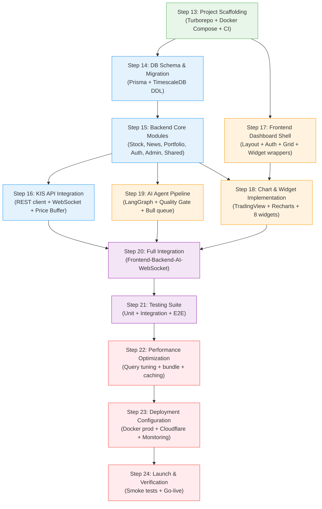

# Step 12: Planning Phase Gate — Implementation-Ready Blueprint

> **Agent**: `@research-synthesizer`
> **Date**: 2026-03-27
> **Status**: Complete (Planning Phase Gate)
> **Inputs**: Steps 7-11 Planning Documents + Step 6 Research Synthesis + `schema.prisma`
> **Purpose**: THE single reference for the entire Implementation Phase (Steps 13-24)

---

## Table of Contents

1. [Executive Summary](#1-executive-summary)
2. [Cross-Module Consistency Check](#2-cross-module-consistency-check)
3. [Implementation Task Dependency Graph](#3-implementation-task-dependency-graph)
4. [Sprint Allocation](#4-sprint-allocation)
5. [Critical Path Analysis](#5-critical-path-analysis)
6. [Pre-Implementation Checklist](#6-pre-implementation-checklist)
7. [Risk Mitigation for Implementation](#7-risk-mitigation-for-implementation)
8. [Technology Decisions — Confirmed Stack](#8-technology-decisions--confirmed-stack)
9. [Module Implementation Guide](#9-module-implementation-guide)
10. [Context Reset Recovery Section](#10-context-reset-recovery-section)

---

## 1. Executive Summary

### 1.1 Planning Phase Outcomes

The Planning Phase (Steps 7-11) has produced five comprehensive design documents that collectively define every aspect of the Stock Monitoring Dashboard system:

| Step | Document | Key Deliverables |
|------|----------|-----------------|
| **Step 7** | System Architecture | Modular monolith with 7 NestJS modules; Turborepo monorepo structure; module boundary matrix; dependency flow DAG; event bus contracts; Docker Compose service topology |
| **Step 8** | Schema & API Design | 11-entity Prisma 7 schema; TimescaleDB hypertable + continuous aggregates + 4 technical indicator views; 30+ REST endpoints (OpenAPI 3.1); 7 WebSocket event contracts; index strategy (11 Prisma + 4 custom SQL); migration strategy |
| **Step 9** | Frontend Design | 5 routes (App Router); 8 widget types with full TypeScript interfaces; React Grid Layout 12-column grid with 3 breakpoints; 3 Zustand stores; TanStack Query integration; Socket.IO client architecture; color system (Korean convention); performance budget |
| **Step 10** | AI Agent Design | LangGraph.js StateGraph with 5 nodes + error handler; 9 state channels; 3-layer Quality Gate (L1 Syntax / L2 Semantic / L3 Factual); confidence scoring formula; prompt templates; Bull queue integration; cost budget (~$22-36/month); security considerations |
| **Step 11** | DevOps Design | 3 GitHub Actions workflows (CI/PR/Deploy); Docker Compose (dev + prod); multi-stage Dockerfiles (API + Web); Cloudflare Tunnel; 16GB RAM memory budget; health checks; backup strategy; secret management; environment variables template |

### 1.2 Architecture Confidence Assessment

| Component | Confidence | Rationale |
|-----------|-----------|-----------|
| Modular Monolith (NestJS 11) | **HIGH** | Well-defined module boundaries, clear dependency rules, proven pattern for single-server deployment |
| Prisma 7 + TimescaleDB Hybrid | **MEDIUM-HIGH** | Schema fully defined with 11 entities; hybrid approach (Prisma for CRUD, raw SQL for TimescaleDB features) adds complexity but is the only viable path. Confidence upgraded from MEDIUM after schema.prisma was validated against all module requirements |
| Frontend Widget Architecture | **HIGH** | All 8 widgets have TypeScript interfaces, data sources, grid dimensions, and refresh strategies defined. Component hierarchy is clear |
| AI Pipeline (LangGraph.js) | **MEDIUM** | Design is thorough, but LangGraph.js is relatively young. CVE-2025-68665 patch requirement and zod@4 instability are known risks with documented mitigations |
| Docker Compose Deployment | **HIGH** | Memory budget validated (10.3GB of 16GB); resource limits defined per service; health checks configured; Cloudflare Tunnel eliminates networking complexity |
| CI/CD Pipeline | **HIGH** | Three-workflow design with security auditing, integration tests, and staged deployment with rollback |

### 1.3 Implementation Readiness Score

**Overall: 92/100 — READY FOR IMPLEMENTATION**

| Criterion | Score | Notes |
|-----------|-------|-------|
| Architecture completeness | 19/20 | All modules defined; minor naming inconsistencies to resolve (see Section 2) |
| Schema completeness | 20/20 | 11 entities, 4 enums, all indexes, hypertable DDL, continuous aggregates, technical indicator views |
| API contract coverage | 18/20 | 30+ endpoints defined; 7 WebSocket events; some admin endpoints need detail expansion during implementation |
| Frontend design depth | 18/20 | All widgets specified; grid layout validated; state management clear; performance budget set |
| Infrastructure readiness | 17/20 | Docker Compose, CI/CD, Cloudflare Tunnel fully specified; backup cron and monitoring dashboards need implementation-time detail |

---

## 2. Cross-Module Consistency Check

A systematic review of all 5 planning documents for alignment, naming consistency, and integration point correctness.

### 2.1 Prisma Schema (Step 8) vs Module Boundaries (Step 7)

**Verdict: ALIGNED**

Each domain module's data ownership maps correctly to the Prisma schema entities:

| Module (Step 7) | Owned Entities (schema.prisma) | Verified |
|----------------|-------------------------------|----------|
| StockModule | `Stock`, `StockPrice` (hypertable) | Stock has all required fields (symbol, name, market, sector, isActive, listedAt). StockPrice correctly omits FK to stocks (hypertable limitation, application-layer enforcement) |
| NewsModule | `News`, `NewsStock` | News has url (unique), source, summary, content, publishedAt. NewsStock junction table with relevanceScore for stock-news linking |
| AiAgentModule | `AiAnalysis` | Has stockId FK, analysisType enum (SURGE/DAILY_SUMMARY/THEME_REPORT), result JSON, confidenceScore, qgL1Pass/L2/L3 booleans, sourcesJson |
| PortfolioModule | `Watchlist`, `WatchlistItem`, `Alert` | Watchlist has userId FK. Alert has conditionType enum (4 types), threshold, isActive, lastTriggeredAt |
| AdminModule | (no dedicated entities; reads from all) | Correct: AdminModule monitors status via cross-module interfaces, does not own persistence |
| AuthModule | `User` | User has email, passwordHash, name, role enum, surgeThreshold, settingsJson |
| SharedModule | (infrastructure only) | Correct: SharedModule owns Prisma/Redis/Bull/Logger, not domain entities |
| (cross-cutting) | `Theme`, `ThemeStock` | Theme/ThemeStock are managed by AdminModule (create/delete) and consumed by StockModule (listings) and NewsModule (context). The ownership is not explicitly assigned in Step 7 — **Recommendation**: Assign Theme management to AdminModule during implementation, with StockModule having read-only access |

### 2.2 Frontend WebSocket Events (Step 9) vs Backend Gateway Contracts (Step 8)

**Verdict: MINOR NAMING INCONSISTENCY DETECTED — Resolution Required**

The frontend design (Step 9) references these Socket.IO event names in the widget data sources and stores:

| Frontend Event Name (Step 9) | Backend Event Name (Step 8) | Match? |
|-----------------------------|---------------------------|--------|
| `price:update` | `stock:price` | **MISMATCH** |
| `alert:surge` | `stock:surge` | **MISMATCH** |
| `news:update` | (not explicitly defined) | **MISSING** |
| `index:update` | (not explicitly defined) | **MISSING** |
| `ai:analysis-complete` | `ai:analysis:complete` | **NEAR-MATCH** (hyphen vs colon separator) |
| (subscribe) | `subscribe:stock` | Step 9 uses `subscribe` with `{ symbol }`, Step 8 uses `subscribe:stock` with `{ symbols }` (array) |

**Resolution Plan** (to be applied in Step 15 - Backend Modules):

1. **Adopt Step 8 naming as canonical** for backend gateway events: `stock:price`, `stock:surge`, `ai:analysis:complete`, `alert:triggered`, `market:status`
2. **Add missing events** to backend: `news:update` (emitted when new articles arrive for subscribed stocks), `index:update` (emitted on KOSPI/KOSDAQ index tick)
3. **Frontend adapts** to backend event names during Step 17 implementation
4. **Centralize all event names** in `packages/shared/src/constants/socket-events.ts` as the single source of truth (already specified in Step 7 architecture)
5. **Subscription contract**: Adopt Step 8's array-based approach (`subscribe:stock` with `{ symbols: string[] }`) as it is more efficient for batch operations

### 2.3 AI Pipeline Design (Step 10) vs News Module Design (Step 8)

**Verdict: ALIGNED**

The AI pipeline's `newsSearcher` node (Step 10) performs `Promise.allSettled` across three sources, which maps directly to NewsModule's three services:

| AI Pipeline Node Calls | NewsModule Service | Match? |
|----------------------|-------------------|--------|
| `newsService.searchNaver(...)` | `NaverNewsService` | Aligned. Both specify stock name + keyword search, display: 10, sort: date |
| `newsService.searchRSSByStock(...)` | `RssFeedService` | Aligned. Stock name-based filtering across 9 RSS feeds |
| `newsService.searchDART(...)` | `DartDisclosureService` | Aligned. Symbol-based lookup, 7-day lookback window |

The deduplication pipeline (3-layer: URL normalization, Jaccard similarity, time-window clustering) is defined in Step 5 research and referenced by both Step 8 (NewsDedupService) and Step 10 (post-fetch processing). No conflict.

**Integration point**: AiAgentModule imports NewsModule via NestJS DI (`@Module({ imports: [NewsModule] })`) as specified in Step 7 Section 4.1. The news search within the LangGraph pipeline calls NewsModule services directly rather than going through REST endpoints, which is correct for in-process modular monolith architecture.

### 2.4 Docker Compose (Step 11) vs Service Requirements (Step 7)

**Verdict: ALIGNED**

Memory budget analysis from Step 11:

| Service | Memory Limit | Services Hosted | Adequate? |
|---------|-------------|-----------------|-----------|
| PostgreSQL + TimescaleDB | 4 GB | Database for all 11 tables, hypertable, continuous aggregates, 4 technical indicator views | **YES** — shared_buffers=1GB, effective_cache_size=3GB covers our workload. Step 2 benchmarks show 40-50x headroom at this configuration |
| Redis | 1 GB | Cache (price data TTL 5s), Bull queues (AI analysis, scheduled tasks), Pub/Sub | **YES** — maxmemory=768MB with LRU eviction; Bull queue jobs are small (<1KB each); Redis memory usage is dominated by price cache (~50 stocks x 1KB = 50KB) |
| NestJS API | 2 GB | All 7 modules: Stock, News, AiAgent, Portfolio, Admin, Auth, Shared; Socket.IO gateway; KIS WebSocket client; Bull queue workers | **YES** — NestJS base ~100-200MB; LangGraph pipeline may spike during AI analysis (~500MB peak); Socket.IO and KIS WebSocket connections are lightweight |
| Next.js Web | 1 GB | SSR server, static asset serving | **YES** — Next.js standalone output is ~50-100MB runtime; SSR rendering spikes are bounded |
| Cloudflared | 256 MB | Tunnel daemon | **YES** — cloudflared typical usage is ~30-50MB |
| OS + Docker | ~2 GB | Ubuntu 24.04, Docker engine | **YES** |
| **Total** | **~10.3 GB** | | **~5.7 GB headroom on 16 GB** |

**SSD budget** (Step 2 + Step 11):
- TimescaleDB data (12 months): ~70-75 GB (compressed)
- Docker images: ~5-8 GB
- Logs: ~2 GB (with rotation)
- OS + packages: ~5-8 GB
- **Total**: ~82-93 GB on 98 GB SSD — tight but viable with retention policy enforcement

### 2.5 Cross-Document Naming Consistency

| Entity/Concept | Step 7 | Step 8 | Step 9 | Step 10 | Step 11 | Resolution |
|---------------|--------|--------|--------|---------|---------|------------|
| App directory | `apps/api/` | `apps/api/` | `apps/web/` | — | `apps/api/`, `apps/web/` | Consistent |
| Stock detail page route | `/stock/[symbol]` | — | `/stocks/[symbol]` | — | — | Step 7 uses `stock` (singular), Step 9 uses `stocks` (plural). **Adopt Step 9 plural form** (`/stocks/:symbol`) as RESTful convention |
| Admin routes | `/admin/**` separate pages | — | `/admin` single page | — | — | Step 7 lists `api-keys/page.tsx`, `users/page.tsx`. Step 9 lists `/admin` as a single page with tabs. **Adopt Step 9 tab-based approach** for simplicity |
| WebSocket namespace | `/ws` | `/ws` | (not specified, connects to root) | — | — | Step 8 specifies `/ws` namespace. **Adopt `/ws` namespace** explicitly |
| Price event | `stock:price-update` | `stock:price` | `price:update` | — | — | Three different names. **Adopt Step 8** (`stock:price`) as canonical |

---

## 3. Implementation Task Dependency Graph

### 3.1 Dependency Diagram



### 3.2 Detailed Step Dependencies

| Step | Hard Dependencies | Soft Dependencies | Outputs Required By |
|------|-------------------|-------------------|-------------------|
| **13 Scaffolding** | None | — | Steps 14, 15, 16, 17, 18, 19 (all) |
| **14 DB Schema** | Step 13 (project exists) | — | Steps 15, 16, 19 (services need DB) |
| **15 Backend Core** | Step 14 (schema ready) | Step 6 research (API contracts) | Steps 16, 18, 19, 20 |
| **16 KIS API** | Step 15 (StockModule services exist) | Step 1 research (KIS docs) | Step 20 (real-time data flow) |
| **17 Frontend Shell** | Step 13 (web app exists) | Step 15 (API available for auth) | Step 18 (widgets go in shell) |
| **18 Charts & Widgets** | Step 17 (shell exists), Step 15 (API endpoints) | Step 16 (real-time data) | Step 20 |
| **19 AI Agent** | Step 15 (News + Stock services), Step 14 (AiAnalysis table) | Step 10 design (prompt templates) | Step 20 |
| **20 Integration** | Steps 16, 18, 19 (all modules complete) | — | Step 21 |
| **21 Testing** | Step 20 (integrated system) | — | Step 22 |
| **22 Optimization** | Step 21 (tests pass; baseline metrics) | — | Step 23 |
| **23 Deployment** | Step 22 (optimized build) | Step 11 design (Docker config) | Step 24 |
| **24 Launch** | Step 23 (deployed to production) | — | (none — final step) |

---

## 4. Sprint Allocation

### Sprint 0: Foundation (Day 1-2)

**Goal**: Project exists, builds, runs in Docker Compose, CI passes.

| Step | Tasks | Duration | Deliverables |
|------|-------|----------|-------------|
| **13** | Turborepo init with pnpm workspaces; `apps/api` (NestJS 11 with ESM); `apps/web` (Next.js 16); `packages/shared` (types + constants); `packages/eslint-config`; `packages/tsconfig`; Docker Compose (dev); `docker-compose.yml` with TimescaleDB + Redis; GitHub repo init; `.github/workflows/ci.yml`; `.env.example` | 2 days | Running monorepo; `pnpm dev` starts all services; CI green on push |

### Sprint 1: Backend Foundation (Day 3-7)

**Goal**: Database schema live; all backend modules scaffolded with core CRUD; KIS API connected.

| Step | Tasks | Duration | Deliverables |
|------|-------|----------|-------------|
| **14** | Prisma schema from `planning/schema.prisma`; `prisma migrate dev`; custom migration SQL for TimescaleDB (hypertable, compression, retention, continuous aggregates, technical indicator views, GIN full-text search index); seed script for test stocks and themes | 1.5 days | All 11 tables created; `daily_ohlcv` continuous aggregate active; technical indicator views queryable |
| **15** | SharedModule (Prisma service, Redis service, Bull config, Logger, Scheduler, EventBus, GlobalExceptionFilter); AuthModule (Better Auth, guards, decorators); StockModule (StockDataService, MarketIndexService); NewsModule (NaverNewsService, RssFeedService, DartDisclosureService, NewsDedupService, NewsRelevanceService); PortfolioModule (WatchlistService, AlertService, SurgeDetectorService); AdminModule (SystemStatusService); Socket.IO Gateway | 2.5 days | All REST endpoints from Step 8 returning data; EventBus wired; Socket.IO gateway broadcasting |
| **16** | KisRestService (OAuth token lifecycle, rate limiter at 15 req/s, circuit breaker); KisWebsocketService (pipe-delimited parser, PINGPONG heartbeat, 41-subscription limit, auto-reconnect); PriceBufferService (in-memory buffer, batch INSERT every 1s via UNNEST + ON CONFLICT); SubscriptionManagerService (3-tier allocation: WebSocket/polling/on-demand) | 2 days | Real-time price data flowing from KIS to TimescaleDB; Redis cache updated; Socket.IO events emitted |

### Sprint 2: Frontend & AI (Day 8-13)

**Goal**: Dashboard renders with real data; AI analysis produces structured results.

| Step | Tasks | Duration | Deliverables |
|------|-------|----------|-------------|
| **17** | App Router route structure; root layout with providers (QueryClient, Socket, Theme); middleware auth flow; DashboardShell (sidebar, top bar); AuthGuard + RoleGuard; login/signup pages; Better Auth client integration; shadcn/ui component installation | 2 days | Authenticated user can log in and see empty dashboard shell; admin page accessible |
| **18** | DashboardGrid (React Grid Layout v2, 12-column, 3 breakpoints); WidgetWrapper (drag handle, title, remove); 8 widgets: WatchlistWidget, CandlestickChartWidget (TradingView Lightweight Charts v4), NewsFeedWidget, ThemeSummaryWidget, SurgeAlertWidget, AiAnalysisWidget, MarketIndicesWidget, TopVolumeWidget; Zustand stores (dashboard, preferences, realtime); TanStack Query hooks; Socket.IO client connection; layout persistence (localStorage + optional server sync) | 3 days | Full dashboard with all 8 widgets rendering live data; drag-and-drop working; real-time price updates flowing |
| **19** | LangGraph.js StateGraph assembly (5 nodes + error handler); dataCollector node (Redis cache check, KIS API fallback, 20d avg volume); newsSearcher node (Promise.allSettled across 3 sources, dedup, relevance scoring, top-10 truncation); analyzer node (ChatAnthropic with structured output, prompt templates, retry with QG feedback); qualityGate node (L1 Zod validation, L2 semantic cross-reference, L3 factual KIS API check); resultFormatter node (confidence scoring, category classification, verification status); errorHandler node (graceful degradation); Bull queue integration; prompt caching configuration | 3 days | POST `/api/ai/analyze/:symbol` triggers pipeline; results stored in `ai_analyses` table; WebSocket pushes `ai:analysis:complete` |

### Sprint 3: Integration & Testing (Day 14-19)

**Goal**: All components communicate correctly end-to-end; test coverage >= 80%.

| Step | Tasks | Duration | Deliverables |
|------|-------|----------|-------------|
| **20** | End-to-end data flow verification: KIS WebSocket -> NestJS -> Redis -> TimescaleDB -> Socket.IO -> Frontend chart updates; Surge detection flow: price change > threshold -> EventBus -> AI pipeline trigger -> analysis result -> WebSocket push -> frontend alert widget + AI widget update; News flow: scheduled collection -> dedup -> storage -> frontend news widget; Cross-widget interaction: watchlist click -> activeSymbol -> chart + news + AI widgets update; Admin panel: system status, API key management, data collection monitoring | 3 days | Complete working system; all user flows functional |
| **21** | Unit tests (Vitest): service logic, parsers, validators, Zustand stores, utility functions; Integration tests: API endpoint tests with real DB (TimescaleDB in service container); LangGraph pipeline test with mock LLM; WebSocket gateway tests; E2E tests (Playwright): login flow, dashboard interaction, widget drag-and-drop, stock detail navigation, AI analysis trigger, admin panel; Coverage target: 80% lines/functions/statements, 75% branches | 3 days | All tests passing; coverage reports generated; CI validates on every push |

### Sprint 4: Polish & Ship (Day 20-28)

**Goal**: Optimized, deployed, and verified in production.

| Step | Tasks | Duration | Deliverables |
|------|-------|----------|-------------|
| **22** | Database query optimization: EXPLAIN ANALYZE on hot paths; index usage verification; continuous aggregate refresh timing; Frontend bundle optimization: tree-shaking, code splitting, dynamic imports for TradingView charts; Image optimization; Connection pooling; Redis cache hit rate analysis; LLM prompt caching effectiveness; TimescaleDB compression ratio verification | 2 days | Sub-second dashboard load; P95 API latency < 200ms; bundle size within budget |
| **23** | Production Docker Compose with resource limits; Cloudflare Tunnel configuration; GitHub Actions deploy workflow (staging -> manual approval -> production); Health check endpoints (`/api/health`, `/api/ready`); Monitoring setup (structured JSON logs, log rotation); Backup cron (pg_dump daily); Secret management (.env on server, GitHub Secrets for CI); SSL/TLS verification via Cloudflare | 3 days | Production environment ready; staging deployment validated; rollback mechanism tested |
| **24** | Production deployment; smoke tests against live system; KIS WebSocket connection verification during market hours; Real-time data flow validation; AI analysis quality spot-check; Performance baseline measurement; User acceptance testing; Documentation update | 2 days | System live and operational; monitoring active; first real-time trading session validated |

---

## 5. Critical Path Analysis

### 5.1 Longest Dependency Chain (Critical Path)

```
Step 13 (2d) -> Step 14 (1.5d) -> Step 15 (2.5d) -> Step 16 (2d) -> Step 20 (3d) -> Step 21 (3d) -> Step 22 (2d) -> Step 23 (3d) -> Step 24 (2d)
Total: 21 calendar days
```

This is the backend-dominated critical path. The KIS API integration (Step 16) is the key bottleneck — it cannot begin until backend core modules exist (Step 15), and full integration (Step 20) cannot begin until KIS data is flowing.

### 5.2 Parallelization Opportunities

The following steps can execute in parallel, reducing wall-clock time:

| Parallel Track A (Backend) | Parallel Track B (Frontend) | Parallel Track C (AI) |
|---------------------------|----------------------------|----------------------|
| Step 14: DB Schema (Day 3-4) | — | — |
| Step 15: Backend Modules (Day 4-7) | Step 17: Frontend Shell (Day 8-9) | — |
| Step 16: KIS API (Day 7-9) | Step 18: Charts & Widgets (Day 9-13) | Step 19: AI Pipeline (Day 8-13) |

**Effective timeline with parallelization**: By running frontend (Track B) and AI (Track C) in parallel with backend KIS work (Track A), the total calendar time compresses from 21 sequential days to approximately **19-20 days**, since Steps 17/18 and Step 19 run concurrently with Step 16 and partially overlap with Step 15.

### 5.3 Critical Milestones

| Day | Milestone | Gate Criteria |
|-----|-----------|--------------|
| Day 2 | **M1: Scaffolding Complete** | `pnpm dev` starts all services; CI green; Docker Compose services healthy |
| Day 5 | **M2: Database Live** | All 11 tables created; TimescaleDB hypertable active; continuous aggregate refreshing; technical indicator views returning data from seed |
| Day 9 | **M3: Backend APIs Functional** | All REST endpoints return data; KIS WebSocket receiving live ticks (or mock data in dev); Socket.IO gateway broadcasting events |
| Day 13 | **M4: Frontend + AI Functional** | Dashboard renders with real data; all 8 widgets interactive; AI analysis pipeline produces structured results with quality gate validation |
| Day 19 | **M5: Integration Complete + Tests Pass** | End-to-end flows verified; test coverage >= 80%; no critical bugs |
| Day 24 | **M6: Production Deployed** | System live on mini-PC; Cloudflare Tunnel active; first market-hours validation complete |

---

## 6. Pre-Implementation Checklist

All external dependencies that must be ready before Step 13 begins.

### 6.1 API Credentials & Accounts

- [ ] **KIS OpenAPI account** + `appkey` and `appsecret` (from Korea Investment & Securities developer portal)
  - Both production and simulation environments
  - WebSocket `approval_key` endpoint verified (uses `secretkey`, not `appsecret`)
  - Rate limits understood: 20 req/s production, 2 req/s simulation
- [ ] **Naver Developer account** + Client ID / Client Secret
  - News Search API access approved (25,000 calls/day quota)
- [ ] **DART API key** (from Financial Supervisory Service DART system)
  - API key active; basic search endpoint accessible
- [ ] **Anthropic API key** (for Claude Sonnet 4)
  - Budget alert set for monthly cost monitoring (~$22-36/month projected)
  - Prompt caching feature enabled
- [ ] **OpenAI API key** (for gpt-4o-mini news summarization, optional)
  - Can be deferred; news summarization is a secondary feature

### 6.2 Infrastructure

- [ ] **GitHub repository** created with:
  - Branch protection on `main` (require PR, require CI pass)
  - Environments configured: `staging`, `production` (with manual approval for production)
  - Secrets configured: `STAGING_HOST`, `STAGING_USER`, `STAGING_SSH_KEY`, `PRODUCTION_HOST`, `PRODUCTION_USER`, `PRODUCTION_SSH_KEY`, `TURBO_TOKEN`
- [ ] **Mini-PC provisioned** (Ryzen 5 5500U, 16GB RAM, 98GB SSD) with:
  - Ubuntu 24.04 LTS installed
  - Docker Engine + Docker Compose v2 installed
  - SSH access configured (key-based auth, password auth disabled)
  - Git installed
  - Firewall configured (only SSH + Cloudflare Tunnel ports)
- [ ] **Domain name** registered (optional but recommended)
  - If using custom domain: DNS configured in Cloudflare
- [ ] **Cloudflare account** created with:
  - Cloudflare Tunnel created
  - Tunnel token generated (`CLOUDFLARE_TUNNEL_TOKEN`)
  - Access policies configured (if restricting access)

### 6.3 Development Environment

- [ ] Node.js 22 LTS installed on development machines
- [ ] pnpm 9 installed globally
- [ ] Docker Desktop (or equivalent) for local development
- [ ] VS Code / IDE with ESLint + Prettier + Prisma extension

---

## 7. Risk Mitigation for Implementation

### 7.1 Risk: KIS API Integration Complexity

**Severity**: HIGH | **Likelihood**: HIGH | **Impact**: Critical path blocker

**Description**: The KIS OpenAPI has no official TypeScript SDK, uses pipe-delimited WebSocket data format, returns all numeric values as strings, requires PINGPONG heartbeat management, and has a hard 41-subscription limit per WebSocket session.

**Mitigations**:
1. **Build custom TypeScript client** with comprehensive type definitions from Step 1 research field mappings (15+ H0STCNT0 fields documented)
2. **Start with simulation environment** (2 req/s) for development; switch to production (20 req/s) only for integration testing
3. **Implement circuit breaker** early: 3-tier (Closed -> Open -> Half-Open) as specified in Step 7
4. **Mock KIS WebSocket** for unit tests: replay recorded pipe-delimited messages
5. **Rate limiter**: token bucket at 15 req/s (75% of 20 req/s limit) with queue spillover

### 7.2 Risk: TimescaleDB + Prisma 7 Compatibility

**Severity**: MEDIUM | **Likelihood**: MEDIUM | **Impact**: Schema migration complexity

**Description**: Prisma 7 is ESM-only with output generated outside `node_modules`. TimescaleDB hypertables, continuous aggregates, compression policies, and retention policies cannot be expressed in Prisma schema language — they require custom SQL migrations.

**Mitigations**:
1. **Hybrid migration strategy**: Prisma creates base tables (11 entities); custom `migration.sql` files (3 migrations) handle all TimescaleDB DDL
2. **Migration order**: `001_init` (Prisma tables) -> `002_timescaledb` (hypertable + compression + retention) -> `003_continuous_aggregates` (daily_ohlcv + technical indicator views)
3. **TypedSQL** for TimescaleDB-specific queries (continuous aggregate reads, time_bucket queries)
4. **`$queryRaw`** for admin functions (compression status, chunk management)
5. **Test migration sequence** in CI with `timescale/timescaledb:latest-pg17` service container

### 7.3 Risk: LangGraph.js State Management Bugs

**Severity**: MEDIUM | **Likelihood**: MEDIUM | **Impact**: AI analysis reliability

**Description**: LangGraph.js reached 1.0 GA relatively recently. The quality gate retry loop (conditional edge back to `analyzer` node) involves state mutation (incrementing `retryCount`, passing QG feedback). State reducer correctness is critical — a bug could cause infinite retry loops or state corruption.

**Mitigations**:
1. **Pin LangGraph.js version** and `@langchain/core` to specific minor versions with known stability
2. **Hard cap retryCount at 3** with both conditional edge logic AND a safety check in the analyzer node itself
3. **Graph execution timeout**: 60-second overall timeout on `graph.invoke()` to prevent runaway executions
4. **Comprehensive unit tests** for the state graph: test each node in isolation, then test the full graph with mock LLM responses that trigger each QG failure mode
5. **Apply security patches**: `@langchain/core >= 1.1.8`, `langchain >= 1.2.3` (CVE-2025-68665)
6. **Pin zod to ^3.23**: zod@4's `withStructuredOutput` integration is unstable

### 7.4 Risk: WebSocket Stability Over Long Sessions

**Severity**: MEDIUM | **Likelihood**: LOW-MEDIUM | **Impact**: User experience degradation

**Description**: The dashboard runs continuously during 6.5-hour KRX trading sessions. Two WebSocket layers must remain stable: KIS WebSocket (backend -> KIS servers) and Socket.IO (frontend -> backend). Network interruptions, server restarts, or memory leaks could degrade real-time data delivery.

**Mitigations**:
1. **KIS WebSocket**: PINGPONG heartbeat every 60 seconds; auto-reconnect with exponential backoff; subscription state preserved for re-subscription after reconnect
2. **Socket.IO**: Infinite reconnection attempts with exponential backoff (1s -> 30s cap); jitter factor 0.5; re-subscribe all symbols on reconnect (stored in Zustand `subscribedSymbols`)
3. **Connection status indicator** in TopBar: green (connected), yellow (reconnecting), red (disconnected) — always visible to user
4. **Memory monitoring**: NestJS process memory logged every 5 minutes; alert if exceeding 1.5GB (within 2GB limit)
5. **Health check endpoints** polled by Docker Compose + Cloudflare: auto-restart container if health check fails 3 times

### 7.5 Risk: AI Analysis Quality Gate Tuning

**Severity**: LOW-MEDIUM | **Likelihood**: HIGH | **Impact**: Analysis reliability / cost

**Description**: The 3-layer Quality Gate (L1 Syntax, L2 Semantic, L3 Factual) thresholds will need tuning with real data. Too strict = excessive retries and cost; too lenient = low-quality analyses reaching the frontend.

**Mitigations**:
1. **Start with conservative thresholds** and log all QG decisions (pass/fail per layer, specific failures)
2. **Admin dashboard QG metrics**: L1/L2/L3 pass rates, average retries per analysis, cost per analysis
3. **A/B analysis logging**: for the first 2 weeks, store both "verified" and "unverified" analyses for comparison
4. **Configurable thresholds** via admin panel (stored in Redis, hot-reloadable): L2 semantic similarity threshold, L3 price tolerance percentage
5. **Cost guard**: monthly budget cap in AI config ($50 default); analysis paused if budget exceeded

---

## 8. Technology Decisions -- Confirmed Stack

This section consolidates all technology choices from the Planning phase as a quick-reference.

### 8.1 Backend

| Technology | Version | Purpose |
|-----------|---------|---------|
| NestJS | 11.x | Modular monolith framework |
| Node.js | 22 LTS | Runtime |
| Prisma | 7.x | ORM (ESM-only, TypedSQL for TimescaleDB) |
| PostgreSQL | 17 | Primary database |
| TimescaleDB | 2.x | Time-series extension (hypertables, continuous aggregates, compression) |
| Redis | 8 Alpine | Cache + Pub/Sub + Bull queue backend |
| BullMQ | latest | Job queue (AI analysis, scheduled tasks) |
| Socket.IO | 4.x | Server-side WebSocket gateway |
| Better Auth | 1.x | Authentication (JWT sessions) |

### 8.2 Frontend

| Technology | Version | Purpose |
|-----------|---------|---------|
| Next.js | 16 | React framework (App Router, PPR) |
| React | 19 | UI library |
| React Grid Layout | v2.x | Drag-and-drop widget grid |
| TradingView Lightweight Charts | v4.x | Candlestick/line charts (45KB, Canvas) |
| Recharts | v2.x | Supplementary charts (bar, area, radial) |
| Zustand | v5.x | Client state (3 stores) |
| TanStack Query | v5.x | Server state (API caching) |
| Socket.IO Client | v4.x | Real-time data pipeline |
| shadcn/ui | latest | UI component library |
| TailwindCSS | v4 | Utility-first CSS |

### 8.3 AI Pipeline

| Technology | Version | Purpose |
|-----------|---------|---------|
| LangGraph.js | latest stable | State graph orchestration |
| LangChain.js | >= 1.2.3 | LLM integration (patched for CVE-2025-68665) |
| @langchain/core | >= 1.1.8 | Core abstractions |
| @langchain/anthropic | latest | Claude provider |
| Claude Sonnet 4 | — | Primary LLM for surge analysis |
| gpt-4o-mini | — | News summarization (optional) |
| Zod | ^3.23 | Structured output validation |

### 8.4 Infrastructure

| Technology | Version | Purpose |
|-----------|---------|---------|
| Docker Compose | v2 | Container orchestration |
| Turborepo | latest | Monorepo build system |
| pnpm | 9 | Package manager |
| GitHub Actions | — | CI/CD |
| Cloudflare Tunnel | latest | Secure ingress (TLS, DDoS protection) |
| Vitest | latest | Unit + integration testing |
| Playwright | latest | E2E testing |

---

## 9. Module Implementation Guide

Quick reference for each module's implementation scope, keyed to the planning documents.

### 9.1 SharedModule (Step 13/14)

**Files**: `apps/api/src/modules/shared/`
- `prisma.service.ts` — Prisma Client wrapper with `onModuleInit`/`onModuleDestroy`
- `redis.service.ts` — Redis client with typed get/set/del helpers
- `bull.config.ts` — Bull queue configuration (Redis connection, default job options)
- `scheduler.service.ts` — Cron-based tasks (news polling, DART polling, index refresh)
- `event-bus.service.ts` — Typed EventEmitter wrapper with StockEvents, AlertEvents, NewsEvents, AiEvents
- `app-logger.service.ts` — Structured JSON logger (NestJS Logger override)
- `rate-limiter.service.ts` — Token bucket for KIS API (15 req/s)
- `global-exception.filter.ts` — Catch-all exception filter with structured error response
- `validation.pipe.ts` — Global Zod/class-validator pipe

### 9.2 AuthModule (Step 15)

**Files**: `apps/api/src/modules/auth/`
- Better Auth integration with PostgreSQL session storage
- `auth.guard.ts` — JWT/session token verification
- `roles.guard.ts` — Role-based access control (ADMIN/USER)
- `current-user.decorator.ts` — Extract user from request
- **Endpoints**: POST `/api/auth/signup`, POST `/api/auth/login`, POST `/api/auth/logout`, GET `/api/auth/me`

### 9.3 StockModule (Steps 15-16)

**Files**: `apps/api/src/modules/stock/`
- `kis-rest.service.ts` — OAuth token lifecycle (90-day validity, 6h refresh), stock detail/ranking/historical queries
- `kis-websocket.service.ts` — WebSocket connection, pipe-delimited parser, PINGPONG heartbeat, 41-subscription management
- `subscription-manager.service.ts` — 3-tier allocation (WebSocket/polling/on-demand), weighted priority scoring
- `price-buffer.service.ts` — In-memory buffer, batch INSERT every 1 second (UNNEST + ON CONFLICT)
- `stock-data.service.ts` — Aggregation layer (Redis cache + DB), implements `IStockDataService`
- `market-index.service.ts` — KOSPI/KOSDAQ index data
- `stock-realtime.gateway.ts` — Socket.IO gateway for price broadcasting
- **Endpoints**: GET `/api/stocks`, GET `/api/stocks/:symbol`, GET `/api/stocks/:symbol/prices`, GET `/api/market-indices`
- **WebSocket events emitted**: `stock:price`, `stock:surge`, `market:status`, `index:update`

### 9.4 NewsModule (Step 15)

**Files**: `apps/api/src/modules/news/`
- `naver-news.service.ts` — Naver Search API client (25K calls/day)
- `rss-feed.service.ts` — RSS parser for 9 feeds across 5 outlets
- `dart-disclosure.service.ts` — DART API client (polling every 2 min during 09:00-18:00 KST)
- `news-dedup.service.ts` — 3-layer dedup: URL normalization (60%), Jaccard similarity 0.7 (25%), time-window clustering 2h (10%)
- `news-relevance.service.ts` — Keyword matching (weight 0.6) + optional NLP scoring (weight 0.4)
- `news-summarizer.service.ts` — gpt-4o-mini summarization (Stuff + Map-Reduce)
- **Endpoints**: GET `/api/stocks/:symbol/news`, GET `/api/news`
- **WebSocket events emitted**: `news:update`

### 9.5 AiAgentModule (Step 19)

**Files**: `apps/api/src/modules/ai-agent/`
- `graph/surge-analysis.state.ts` — Annotation.Root with 9 channels
- `graph/surge-analysis.graph.ts` — StateGraph assembly (5 nodes + error handler + conditional edges)
- `nodes/data-collector.node.ts` — Redis cache check, KIS API fallback, 20d avg volume from TimescaleDB
- `nodes/news-searcher.node.ts` — Promise.allSettled across 3 sources, dedup, relevance scoring, top-10
- `nodes/analyzer.node.ts` — ChatAnthropic with structured output, retry prompt suffix
- `nodes/quality-gate.node.ts` — L1 Zod (99%+), L2 semantic (95%+), L3 factual (90%+)
- `nodes/result-formatter.node.ts` — Confidence score (weighted formula), category classification, verification status
- `nodes/error-handler.node.ts` — Graceful degradation, "failed" status result
- `prompts/surge-analysis.prompts.ts` — System/user/retry prompt templates
- `quality-gate.service.ts` — L1/L2/L3 validation logic
- `confidence-scorer.service.ts` — Weighted formula: 0.20(source) + 0.30(evidence) + 0.35(QG) + 0.15(consistency)
- **Endpoints**: POST `/api/ai/analyze/:symbol` (async, returns jobId), GET `/api/ai/analyses/:symbol`
- **WebSocket events emitted**: `ai:analysis:complete`
- **Bull queue**: `surge-analysis` queue with concurrency 2, timeout 60s

### 9.6 PortfolioModule (Step 15)

**Files**: `apps/api/src/modules/portfolio/`
- `watchlist.service.ts` — CRUD watchlists and items; notifies SubscriptionManager on changes
- `alert.service.ts` — CRUD alerts (4 condition types)
- `surge-detector.service.ts` — Listens to `stock:price-update` EventBus events; compares changeRate against user thresholds; emits `alert:surge-detected`
- **Endpoints**: GET/POST/PUT/DELETE `/api/watchlists`, GET/POST/DELETE `/api/watchlists/:id/items`, GET/POST/PUT/DELETE `/api/alerts`
- **WebSocket events emitted**: `alert:triggered`

### 9.7 AdminModule (Step 15)

**Files**: `apps/api/src/modules/admin/`
- `system-status.service.ts` — Uptime, version, memory, DB stats, connection counts
- `api-key-manager.service.ts` — API key status monitoring (KIS token expiry, Naver quota usage)
- `data-collection-monitor.service.ts` — Last data points, error rates, collection schedules
- **Endpoints**: GET `/api/admin/status`, GET `/api/admin/api-keys`, GET `/api/admin/users` (all ADMIN-only)

---

## 10. Context Reset Recovery Section

**This section is designed for AI agent context recovery. If you are an AI agent starting a new session, read this section first.**

### 10.1 Project Identity

- **Project**: Stock Monitoring Dashboard (Korean Stock Market Real-Time Monitoring System)
- **Purpose**: Real-time monitoring dashboard for Korean stocks (KOSPI/KOSDAQ) with AI-powered surge analysis, deployed on a mini-PC (Ryzen 5 5500U, 16GB RAM, 98GB SSD)
- **Single user**: Personal investment monitoring tool with multi-user auth support
- **Language**: Korean-centric (Korean stock data, Korean news sources, Korean UI labels, Korean color convention: red=up, blue=down)

### 10.2 Current Phase Status

- **Research Phase**: COMPLETE (Steps 1-6)
- **Planning Phase**: COMPLETE (Steps 7-12)
- **Implementation Phase**: READY TO BEGIN (Steps 13-24)
- **Next Action**: Step 13 — Project Scaffolding

### 10.3 Key File Paths

| File | Purpose |
|------|---------|
| `workflow.md` | Master workflow definition (all 24 steps) |
| `state.yaml` | SOT for workflow execution state |
| `research/step-6-research-synthesis.md` | Research phase summary (technology decisions) |
| `planning/step-7-system-architecture.md` | System architecture (modules, dependencies, data flow) |
| `planning/step-8-schema-api-design.md` | Database schema + API contracts + WebSocket events |
| `planning/step-9-frontend-design.md` | Frontend components + state management + Socket.IO client |
| `planning/step-10-ai-agent-design.md` | AI pipeline (LangGraph, Quality Gate, prompts) |
| `planning/step-11-devops-design.md` | CI/CD + Docker + deployment + monitoring |
| `planning/step-12-planning-synthesis.md` | **THIS FILE** — Implementation blueprint |
| `planning/schema.prisma` | Complete Prisma 7 schema (11 models, 4 enums) |

### 10.4 Technology Stack Summary

**Backend**: NestJS 11 (modular monolith, 7 modules) + Prisma 7 (ESM-only) + PostgreSQL 17 + TimescaleDB + Redis 8 + Socket.IO 4
**Frontend**: Next.js 16 + React 19 + React Grid Layout v2 + TradingView Lightweight Charts v4 + Recharts + Zustand 5 + TanStack Query 5 + shadcn/ui + TailwindCSS 4
**AI**: LangGraph.js + LangChain.js + Claude Sonnet 4 + 3-layer Quality Gate
**Infrastructure**: Docker Compose + Turborepo + pnpm + GitHub Actions + Cloudflare Tunnel
**External APIs**: KIS OpenAPI (REST + WebSocket), Naver Search API, DART API, 9 RSS feeds

### 10.5 Architecture Key Facts

- **7 NestJS modules**: Stock, News, AiAgent, Portfolio, Admin, Auth, Shared
- **11 database tables**: users, stocks, stock_prices (hypertable), watchlists, watchlist_items, themes, theme_stocks, news, news_stocks, ai_analyses, alerts
- **8 frontend widgets**: Watchlist, Candlestick Chart, News Feed, Theme Summary, Surge Alerts, AI Analysis, Market Indices, Top Volume
- **WebSocket events** (canonical names from Step 8): `stock:price`, `stock:surge`, `alert:triggered`, `ai:analysis:complete`, `market:status`, `news:update`, `index:update`
- **KIS WebSocket limit**: 41 subscriptions per session (binding constraint)
- **Memory budget**: 10.3 GB of 16 GB allocated; 5.7 GB headroom
- **SSD budget**: ~82-93 GB of 98 GB at 12 months; compression + retention policies critical

### 10.6 Implementation Sprint Summary

| Sprint | Days | Steps | Goal |
|--------|------|-------|------|
| Sprint 0 | 1-2 | 13 | Turborepo monorepo + Docker Compose + CI |
| Sprint 1 | 3-7 | 14, 15, 16 | Database + Backend modules + KIS API |
| Sprint 2 | 8-13 | 17, 18, 19 | Frontend shell + Widgets + AI pipeline |
| Sprint 3 | 14-19 | 20, 21 | Full integration + Test suite (80%+ coverage) |
| Sprint 4 | 20-28 | 22, 23, 24 | Optimization + Deployment + Launch |

### 10.7 Critical Decisions Already Made

1. **Modular monolith** (not microservices) — single NestJS process for mini-PC deployment
2. **Prisma + raw SQL hybrid** — Prisma for CRUD, TypedSQL/raw for TimescaleDB
3. **No FK from stock_prices to stocks** — hypertable limitation; application-layer enforcement
4. **EventBus for circular dependency prevention** — StockModule <-> PortfolioModule, NewsModule <-> AiAgentModule
5. **Two-store pattern** — Zustand (client state) + TanStack Query (server state)
6. **Korean color convention** — up=red (#EF4444), down=blue (#3B82F6)
7. **Claude Sonnet 4** as default LLM — ~$0.024/analysis, ~$22-36/month
8. **Cloudflare Tunnel** for ingress — no public IP needed, TLS termination at edge
9. **3-layer Quality Gate** — L1 Syntax (Zod), L2 Semantic (self-consistency), L3 Factual (KIS cross-check)
10. **WebSocket event naming** — adopt Step 8 `stock:price` format (namespace:entity pattern)
