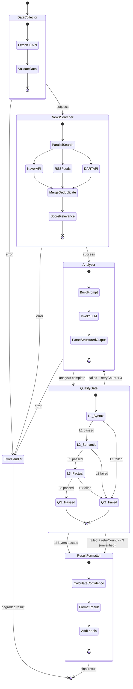
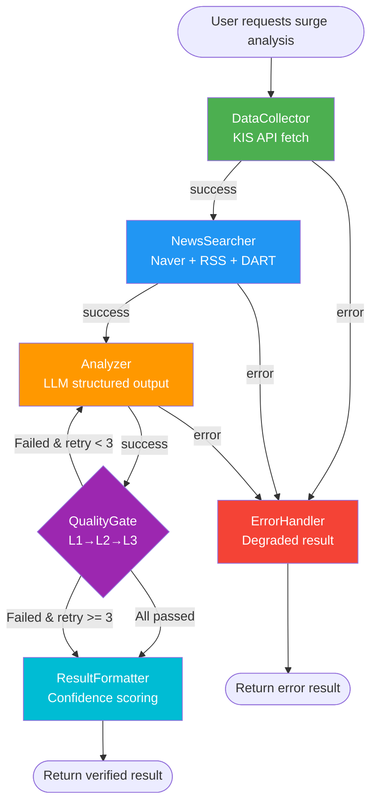

# Step 4: AI Agent Pipeline Research — LangChain.js + LangGraph.js

> **Agent**: `@ai-pipeline-researcher`
> **Date**: 2026-03-27
> **Input**: PRD §3.6 (AI Surge Analysis), §4.7 (AI Agent Layer), §6.2 (Quality Gate), Branch 5.1 (hallucination rates)
> **Status**: Research Complete

---

## Table of Contents

1. [LangGraph.js State Graph Design](#1-langgraphjs-state-graph-design)
2. [LangChain.js Chain Composition](#2-langchainjs-chain-composition)
3. [Quality Gate Implementation (3 Layers)](#3-quality-gate-implementation-3-layers)
4. [Confidence Scoring Algorithm](#4-confidence-scoring-algorithm)
5. [Hallucination Mitigation Strategy](#5-hallucination-mitigation-strategy)
6. [Security: CVE-2025-68664 and CVE-2025-68665](#6-security-cve-2025-68664-and-cve-2025-68665)
7. [Cost Optimization](#7-cost-optimization)
8. [Prompt Templates for Surge Analysis](#8-prompt-templates-for-surge-analysis)
9. [Complete State Diagram](#9-complete-state-diagram)
10. [Package Versions and Dependencies](#10-package-versions-and-dependencies)
11. [Sources](#11-sources)

---

## 1. LangGraph.js State Graph Design

### 1.1 Architecture Overview

The PRD §4.7 specifies a 5-node orchestration pipeline:

```
DataCollector → NewsSearcher → Analyzer → QualityGate → ResultFormatter
```

LangGraph.js provides the `StateGraph` class as the primary abstraction for building stateful, graph-based AI workflows. Each node is a TypeScript function that receives the current state, performs computation, and returns a partial state update. Edges (both static and conditional) define the flow between nodes.

### 1.2 State Definition with Annotation.Root

State schemas in LangGraph.js are defined using `Annotation.Root`, which creates a structured representation of the graph's state channels. Each key represents a channel that nodes can read from and write to, with optional reducer functions that define how updates are merged.

```typescript
import { Annotation } from "@langchain/langgraph";

// --- Domain types ---
interface StockData {
  symbol: string;
  name: string;
  currentPrice: number;
  changePercent: number;
  volume: number;
  previousClose: number;
  high52w: number;
  low52w: number;
  marketCap: number;
  fetchedAt: string;
}

interface NewsArticle {
  title: string;
  source: string;
  url: string;
  publishedAt: string;
  summary: string;
  relevanceScore: number;
}

interface SurgeAnalysis {
  primaryCause: string;
  secondaryCauses: string[];
  evidence: Array<{ claim: string; source: string; url: string }>;
  sentiment: "bullish" | "bearish" | "neutral";
  timeHorizon: "short-term" | "medium-term" | "long-term";
  riskFactors: string[];
}

interface QualityGateResult {
  l1Syntax: { passed: boolean; errors: string[] };
  l2Semantic: { passed: boolean; inconsistencies: string[] };
  l3Factual: { passed: boolean; mismatches: string[] };
  overallPassed: boolean;
  retryCount: number;
}

interface AnalysisResult {
  symbol: string;
  analysis: SurgeAnalysis;
  confidenceScore: number;
  qualityGate: QualityGateResult;
  generatedAt: string;
  modelUsed: string;
  aiGenerated: true;         // always true — PRD: "AI 생성" label mandatory
  verificationStatus: "verified" | "unverified" | "failed";
}

// --- LangGraph State Annotation ---
const SurgeAnalysisState = Annotation.Root({
  // Input
  symbol: Annotation<string>(),
  requestId: Annotation<string>(),

  // Node outputs (each node writes to its own channel)
  stockData: Annotation<StockData | null>({
    reducer: (_prev, next) => next,
    default: () => null,
  }),
  newsArticles: Annotation<NewsArticle[]>({
    reducer: (_prev, next) => next,
    default: () => [],
  }),
  surgeAnalysis: Annotation<SurgeAnalysis | null>({
    reducer: (_prev, next) => next,
    default: () => null,
  }),
  qualityGateResult: Annotation<QualityGateResult | null>({
    reducer: (_prev, next) => next,
    default: () => null,
  }),
  finalResult: Annotation<AnalysisResult | null>({
    reducer: (_prev, next) => next,
    default: () => null,
  }),

  // Control flow
  currentStep: Annotation<string>({
    reducer: (_prev, next) => next,
    default: () => "dataCollector",
  }),
  error: Annotation<{ node: string; message: string; stack?: string } | null>({
    reducer: (_prev, next) => next,
    default: () => null,
  }),
  retryCount: Annotation<number>({
    reducer: (_prev, next) => next,
    default: () => 0,
  }),
});

type SurgeAnalysisStateType = typeof SurgeAnalysisState.State;
```

**Design decisions**:

- Each node writes to its own dedicated channel (`stockData`, `newsArticles`, `surgeAnalysis`, etc.), preventing cross-write conflicts.
- Reducer functions use `(_prev, next) => next` (last-writer-wins), appropriate because each channel is written by exactly one node.
- The `error` channel and `retryCount` channel support Quality Gate retry logic (PRD §6.2: max 3 retries).

### 1.3 Node Implementations

Each node follows the LangGraph.js convention: a TypeScript async function with the first argument being the state and an optional second argument being `RunnableConfig`.

#### Node 1: DataCollector

```typescript
import { RunnableConfig } from "@langchain/core/runnables";

async function dataCollectorNode(
  state: SurgeAnalysisStateType,
  config?: RunnableConfig
): Promise<Partial<SurgeAnalysisStateType>> {
  try {
    // Call KIS API service (injected via config or module DI)
    const kisService = config?.configurable?.kisService;
    const stockData = await kisService.getStockDetail(state.symbol);

    return {
      stockData: {
        symbol: stockData.symbol,
        name: stockData.name,
        currentPrice: stockData.currentPrice,
        changePercent: stockData.changePercent,
        volume: stockData.volume,
        previousClose: stockData.previousClose,
        high52w: stockData.high52w,
        low52w: stockData.low52w,
        marketCap: stockData.marketCap,
        fetchedAt: new Date().toISOString(),
      },
      currentStep: "newsSearcher",
    };
  } catch (err) {
    return {
      error: {
        node: "dataCollector",
        message: err instanceof Error ? err.message : String(err),
        stack: err instanceof Error ? err.stack : undefined,
      },
      currentStep: "errorHandler",
    };
  }
}
```

#### Node 2: NewsSearcher

```typescript
async function newsSearcherNode(
  state: SurgeAnalysisStateType,
  config?: RunnableConfig
): Promise<Partial<SurgeAnalysisStateType>> {
  try {
    const newsService = config?.configurable?.newsService;
    const stockName = state.stockData!.name;
    const symbol = state.symbol;

    // Parallel search: Naver API + RSS feeds + DART
    const [naverResults, rssResults, dartResults] = await Promise.all([
      newsService.searchNaver(`${stockName} 주가 급등`, { display: 10 }),
      newsService.searchRSS(stockName),
      newsService.searchDART(symbol),
    ]);

    // Merge, deduplicate, and score relevance
    const allArticles = newsService.mergeAndDeduplicate([
      ...naverResults,
      ...rssResults,
      ...dartResults,
    ]);

    // Sort by relevance score, take top 10
    const topArticles = allArticles
      .sort((a, b) => b.relevanceScore - a.relevanceScore)
      .slice(0, 10);

    return {
      newsArticles: topArticles,
      currentStep: "analyzer",
    };
  } catch (err) {
    return {
      error: {
        node: "newsSearcher",
        message: err instanceof Error ? err.message : String(err),
      },
      currentStep: "errorHandler",
    };
  }
}
```

#### Node 3: Analyzer (LLM-powered)

```typescript
import { ChatPromptTemplate } from "@langchain/core/prompts";
import { RunnableSequence } from "@langchain/core/runnables";

async function analyzerNode(
  state: SurgeAnalysisStateType,
  config?: RunnableConfig
): Promise<Partial<SurgeAnalysisStateType>> {
  try {
    const model = config?.configurable?.chatModel;  // ChatAnthropic or ChatOpenAI
    const structuredModel = model.withStructuredOutput(surgeAnalysisSchema);

    const prompt = ChatPromptTemplate.fromMessages([
      ["system", SURGE_ANALYSIS_SYSTEM_PROMPT],
      ["human", SURGE_ANALYSIS_USER_PROMPT],
    ]);

    const chain = RunnableSequence.from([prompt, structuredModel]);

    const analysis = await chain.invoke({
      stockName: state.stockData!.name,
      symbol: state.symbol,
      currentPrice: state.stockData!.currentPrice,
      changePercent: state.stockData!.changePercent,
      volume: state.stockData!.volume,
      newsArticles: JSON.stringify(state.newsArticles, null, 2),
    });

    return {
      surgeAnalysis: analysis,
      currentStep: "qualityGate",
    };
  } catch (err) {
    return {
      error: {
        node: "analyzer",
        message: err instanceof Error ? err.message : String(err),
      },
      currentStep: "errorHandler",
    };
  }
}
```

#### Node 4: QualityGate

```typescript
async function qualityGateNode(
  state: SurgeAnalysisStateType,
  config?: RunnableConfig
): Promise<Partial<SurgeAnalysisStateType>> {
  const analysis = state.surgeAnalysis!;
  const stockData = state.stockData!;
  const kisService = config?.configurable?.kisService;

  // L1: Syntax Validation (Zod schema)
  const l1Result = validateL1Syntax(analysis);

  // L2: Semantic Validation (self-consistency)
  const l2Result = validateL2Semantic(analysis, state.newsArticles);

  // L3: Factual Validation (KIS API cross-check)
  const l3Result = await validateL3Factual(analysis, stockData, kisService);

  const overallPassed = l1Result.passed && l2Result.passed && l3Result.passed;
  const newRetryCount = state.retryCount + (overallPassed ? 0 : 1);

  return {
    qualityGateResult: {
      l1Syntax: l1Result,
      l2Semantic: l2Result,
      l3Factual: l3Result,
      overallPassed,
      retryCount: newRetryCount,
    },
    retryCount: newRetryCount,
    currentStep: overallPassed ? "resultFormatter" : "qualityGateRouter",
  };
}
```

#### Node 5: ResultFormatter

```typescript
async function resultFormatterNode(
  state: SurgeAnalysisStateType
): Promise<Partial<SurgeAnalysisStateType>> {
  const confidenceScore = calculateConfidenceScore(
    state.newsArticles,
    state.surgeAnalysis!,
    state.qualityGateResult!
  );

  const result: AnalysisResult = {
    symbol: state.symbol,
    analysis: state.surgeAnalysis!,
    confidenceScore,
    qualityGate: state.qualityGateResult!,
    generatedAt: new Date().toISOString(),
    modelUsed: "claude-sonnet-4-20250514",  // or from config
    aiGenerated: true,
    verificationStatus: state.qualityGateResult!.overallPassed
      ? "verified"
      : "unverified",
  };

  return {
    finalResult: result,
    currentStep: "done",
  };
}
```

#### Error Handler Node

```typescript
async function errorHandlerNode(
  state: SurgeAnalysisStateType
): Promise<Partial<SurgeAnalysisStateType>> {
  console.error(
    `[SurgeAnalysis] Error in ${state.error?.node}: ${state.error?.message}`
  );

  // Return a degraded result with "failed" verification status
  return {
    finalResult: {
      symbol: state.symbol,
      analysis: {
        primaryCause: "Analysis unavailable due to processing error",
        secondaryCauses: [],
        evidence: [],
        sentiment: "neutral",
        timeHorizon: "short-term",
        riskFactors: [`Processing error: ${state.error?.message}`],
      },
      confidenceScore: 0,
      qualityGate: {
        l1Syntax: { passed: false, errors: ["Processing error"] },
        l2Semantic: { passed: false, inconsistencies: [] },
        l3Factual: { passed: false, mismatches: [] },
        overallPassed: false,
        retryCount: state.retryCount,
      },
      generatedAt: new Date().toISOString(),
      modelUsed: "none",
      aiGenerated: true,
      verificationStatus: "failed",
    },
    currentStep: "done",
  };
}
```

### 1.4 Graph Assembly with Conditional Edges

```typescript
import { END, START, StateGraph } from "@langchain/langgraph";

function buildSurgeAnalysisGraph() {
  const graph = new StateGraph(SurgeAnalysisState)
    // Register all nodes
    .addNode("dataCollector", dataCollectorNode)
    .addNode("newsSearcher", newsSearcherNode)
    .addNode("analyzer", analyzerNode)
    .addNode("qualityGate", qualityGateNode)
    .addNode("resultFormatter", resultFormatterNode)
    .addNode("errorHandler", errorHandlerNode)

    // Static edges: happy path
    .addEdge(START, "dataCollector")
    .addEdge("dataCollector", "newsSearcher")
    .addEdge("newsSearcher", "analyzer")
    .addEdge("analyzer", "qualityGate")

    // Conditional edge: Quality Gate routing
    .addConditionalEdges("qualityGate", (state) => {
      if (state.qualityGateResult?.overallPassed) {
        return "resultFormatter";
      }
      // Max 3 retries per PRD §6.2
      if (state.retryCount < 3) {
        return "analyzer";  // retry analysis
      }
      return "resultFormatter";  // proceed with "unverified" label
    })

    .addEdge("resultFormatter", END)
    .addEdge("errorHandler", END);

  return graph.compile();
}
```

**Retry strategy**: When the Quality Gate fails, the conditional edge routes back to the Analyzer node for re-generation. After 3 retries (the maximum per PRD §6.2), the result proceeds to ResultFormatter with `verificationStatus: "unverified"` and the label "검증 미완료".

### 1.5 Error Handling Strategy

Each node wraps its logic in try/catch and writes to the `error` channel on failure, setting `currentStep` to `"errorHandler"`. This approach:

1. Prevents the entire graph from crashing on a single node failure.
2. Preserves partial state for debugging.
3. Returns a gracefully degraded result to the user.

For transient failures (e.g., KIS API timeouts), LangGraph.js supports retry policies at the node level:

```typescript
// Add retry policy to specific nodes
graph.addNode("dataCollector", dataCollectorNode, {
  retryPolicy: {
    maxAttempts: 3,
    initialInterval: 1000,       // 1 second
    backoffFactor: 2,            // exponential backoff
    maxInterval: 10000,          // max 10 seconds
  },
});
```

---

## 2. LangChain.js Chain Composition

### 2.1 Provider Abstraction (Claude vs GPT-4o Switching)

LangChain.js provides a unified interface for different LLM providers through the `BaseChatModel` abstraction. The `@langchain/openai` and `@langchain/anthropic` packages implement this interface, allowing seamless provider switching.

```typescript
import { ChatAnthropic } from "@langchain/anthropic";
import { ChatOpenAI } from "@langchain/openai";
import { initChatModel } from "langchain/chat_models/universal";

// Option 1: Direct instantiation
function createModel(provider: "anthropic" | "openai") {
  if (provider === "anthropic") {
    return new ChatAnthropic({
      model: "claude-sonnet-4-20250514",
      temperature: 0,
      maxTokens: 4096,
    });
  }
  return new ChatOpenAI({
    model: "gpt-4o",
    temperature: 0,
    maxTokens: 4096,
  });
}

// Option 2: Universal initChatModel (auto-detects provider)
async function createModelUniversal(modelName: string) {
  return await initChatModel(modelName, {
    temperature: 0,
    maxTokens: 4096,
  });
}
```

**Recommendation**: Use direct instantiation (Option 1) in production for explicit control over provider-specific configuration. The `initChatModel` function is useful for development/testing where rapid model switching is needed.

### 2.2 Structured Output with Zod

The `.withStructuredOutput()` method binds a Zod schema to the model, enforcing structured responses at the API level. This is the primary mechanism for ensuring LLM outputs conform to our expected format.

```typescript
import { z } from "zod";

const surgeAnalysisSchema = z.object({
  primaryCause: z
    .string()
    .describe("The main reason for the stock price surge, in Korean"),
  secondaryCauses: z
    .array(z.string())
    .max(5)
    .describe("Secondary contributing factors"),
  evidence: z
    .array(
      z.object({
        claim: z.string().describe("The factual claim being cited"),
        source: z.string().describe("Source name (e.g., 한국경제)"),
        url: z.string().url().describe("Direct URL to the source article"),
      })
    )
    .min(1)
    .describe("Evidence citations — at least 1 required"),
  sentiment: z.enum(["bullish", "bearish", "neutral"]),
  timeHorizon: z.enum(["short-term", "medium-term", "long-term"]),
  riskFactors: z
    .array(z.string())
    .max(5)
    .describe("Risk factors that could reverse the trend"),
});

type SurgeAnalysisOutput = z.infer<typeof surgeAnalysisSchema>;
```

**Important TypeScript consideration**: When using `withStructuredOutput` with deeply nested Zod schemas, TypeScript may emit "Type instantiation is excessively deep" errors. The fix is to provide an explicit generic:

```typescript
const structuredModel = model.withStructuredOutput<SurgeAnalysisOutput>(
  surgeAnalysisSchema
);
```

**Zod version note**: As of March 2026, LangChain.js `withStructuredOutput` works reliably with zod@3.x. Support for zod@4 type inference is being actively addressed (langchainjs issue #8357, #8413). **Recommendation**: Pin to `zod@^3.23` until zod@4 support is stable.

### 2.3 RunnableSequence Composition (LCEL)

LangChain Expression Language (LCEL) provides a declarative way to compose chains using the `.pipe()` method or `RunnableSequence.from()`:

```typescript
import { ChatPromptTemplate } from "@langchain/core/prompts";
import { RunnableSequence } from "@langchain/core/runnables";
import { StringOutputParser } from "@langchain/core/output_parsers";

// Full analysis chain
const analysisChain = RunnableSequence.from([
  ChatPromptTemplate.fromMessages([
    ["system", SURGE_ANALYSIS_SYSTEM_PROMPT],
    ["human", SURGE_ANALYSIS_USER_PROMPT],
  ]),
  model.withStructuredOutput(surgeAnalysisSchema),
]);

// Usage
const result = await analysisChain.invoke({
  stockName: "삼성전자",
  symbol: "005930",
  currentPrice: 87500,
  changePercent: 12.3,
  volume: 45000000,
  newsArticles: JSON.stringify(articles),
});
```

---

## 3. Quality Gate Implementation (3 Layers)

Per PRD §6.2, the Quality Gate has three layers with specific pass-rate targets:

| Layer | Name | Target Pass Rate | Mechanism |
|-------|------|-----------------|-----------|
| L1 | Syntax Validation | 99%+ | Zod schema parsing |
| L2 | Semantic Validation | 95%+ | Self-consistency check |
| L3 | Factual Validation | 90%+ | KIS API cross-validation |

### 3.1 L1: Syntax Validation (Zod Schema)

L1 ensures the LLM output conforms to the expected structure. Even with `withStructuredOutput`, Zod re-validation catches edge cases (truncated responses, schema drift).

```typescript
function validateL1Syntax(
  analysis: unknown
): { passed: boolean; errors: string[] } {
  const result = surgeAnalysisSchema.safeParse(analysis);

  if (result.success) {
    return { passed: true, errors: [] };
  }

  const errors = result.error.issues.map(
    (issue) => `${issue.path.join(".")}: ${issue.message}`
  );
  return { passed: false, errors };
}
```

**Additional L1 checks**:
- `evidence` array has at least 1 entry (enforced by Zod `.min(1)`)
- All URLs are valid format (enforced by Zod `.url()`)
- `primaryCause` is non-empty
- No `null` or `undefined` in required fields

### 3.2 L2: Semantic Validation (Self-Consistency)

L2 checks whether the analysis is internally consistent and whether the claims are supported by the cited evidence.

```typescript
function validateL2Semantic(
  analysis: SurgeAnalysis,
  newsArticles: NewsArticle[]
): { passed: boolean; inconsistencies: string[] } {
  const inconsistencies: string[] = [];

  // Check 1: Sentiment consistency
  // If changePercent > 0 and sentiment is "bearish", flag inconsistency
  // (a surge with bearish sentiment needs justification)
  if (analysis.sentiment === "bearish") {
    inconsistencies.push(
      "Bearish sentiment for a surging stock requires explicit justification"
    );
  }

  // Check 2: Evidence-claim alignment
  // Each evidence URL should reference a news article from the provided set
  const newsUrls = new Set(newsArticles.map((a) => a.url));
  for (const ev of analysis.evidence) {
    if (!newsUrls.has(ev.url)) {
      inconsistencies.push(
        `Evidence URL not found in provided news articles: ${ev.url}`
      );
    }
  }

  // Check 3: Primary cause should be mentioned in at least one evidence claim
  const evidenceText = analysis.evidence
    .map((e) => e.claim)
    .join(" ")
    .toLowerCase();
  const primaryCauseLower = analysis.primaryCause.toLowerCase();
  const causeKeywords = extractKeywords(primaryCauseLower);
  const keywordOverlap = causeKeywords.filter((kw) =>
    evidenceText.includes(kw)
  );
  if (keywordOverlap.length === 0) {
    inconsistencies.push(
      "Primary cause has no keyword overlap with cited evidence"
    );
  }

  // Check 4: Risk factors should not contradict the primary cause
  // (e.g., primary cause is "earnings beat" but risk factor is "no earnings report")
  // This is a soft check — flagged but doesn't fail L2 alone

  return {
    passed: inconsistencies.length === 0,
    inconsistencies,
  };
}

function extractKeywords(text: string): string[] {
  // Korean-aware keyword extraction (remove particles/josa)
  const particles = [
    "은", "는", "이", "가", "을", "를", "의", "에", "에서", "로", "으로",
    "와", "과", "도", "만", "까지", "부터", "에게", "한테",
  ];
  const words = text.split(/[\s,.\-;:()]+/).filter((w) => w.length > 1);
  return words.filter((w) => !particles.includes(w));
}
```

### 3.3 L3: Factual Validation (KIS API Cross-Check)

L3 cross-validates the analysis claims against real stock data from the KIS API. This is the strongest defense against hallucination.

```typescript
async function validateL3Factual(
  analysis: SurgeAnalysis,
  stockData: StockData,
  kisService: KisApiService
): Promise<{ passed: boolean; mismatches: string[] }> {
  const mismatches: string[] = [];

  // Check 1: Price direction matches claim
  // If analysis says "급등" (surge), the changePercent should be positive
  if (stockData.changePercent < 0 && analysis.sentiment === "bullish") {
    mismatches.push(
      `Bullish sentiment but stock is actually down ${stockData.changePercent}%`
    );
  }

  // Check 2: Volume claim validation
  // If analysis mentions "거래량 폭증" (volume surge), verify against actual data
  const avgVolume = await kisService.getAverageVolume(
    stockData.symbol,
    20  // 20-day average
  );
  if (avgVolume && stockData.volume < avgVolume * 1.5) {
    const mentionsVolumeSurge = analysis.primaryCause.includes("거래량") ||
      analysis.secondaryCauses.some((c) => c.includes("거래량"));
    if (mentionsVolumeSurge) {
      mismatches.push(
        `Claims volume surge but actual volume (${stockData.volume}) is only ` +
        `${(stockData.volume / avgVolume * 100).toFixed(0)}% of 20-day average`
      );
    }
  }

  // Check 3: Price magnitude plausibility
  // If analysis claims "상한가" (limit up, +30%), verify actual changePercent
  if (
    analysis.primaryCause.includes("상한가") &&
    stockData.changePercent < 29.0
  ) {
    mismatches.push(
      `Claims 상한가 (limit up) but actual change is only ${stockData.changePercent}%`
    );
  }

  // Check 4: Time consistency
  // News articles should be from a relevant time window (within 48 hours)
  // (This check is applied during NewsSearcher but double-checked here)

  return {
    passed: mismatches.length === 0,
    mismatches,
  };
}
```

### 3.4 Quality Gate Retry Flow

Per PRD §6.2: "실패 → 재생성 (최대 3회) → 최종 실패 시 '검증 미완료' 라벨"

```
Analyzer → QualityGate
              │
              ├── All 3 layers pass → ResultFormatter (verificationStatus: "verified")
              │
              ├── Any layer fails + retryCount < 3 → Analyzer (re-generate)
              │
              └── Any layer fails + retryCount >= 3 → ResultFormatter (verificationStatus: "unverified")
```

On retry, the Analyzer receives the previous `qualityGateResult` in the state, enabling the prompt to include feedback about what went wrong. This guided retry improves the chance of passing on subsequent attempts.

---

## 4. Confidence Scoring Algorithm

### 4.1 Formula Design

The confidence score is a weighted average of four components, outputting a value in the range [0, 100]:

```
ConfidenceScore = w₁·S_source + w₂·S_evidence + w₃·S_quality + w₄·S_consistency
```

| Component | Symbol | Weight (wᵢ) | Range | Description |
|-----------|--------|-------------|-------|-------------|
| Source Count | S_source | 0.20 | [0, 100] | Number of independent news sources |
| Evidence Strength | S_evidence | 0.30 | [0, 100] | Quality and specificity of evidence citations |
| QG Pass Rate | S_quality | 0.35 | [0, 100] | Quality Gate layer pass results |
| Cross-Source Consistency | S_consistency | 0.15 | [0, 100] | Agreement between different sources |

### 4.2 Component Scoring Functions

```typescript
function calculateConfidenceScore(
  newsArticles: NewsArticle[],
  analysis: SurgeAnalysis,
  qualityGate: QualityGateResult
): number {
  const sourceScore = calculateSourceScore(newsArticles);
  const evidenceScore = calculateEvidenceScore(analysis);
  const qualityScore = calculateQualityScore(qualityGate);
  const consistencyScore = calculateConsistencyScore(newsArticles, analysis);

  const raw =
    0.20 * sourceScore +
    0.30 * evidenceScore +
    0.35 * qualityScore +
    0.15 * consistencyScore;

  // Clamp to [0, 100] and round to integer
  return Math.round(Math.max(0, Math.min(100, raw)));
}

// S_source: More independent sources → higher confidence
function calculateSourceScore(articles: NewsArticle[]): number {
  const uniqueSources = new Set(articles.map((a) => a.source)).size;
  // 1 source = 20, 3 sources = 60, 5+ sources = 100
  if (uniqueSources >= 5) return 100;
  if (uniqueSources >= 3) return 60 + (uniqueSources - 3) * 20;
  return uniqueSources * 20;
}

// S_evidence: Quality of cited evidence
function calculateEvidenceScore(analysis: SurgeAnalysis): number {
  const evidenceCount = analysis.evidence.length;
  const hasUrls = analysis.evidence.every((e) => e.url && e.url.length > 0);
  const hasClaims = analysis.evidence.every(
    (e) => e.claim && e.claim.length > 10
  );

  let score = 0;
  score += Math.min(evidenceCount * 15, 45);  // up to 45 for 3+ pieces
  score += hasUrls ? 30 : 0;                  // 30 for valid URLs
  score += hasClaims ? 25 : 0;                // 25 for substantive claims
  return Math.min(score, 100);
}

// S_quality: Quality Gate pass results
function calculateQualityScore(qg: QualityGateResult): number {
  let score = 0;
  score += qg.l1Syntax.passed ? 30 : 0;
  score += qg.l2Semantic.passed ? 35 : 0;
  score += qg.l3Factual.passed ? 35 : 0;

  // Penalty for retries: -5 per retry
  score -= qg.retryCount * 5;
  return Math.max(0, score);
}

// S_consistency: Agreement across sources
function calculateConsistencyScore(
  articles: NewsArticle[],
  analysis: SurgeAnalysis
): number {
  // Check if multiple articles mention the same primary cause theme
  const primaryKeywords = extractKeywords(
    analysis.primaryCause.toLowerCase()
  );

  let articlesMatchingCause = 0;
  for (const article of articles) {
    const titleAndSummary =
      (article.title + " " + article.summary).toLowerCase();
    const matchCount = primaryKeywords.filter((kw) =>
      titleAndSummary.includes(kw)
    ).length;
    if (matchCount >= 2) articlesMatchingCause++;
  }

  const matchRatio = articles.length > 0
    ? articlesMatchingCause / articles.length
    : 0;

  return Math.round(matchRatio * 100);
}
```

### 4.3 Example Calculation

Scenario: Samsung Electronics (005930) surges 8.5%, with 5 news sources, 3 evidence citations, all Quality Gate layers passing, and 4 of 5 sources mentioning the primary cause.

```
S_source     = 100        (5 unique sources)
S_evidence   = 100        (3 citations with URLs and claims)
S_quality    = 100        (all 3 layers passed, 0 retries)
S_consistency = 80        (4/5 sources match)

ConfidenceScore = 0.20(100) + 0.30(100) + 0.35(100) + 0.15(80)
               = 20 + 30 + 35 + 12
               = 97
```

Result: Confidence 97/100, displayed as "AI 분석 신뢰도: 97점" with "AI 생성" label.

### 4.4 Score Interpretation Tiers

| Range | Label | Display Color | Meaning |
|-------|-------|--------------|---------|
| 80-100 | High Confidence | Green | Strong evidence, all QG passed |
| 60-79 | Moderate Confidence | Yellow | Some evidence gaps or QG concerns |
| 40-59 | Low Confidence | Orange | Limited evidence, QG issues |
| 0-39 | Very Low Confidence | Red | Insufficient evidence or QG failures |

---

## 5. Hallucination Mitigation Strategy

Per PRD Branch 5.1, LLM hallucination rates range from 33-79%. For financial analysis, hallucinations can cause real monetary harm. Our mitigation uses a multi-layered defense strategy.

### 5.1 Layer 1: Structured Output Enforcement

By using `withStructuredOutput()` with a Zod schema, we constrain the LLM's output space. The model cannot produce free-form text — it must fill specific fields with specific types. This eliminates an entire class of hallucinations (e.g., fabricated statistics embedded in prose).

```typescript
// The LLM MUST produce output matching this schema — no free-form responses
const structuredModel = model.withStructuredOutput(surgeAnalysisSchema);
```

### 5.2 Layer 2: Citation Requirements

The Zod schema requires at least one evidence citation with a real URL. The L2 Semantic validation then cross-checks that cited URLs exist in the provided news articles.

**Prompt enforcement** (in the system prompt):

```
Every claim in primaryCause and secondaryCauses MUST be backed by at least one
entry in the evidence array. If you cannot find a source for a claim, do NOT
include it. It is better to say "원인 불명" (cause unknown) than to fabricate.
```

### 5.3 Layer 3: Fact-Grounding Prompts

The analysis prompt provides the LLM with concrete, verified data (stock prices from KIS API, news articles from verified sources), and explicitly instructs it to ground all claims in this data.

```
You are analyzing stock {symbol} ({stockName}).
FACTUAL DATA (verified from Korea Investment & Securities API):
- Current Price: {currentPrice} KRW
- Change: {changePercent}%
- Volume: {volume}

NEWS ARTICLES (verified from Naver/RSS/DART):
{newsArticles}

RULES:
1. ONLY cite information present in the provided news articles.
2. NEVER fabricate news sources, quotes, or statistics.
3. If the provided data is insufficient, state "분석 불가" (analysis unavailable).
4. All price/volume claims MUST match the provided FACTUAL DATA.
```

### 5.4 Layer 4: L3 Factual Cross-Validation

As described in Section 3.3, the L3 Quality Gate cross-validates every factual claim against real KIS API data. This catches any hallucinated price claims, volume assertions, or market cap references.

### 5.5 Layer 5: Korean Financial Domain Prompt Engineering

Korean financial news has domain-specific patterns that general LLMs may hallucinate about:

- **상한가/하한가**: Limit up (30%) / limit down (30%) are hard KOSPI/KOSDAQ rules. The LLM must not claim 상한가 unless changePercent >= 29%.
- **거래정지**: Trading halt has specific regulatory triggers. The LLM must not fabricate halt reasons.
- **공시**: DART disclosures have specific legal categories. The LLM must cite actual DART announcement IDs.

The system prompt includes a domain glossary:

```
KOREAN FINANCIAL TERMS — USE ACCURATELY:
- 급등: Surge (typically >5% intraday gain)
- 상한가: Daily limit up (+30% for KOSPI/KOSDAQ)
- 하한가: Daily limit down (-30%)
- 거래량 폭증: Volume spike (typically >3x 20-day average)
- 실적 서프라이즈: Earnings surprise
- 기관 매수: Institutional buying
- 외국인 매수: Foreign investor buying
- 공매도: Short selling
- 테마주: Theme stock (stocks grouped by sector/narrative theme)
- 작전주: Manipulated stock (WARNING: never attribute surge to manipulation without evidence)
```

### 5.6 Combined Hallucination Defense Summary

| Defense Layer | Mechanism | Catches |
|---------------|-----------|---------|
| Structured Output | Zod schema enforcement | Fabricated statistics in prose |
| Citation Requirement | min 1 evidence with URL | Unsupported claims |
| Fact-Grounding Prompt | Provide verified data in prompt | Price/volume hallucination |
| L2 Self-Consistency | Cross-check claims vs evidence | Internal contradictions |
| L3 Factual Cross-Check | KIS API validation | False price/volume assertions |
| Domain Glossary | Korean financial terms in prompt | Misuse of domain terminology |
| Retry on Failure | Max 3 retries with feedback | Persistent hallucination |

---

## 6. Security: CVE-2025-68664 and CVE-2025-68665

### 6.1 CVE-2025-68664 (langchain-core Python, CVSS 9.3)

**Vulnerability**: A serialization injection flaw in langchain-core's `dumps()` and `dumpd()` functions. These functions fail to escape dictionaries containing the reserved `lc` key. Since `lc` is used internally by LangChain to mark serialized objects, user-controlled data (especially LLM response fields like `additional_kwargs` or `response_metadata`) containing this key structure is treated as a legitimate LangChain object during deserialization — enabling secret extraction and potentially remote code execution.

**Attack vector**: Prompt injection → LLM produces a response with `lc` key in `additional_kwargs` → The response is serialized/deserialized in standard operations (streaming, logging, memory/history) → Malicious payload is instantiated.

**12 vulnerable flows** identified in the advisory include standard event streaming, message history/memory, caches, and logging pipelines.

**Patched versions**: langchain-core `0.3.81` and `1.2.5`.

**Patch mechanism**:
1. Escaping in `dumps()`/`dumpd()`: User data with `lc` keys is now escaped during serialization.
2. `load()`/`loads()` defaults hardened: `secrets_from_env` defaults to `False`, `allowed_objects` allowlist restricts deserializable classes to `"core"` by default, Jinja2 templates blocked by default.

### 6.2 CVE-2025-68665 (langchainjs / @langchain/core, CVSS 8.6)

**Vulnerability**: The JavaScript equivalent — `toJSON()` in LangChain.js did not escape objects with `lc` keys when serializing free-form data in `kwargs`.

**Patched versions**: `@langchain/core >= 0.3.80` or `>= 1.1.8`; `langchain >= 0.3.37` or `>= 1.2.3`.

**Patch mechanism**:
1. Escaping fix in `toJSON()`.
2. `load()` hardened: `secretsFromEnv` defaults to `false`, `maxDepth` parameter added (DoS protection against deeply nested structures).

### 6.3 Required Package Versions for This Project

Given that our project uses LangChain.js (not Python), we must ensure:

```json
{
  "@langchain/core": ">=1.1.8",
  "@langchain/langgraph": ">=0.2.40",
  "@langchain/anthropic": ">=0.3.14",
  "@langchain/openai": ">=0.4.6",
  "langchain": ">=1.2.3"
}
```

**Verification steps**:
1. Run `npm audit` after installation — must show 0 critical/high vulnerabilities.
2. Verify `@langchain/core` version is >= 1.1.8: `npm ls @langchain/core`.
3. Search codebase for any direct calls to `load()` / `loads()` and ensure `secretsFromEnv: false` is explicitly set.
4. Never pass raw LLM output to `load()` without sanitization.

### 6.4 Input/Output Sanitization Layer Design

Beyond patching CVEs, we implement a dedicated sanitization layer:

```typescript
// --- Input Sanitizer ---
// Strips potentially dangerous patterns from user input before it reaches the LLM.

const DANGEROUS_PATTERNS = [
  /ignore\s+(all\s+)?(previous|above)\s+instructions/gi,
  /system\s*prompt/gi,
  /\{%.*?%\}/g,           // Jinja2 template injection
  /\{\{.*?\}\}/g,          // Template literal injection
  /"lc":\s*[12]/g,         // LangChain serialization marker injection
];

function sanitizeInput(input: string): string {
  let sanitized = input;
  for (const pattern of DANGEROUS_PATTERNS) {
    sanitized = sanitized.replace(pattern, "[FILTERED]");
  }
  // Length limit: max 2000 characters for stock symbol queries
  return sanitized.slice(0, 2000);
}

// --- Output Sanitizer ---
// Validates and sanitizes LLM output before returning to the user.

function sanitizeOutput(output: SurgeAnalysis): SurgeAnalysis {
  return {
    ...output,
    // Strip any HTML/script tags from text fields
    primaryCause: stripHtml(output.primaryCause),
    secondaryCauses: output.secondaryCauses.map(stripHtml),
    evidence: output.evidence.map((e) => ({
      claim: stripHtml(e.claim),
      source: stripHtml(e.source),
      url: validateUrl(e.url) ? e.url : "",
    })),
    riskFactors: output.riskFactors.map(stripHtml),
  };
}

function stripHtml(text: string): string {
  return text.replace(/<[^>]*>/g, "").replace(/&[a-z]+;/gi, "");
}

function validateUrl(url: string): boolean {
  try {
    const parsed = new URL(url);
    return ["http:", "https:"].includes(parsed.protocol);
  } catch {
    return false;
  }
}
```

**Placement in the pipeline**: Input sanitization runs before the Analyzer node. Output sanitization runs after the Analyzer but before the Quality Gate, so that L1 Zod validation operates on already-sanitized data.

---

## 7. Cost Optimization

### 7.1 Token Pricing (as of March 2026)

| Model | Input (per 1M tokens) | Output (per 1M tokens) | Context Window |
|-------|----------------------|------------------------|----------------|
| Claude Opus 4.6 | $5.00 | $25.00 | 1M tokens |
| Claude Sonnet 4.6 | $3.00 | $15.00 | 1M tokens |
| Claude Haiku 4.5 | $1.00 | $5.00 | 200K tokens |
| GPT-4o (latest) | ~$2.50 | ~$10.00 | 128K tokens |
| GPT-5.2 | $1.75 | $14.00 | 128K tokens |

### 7.2 Estimated Token Usage Per Analysis

A single surge analysis request involves the following token consumption:

| Component | Input Tokens | Output Tokens | Notes |
|-----------|-------------|---------------|-------|
| System prompt | ~800 | — | Domain glossary + rules |
| Stock data | ~200 | — | JSON from KIS API |
| News articles (10) | ~3,000 | — | Titles + summaries |
| User instruction | ~150 | — | Analysis request template |
| **Total Input** | **~4,150** | — | |
| Analysis output | — | ~800 | Structured JSON response |
| Quality Gate retry (if needed) | ~4,500 | ~800 | Includes feedback from failed QG |
| **Total Output** | — | **~800–1,600** | 1-2 attempts |

### 7.3 Cost Per Analysis Request

| Model | Input Cost | Output Cost (1 attempt) | Output Cost (2 attempts) | Total (1 attempt) | Total (2 attempts) |
|-------|-----------|------------------------|------------------------|--------------------|---------------------|
| Claude Sonnet 4.6 | $0.012 | $0.012 | $0.024 | **$0.024** | **$0.036** |
| Claude Opus 4.6 | $0.021 | $0.020 | $0.040 | **$0.041** | **$0.061** |
| GPT-4o | $0.010 | $0.008 | $0.016 | **$0.018** | **$0.026** |

**Recommendation**: Use **Claude Sonnet 4.6** as the default model for surge analysis. It offers the best balance of quality and cost. Reserve Claude Opus 4.6 for complex multi-cause analyses or when Sonnet consistently fails Quality Gate L2/L3.

### 7.4 Monthly Cost Projections

Assumptions: 2,500 KOSPI/KOSDAQ stocks, ~50 surge events per day (>5% change), 1,500 analyses per month.

| Model | Monthly Cost (1,500 analyses) | With Caching (est. 40% reduction) |
|-------|------------------------------|-----------------------------------|
| Claude Sonnet 4.6 | ~$36 | ~$22 |
| Claude Opus 4.6 | ~$62 | ~$37 |
| GPT-4o | ~$27 | ~$16 |

### 7.5 Caching Strategy

#### 7.5.1 Prompt Caching (Anthropic)

LangChain.js provides `anthropicPromptCachingMiddleware` that automatically adds cache control headers. The system prompt and domain glossary (~800 tokens) are identical across all analyses and are prime candidates for caching.

```typescript
import { anthropicPromptCachingMiddleware } from "@langchain/anthropic";

const model = new ChatAnthropic({
  model: "claude-sonnet-4-20250514",
  temperature: 0,
}).withMiddleware(anthropicPromptCachingMiddleware());
```

**Savings**: Cached token reads cost ~$0.30/1M tokens (90% discount vs standard input). For 1,500 analyses/month with an 800-token system prompt, this saves approximately $3.24/month on the system prompt alone.

#### 7.5.2 Response Caching (Redis)

For repeated lookups of the same stock within a time window, cache the full analysis result in Redis:

```typescript
import { RedisCache } from "@langchain/community/caches/ioredis";

// Cache key: `surge-analysis:{symbol}:{date}`
// TTL: 30 minutes (stock data changes rapidly)
const cache = new RedisCache({
  client: redisClient,
  ttl: 1800,  // 30 minutes
});

// Before running the LangGraph pipeline
const cacheKey = `surge-analysis:${symbol}:${dateKey}`;
const cached = await redisClient.get(cacheKey);
if (cached) {
  return JSON.parse(cached) as AnalysisResult;
}

// After successful analysis
await redisClient.setex(cacheKey, 1800, JSON.stringify(result));
```

#### 7.5.3 Batch Analysis Pattern

For end-of-day batch analysis of all surge stocks, use LangChain's batch processing:

```typescript
// Batch processing: analyze multiple stocks in parallel
const surgeStocks = await stockService.getSurgeStocks(threshold: 5.0);

// Process in batches of 5 to respect rate limits
const BATCH_SIZE = 5;
for (let i = 0; i < surgeStocks.length; i += BATCH_SIZE) {
  const batch = surgeStocks.slice(i, i + BATCH_SIZE);
  const results = await Promise.all(
    batch.map((stock) =>
      surgeAnalysisGraph.invoke({
        symbol: stock.symbol,
        requestId: `batch-${Date.now()}-${stock.symbol}`,
      })
    )
  );
  // Store results
  await analysisService.saveBatch(results);
}
```

**Cost optimization for batch**: Anthropic offers a Batch API with 50% off standard pricing. Combined with prompt caching (90% off cached reads), batch analysis could reduce per-analysis cost by up to 70%.

---

## 8. Prompt Templates for Surge Analysis

### 8.1 System Prompt (Korean Financial Domain)

```typescript
const SURGE_ANALYSIS_SYSTEM_PROMPT = `당신은 한국 주식 시장 전문 분석가입니다. 주가 급등 종목의 원인을 분석하는 것이 당신의 역할입니다.

## 분석 원칙

1. **사실 기반 분석만 수행**: 제공된 뉴스 기사와 주가 데이터에 근거해서만 분석합니다.
2. **출처 명시 필수**: 모든 주장에는 반드시 근거 뉴스 기사의 출처와 URL을 함께 제시합니다.
3. **근거 없는 추측 금지**: 제공된 데이터로 설명할 수 없는 경우, "원인 불명"으로 표기합니다.
4. **수치 정확성**: 주가, 거래량, 변동률은 제공된 팩트 데이터와 반드시 일치해야 합니다.

## 한국 주식 시장 용어 기준

- 급등: 일중 5% 이상 상승
- 상한가: 일중 +30% (KOSPI/KOSDAQ 기준)
- 하한가: 일중 -30%
- 거래량 폭증: 20일 평균 대비 3배 이상
- 기관 매수 / 외국인 매수: 투자자별 순매수 동향
- 테마주: 특정 이슈/섹터와 연관된 종목군
- 작전주: 주의 — 확실한 근거 없이 "작전" 언급 금지

## 분석 구조

반드시 아래 구조로 응답하세요:
1. primaryCause: 급등의 가장 주된 원인 (한국어, 1-2문장)
2. secondaryCauses: 부수적 원인 (최대 5개)
3. evidence: 근거 자료 (최소 1개, claim/source/url 필수)
4. sentiment: 현재 시장 심리 (bullish/bearish/neutral)
5. timeHorizon: 이 분석의 유효 기간 (short-term/medium-term/long-term)
6. riskFactors: 향후 주의해야 할 리스크 (최대 5개)

## 금지 사항

- 뉴스 기사에 없는 내용을 만들어내지 마세요.
- 가상의 애널리스트 이름, 증권사 리포트, 통계를 인용하지 마세요.
- "~할 것으로 보입니다"와 같은 예측성 표현을 최소화하세요.
- 투자 추천이나 매수/매도 권유를 하지 마세요.`;
```

### 8.2 User Prompt Template

```typescript
const SURGE_ANALYSIS_USER_PROMPT = `## 분석 대상

종목명: {stockName}
종목코드: {symbol}

## 실시간 주가 데이터 (한국투자증권 API 기준)

- 현재가: {currentPrice}원
- 등락률: {changePercent}%
- 거래량: {volume}주

## 관련 뉴스 기사

아래는 검증된 뉴스 소스(네이버, RSS, DART)에서 수집한 관련 기사입니다:

{newsArticles}

## 요청

위 데이터를 바탕으로, 해당 종목의 급등 원인을 분석해주세요.
반드시 제공된 뉴스 기사에 근거하여 분석하고, 모든 주장에 출처를 명시하세요.`;
```

### 8.3 Quality Gate Retry Prompt (Feedback-Enhanced)

When the Quality Gate fails and a retry is needed, the Analyzer receives feedback about what went wrong:

```typescript
const RETRY_PROMPT_SUFFIX = `

## 이전 분석 피드백

이전 분석이 품질 검증(Quality Gate)을 통과하지 못했습니다. 아래 문제를 수정하여 다시 분석해주세요:

### 구문 검증(L1) 오류:
{l1Errors}

### 의미 검증(L2) 불일치:
{l2Inconsistencies}

### 사실 검증(L3) 불일치:
{l3Mismatches}

위 피드백을 반영하여 수정된 분석을 생성해주세요. 특히:
- L2 불일치가 있다면, 근거 URL이 제공된 뉴스 기사와 일치하는지 확인하세요.
- L3 불일치가 있다면, 주가/거래량 수치가 제공된 팩트 데이터와 일치하는지 확인하세요.`;
```

### 8.4 Prompt Design Rationale

1. **Korean-first**: All prompts are in Korean to optimize for Korean financial domain accuracy. LLMs perform better when the prompt language matches the expected output language.

2. **Explicit constraints**: The system prompt includes both positive instructions ("사실 기반 분석만 수행") and negative constraints ("뉴스 기사에 없는 내용을 만들어내지 마세요") to bound the model's behavior from both sides.

3. **Domain glossary in-prompt**: Embedding the terminology glossary directly in the system prompt (rather than relying on the model's training data) ensures correct usage of Korean financial terms. This is especially important for terms with precise quantitative definitions (e.g., 상한가 = exactly +30%).

4. **Grounding data placement**: The actual stock data and news articles are placed in the user prompt (not system prompt) because they change per request. The system prompt remains static and is eligible for prompt caching.

---

## 9. Complete State Diagram

### 9.1 Mermaid State Diagram



### 9.2 Flow Diagram (Mermaid Flowchart)



---

## 10. Package Versions and Dependencies

### 10.1 Required Packages

```json
{
  "dependencies": {
    "@langchain/core": "^1.1.8",
    "@langchain/langgraph": "^0.2.40",
    "@langchain/anthropic": "^0.3.14",
    "@langchain/openai": "^0.4.6",
    "@langchain/community": "^0.3.30",
    "langchain": "^1.2.3",
    "zod": "^3.23.0"
  }
}
```

**Critical**: All `@langchain/core` versions below 1.1.8 are vulnerable to CVE-2025-68665. Pin to `>=1.1.8`.

**Zod**: Pin to `^3.23` (not zod@4) until LangChain.js resolves type inference issues with `withStructuredOutput` (tracked in langchainjs issues #8357 and #8413).

### 10.2 Version Compatibility Matrix

| Package | Minimum Version | Reason |
|---------|----------------|--------|
| @langchain/core | 1.1.8 | CVE-2025-68665 patch |
| @langchain/langgraph | 0.2.40 | StateGraph + Command support |
| @langchain/anthropic | 0.3.14 | Prompt caching middleware |
| langchain | 1.2.3 | CVE-2025-68665 patch |
| zod | 3.23.x | withStructuredOutput compatibility |
| Node.js | 20.x LTS | LangGraph.js requirement |
| TypeScript | 5.4+ | Annotation.Root type inference |

---

## 11. Sources

### Official Documentation
- [LangGraph.js StateGraph API Reference](https://langchain-ai.github.io/langgraphjs/reference/classes/langgraph.StateGraph.html)
- [LangGraph.js Graph API Overview](https://docs.langchain.com/oss/javascript/langgraph/graph-api)
- [LangChain.js Structured Output](https://docs.langchain.com/oss/javascript/langchain/structured-output)
- [LangGraph.js GitHub Repository](https://github.com/langchain-ai/langgraphjs)
- [Anthropic Prompt Caching Middleware](https://docs.langchain.com/oss/javascript/integrations/middleware/anthropic)
- [Claude API Pricing](https://platform.claude.com/docs/en/about-claude/pricing)

### Tutorials and Guides
- [An Absolute Beginner's Guide to LangGraph.js (Microsoft Tech Community)](https://techcommunity.microsoft.com/blog/educatordeveloperblog/an-absolute-beginners-guide-to-langgraph-js/4212496)
- [LangGraph 101: State, Nodes, and Edges in JavaScript](https://medium.com/@barsegyan96armen/langgraph-101-understanding-the-core-concepts-of-state-nodes-and-edges-in-javascript-f91068683d7d)
- [How to Implement LangGraph in TypeScript](https://dev.to/fabrikapp/how-to-implement-a-langchain-langgraph-in-typescript-in-5-minutes-21mh)
- [LangGraph.js Concept Guide](https://dev.to/zand/langgraphjs-concept-guide-50g0)
- [How to Force Perfect JSON Responses in LangChain with TypeScript](https://www.arfat.app/blogs/langchain-structured-output-typescript)
- [LangChain: Structured Output with JavaScript](https://www.robinwieruch.de/langchain-javascript-structured/)
- [Advanced LangGraph: Conditional Edges and Tool-Calling Agents](https://dev.to/jamesli/advanced-langgraph-implementing-conditional-edges-and-tool-calling-agents-3pdn)
- [Dynamic Routing in LangGraph with Command()](https://dev.to/aiengineering/a-beginners-guide-to-dynamic-routing-in-langgraph-with-command-2c5l)
- [Error Handling in LangGraph with Retry Policies](https://dev.to/aiengineering/a-beginners-guide-to-handling-errors-in-langgraph-with-retry-policies-h22)

### Security Advisories
- [CVE-2025-68664: LangChain Serialization Injection (CVSS 9.3)](https://nvd.nist.gov/vuln/detail/CVE-2025-68664)
- [CVE-2025-68665: LangChainJS Serialization Injection (CVSS 8.6)](https://nvd.nist.gov/vuln/detail/CVE-2025-68665)
- [LangGrinch: LangChain Core CVE-2025-68664 Analysis (Cyata)](https://cyata.ai/blog/langgrinch-langchain-core-cve-2025-68664/)
- [CVE-2025-68664 Patch Details (Upwind)](https://www.upwind.io/feed/cve-2025-68664-langchain-serialization-injection)
- [GHSA-r399-636x-v7f6: LangChainJS Advisory (GitHub)](https://github.com/advisories/GHSA-r399-636x-v7f6)
- [CVE-2025-68665: Snyk Vulnerability Database](https://security.snyk.io/vuln/SNYK-JS-LANGCHAINCORE-14563113)

### Provider and Pricing
- [AI API Pricing Comparison 2026 (IntuitionLabs)](https://intuitionlabs.ai/articles/ai-api-pricing-comparison-grok-gemini-openai-claude)
- [Claude API Pricing 2026 (Metacto)](https://www.metacto.com/blogs/anthropic-api-pricing-a-full-breakdown-of-costs-and-integration)
- [OpenAI and Anthropic Integrations (DeepWiki)](https://deepwiki.com/langchain-ai/langchainjs/5.4-openai-and-anthropic-integrations)
- [Use Claude, GPT, Gemini & More in LangChain with One API](https://developer.puter.com/tutorials/access-any-model-using-langchain/)

### Hallucination Mitigation
- [Multi-Layered Framework for LLM Hallucination Mitigation (MDPI)](https://www.mdpi.com/2073-431X/14/8/332)
- [LLM Hallucination Detection and Mitigation (GetMaxim)](https://www.getmaxim.ai/articles/llm-hallucination-detection-and-mitigation-best-techniques/)
- [Mitigating LLM Hallucination in Banking Domain (MIT Thesis)](https://dspace.mit.edu/bitstream/handle/1721.1/162944/sert-dsert-meng-eecs-2025-thesis.pdf)

### Caching and Optimization
- [LangChain.js Anthropic Prompt Caching Middleware Reference](https://reference.langchain.com/javascript/functions/langchain.index.anthropicPromptCachingMiddleware.html)
- [Prompt Caching with LangChain (IBM)](https://www.ibm.com/think/tutorials/implement-prompt-caching-langchain)
- [How to Make LangChain Apps 10x Faster and 5x Cheaper](https://medium.com/@vinodkrane/langchain-in-production-performance-security-and-cost-optimization-d5e0b44a26fd)

### State and Type System
- [Understanding LangGraph Types (Gareth Andrew)](https://gandrew.com/blog/understanding-langgraph-types)
- [StateGraph and Graph Building (DeepWiki)](https://deepwiki.com/langchain-ai/langgraphjs/2.1-stategraph-and-graph-building)
- [Annotation Reference (LangChain.js)](https://reference.langchain.com/javascript/modules/_langchain_langgraph.index.Annotation.html)

---

## Verification Checklist

- [x] LangGraph state graph diagram with all 5 nodes and edges (Section 9)
- [x] Quality Gate 3-layer implementation approach documented (Section 3)
- [x] Confidence score formula defined with example calculation (Section 4)
- [x] Security patch verification steps for CVE-2025-68664 and CVE-2025-68665 (Section 6)
- [x] Token cost estimation per analysis request with Claude/GPT-4o pricing (Section 7)

---

*[trace:step-4:ai-pipeline-research] Research report generated by @ai-pipeline-researcher*
